### Introduction

#### Apache Kafka in five Minutes

* So companies will have a source system, for example, a database, and at some point another part of the company will want to take that data and to put it into another system, for example, a target system. So the data has to move from a source system to a target system. 

  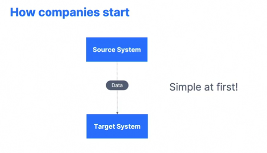

* And at first it's very simple. Someone will write some code and then take the data, extract it, transform it, and then load it. 

* After a while your company evolves and has many source systems and also has many target systems. And now your data integration challenges just get a lot more complicated because all your source systems must send data to all your target systems to share information. 

* And as you can see, we have a lot of integration. So the previous architecture is that, for example, if you have 4 source systems and 6 target systems, you're going to have to write 24 integrations to make it work.

  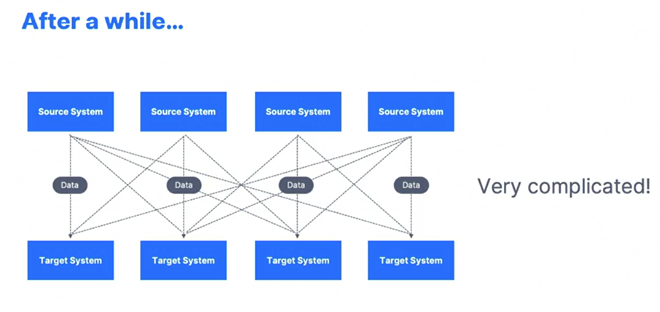

* And each integration comes with difficulty around the protocol because the technology is change So, maybe the data is going to be transferred over TCP, HTTP, REST, FTP, JDBC, the data format. So how is the data parsed? Is it Binary, CSV, JSON, Avro, Protobuf? et cetera et cetera. The schema and evolution. What happens if the data changes in shape overall in your source or your target systems? And then each source system will also have an increased load from all the connections and the request to extract the data. 

  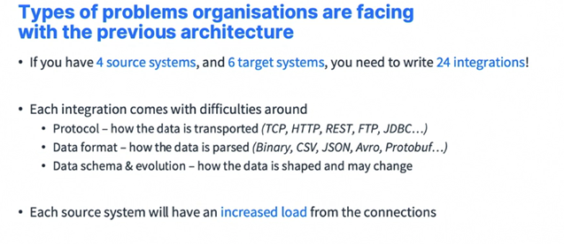

* So how do we solve this problem? Well, we bring some decoupling using Apache Kafka. 

* So we still have our source systems and our target systems, but in the middle we'll sit Apache Kafka. What happens now? The source systems are responsible for sending data, it's called producing for producing data into Apache Kafka. So now Apache Kafka is going to have a data stream of all your data, of all your source systems within it. And your target systems if they ever need to receive data from your source systems, they will actually tap into the data of Apache Kafka because Kafka is meant to actually receive and send data. So your target systems are now consuming from Apache Kafka and everything looks a little bit better and a little bit more scalable. 

  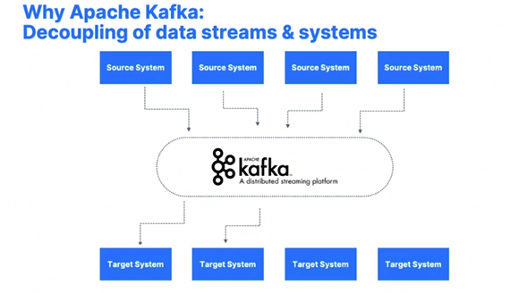

* So if we go back to the same example, what can be your source systems, for example, well it could be website events, pricing data, financial transaction or user interactions and all these things create data streams that means data created in real time, and it is sent to Apache Kafka. Now your target systems could be databases, analytics systems, email systems, and audit system. 

  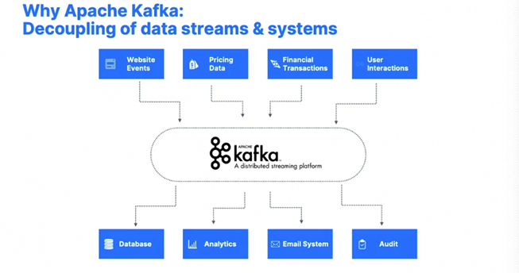

* So this is the kind of architecture we will implement. Now why is Apache Kafka so good? Well, Kafka was created by LinkedIn, and you should know LinkedIn is a huge corporation and it was created as an open source project. Now it's mainly maintained by big corporations such as Confluent, IBM, Cloudera, LinkedIn and so on. It's distributed, has a resilient architecture and is fault tolerant. That means that you can upgrade Kafka, you can do Kafka maintenance without taking the whole system down. Kafka is also very good because it has horizontal scalability. That means that you can add brokers over time into your Kafka cluster, and you can scale to hundreds of brokers. Kafka also has huge scale for messages throughputs, so you can have millions of messages per second. This is the case of Twitter. Also, it's really high performance, so you have really low latency, sometimes measured in less than 10 milliseconds, which is why we called Apache Kafka a real time system. Kafka also has a really wide adoption across the world. And if you're watching this video, that means that, you know, Kafka is being widely adopted. So over 2,000 firms are using Kafka publicly. And also 80% of the Fortune 100 are using Apache Kafka. Big names, obviously using Kafka are you going to be LinkedIn, Airbnb, Netflix, Uber and Walmart. But you don't need to be a mega corporation to use Apache Kafka. Now into the use cases. How is Apache Kafka used? It's used as a messaging system, activity tracking system. 

  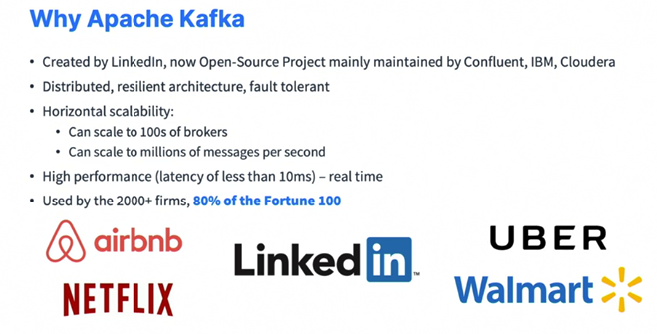

* It's used to gather metrics from many different locations, gather application logs. It used to be like the first use cases for Kafka, more recently is used for stream processing and we'll see how to do that using the Streams API, for example, it's used to decouple system dependencies and microservices. It has integration with big data technologies such as Spark, Flink, Storm, Hadoop and as I said, it's also used for microservices pub/sub. So some more concrete example into how Kafka is being used. So Netflix is using Apache Kafka to apply recommendations in real time while you're watching TV shows. Uber is using Kafka to gather user taxi and trip data in real time and compute and forecast demand. Also compute your pricing in real time. And LinkedIn uses Kafka to prevent spam, collect user interactions to make better connection recommendations in real time. 

  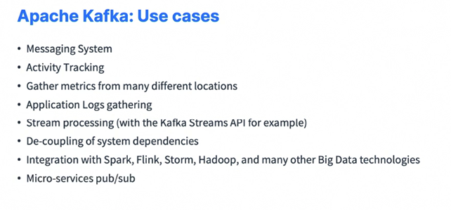

* So in all of that, Kafka is only used as the transportation mechanism, which allows huge data flows in your company.

  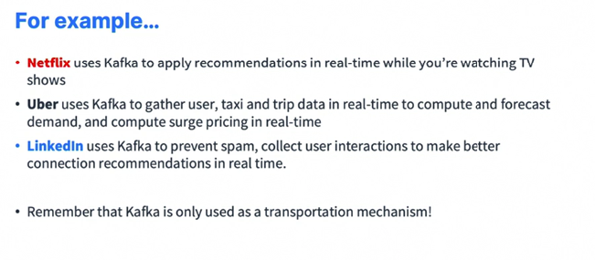

#### Course Objectives

* So we'll start with the Kafka theory section, where we will learn about Kafka cluster, Kafka brokers, we will understand Kafka producers and how they take data from source systems into the Kafka cluster. We'll learn about consumers into how they take data from the cluster and send it to target systems. And we'll learn how Kafka is managed, either using Zookeeper or more recently, using the Kafka craft mode. 

  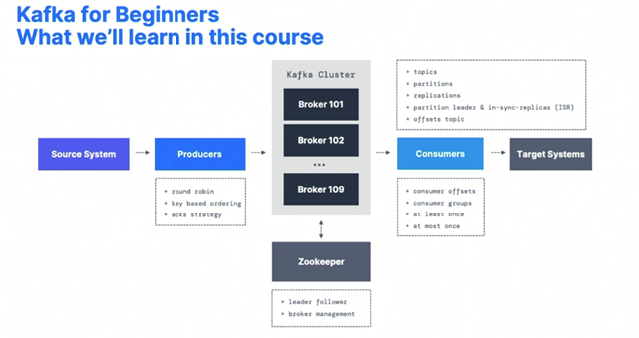

* So what we'll learn in this course is also going to be an introduction to Conduktor to see how we can start Kafka and use Kafka using a graphical UI, an intro to Kafka Connect, Kafka Streams, Confluent Schema Registry. We'll learn about how Kafka is used in the enterprise whether you're looking at Kafka Architectures, we'll have a look at some real world use cases. We'll learn about the advanced APIs and topic configurations and actually a lot more. So the course is structured to be with part one, the fundamentals. 

  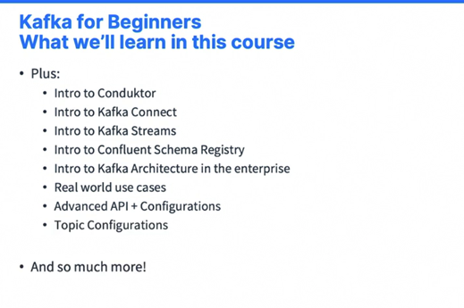

* So it's four hours of content in which first I walk you through the Kafka theory end to end so that you really understand what Kafka is about. Then we'll go ahead and start Kafka on your machine. So we have different instructions based on Linux, Windows, Mac, et cetera, et cetera. Then we'll use the Kafka command line interface to start interacting with Kafka from our terminal, and then we'll do our Java programming to start writing code against Kafka. 

  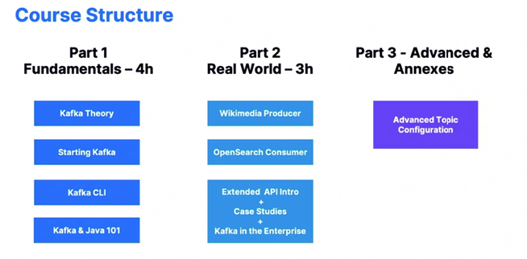

* Next, we'll have the real world architecture. So we'll actually do a more complex producer, a Wikimedia producer in Java as well as a more complex consumer, the open source consumer again in Java. Then we'll have a look at the extended API, such as Kafka Connect, Kafka Stream and Schema Registry. We'll look at case studies and we'll look at how Kafka is used in the enterprise. And finally, there will be a part 3 around advanced topic configurations and any other advanced lectures, I will put there. So just a reminder that this is a beginners course and you don't need to know Kafka at all. What you need to be able to do is to use the command line though, and I will go slowly. But this is better if you have already used the terminal on your computer. We will do some Java programming, so it's good to have some knowledge of Java or programming overall. And for this will use Java 11. Although if you don't know Java, this is fine. You can still download the code and follow along when I talk about Kafka configurations. Linux and Mac are strongly preferred, although if you have Windows, I will show you. We caveats of using Kafka on Windows and make sure you also have some instructions. 

  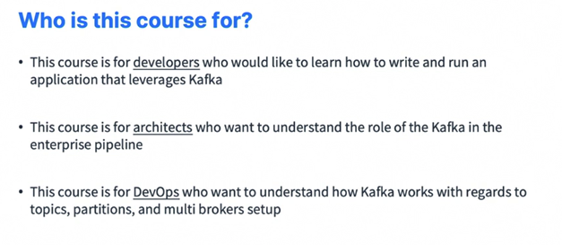

* Of course, you need to be willing to learn a new awesome technology, but if you're here today, that means that you are willing to learn. So who is this course for? You may be a developer who wants to learn how to write and run applications that leverage Kafka. You may be an architect who want to understand the role of Kafka in the enterprise pipeline or DevOps to understand how Kafka works in regards to topic partitions as well as multi-broker setup. So welcome to this course. This is the Apache Kafka series and you're on volume one, which is Kafka for Beginners, which is going to give you a very strong base for Kafka, learn basic operations and write your first consumers and producers. But there is Kafka Connect, Kafka Streams, ksqlDB, Confluent Components, Kafka Security, Kafka Monitoring Operations, Kafka Cluster Setup and Administration in the Apache Kafka series. 

  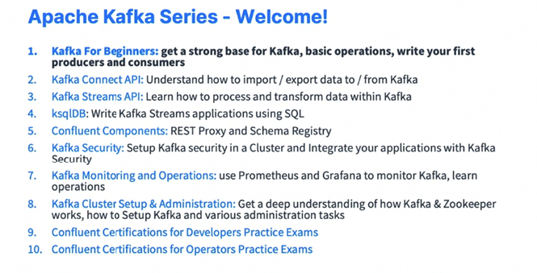

* if you want to specialize as an admin, then Kafka Security, Kafka Monitoring and Kafka Cluster setup are going to be your best friends. Okay, so that's it for this lecture. Welcome to this course, and I will see you in the next lecture.