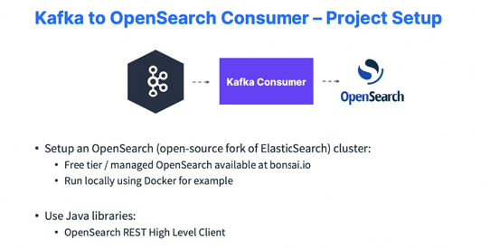
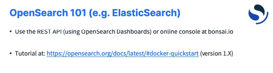

### OpenSearch Consumer and Advanced Consumer Configurations

#### OpenSearch Consumer : Project Overview

* So we're first going to set up the project and the goal of it is to create a Kafka consumer that will take data from our topic and send it into an OpenSearch database. So OpenSearch is an open source fork of ElasticSearch. And to set it up, we have a couple of options. Either we can use a managed solution online available, for example, at bonsai.io, which is a very easy setup to do. 

  

* Or if you know Docker, you can run locally OpenSearch using Docker and I will show you how to do both just to make sure that I address the needs of everyone. Also, you can use Java libraries to write this Kafka consumer, for example, the OpenSearch rest high level client, which I think is nice to use and very explicit. All right, good luck and I will see you in the next lecture for the implementation.

#### OpenSearch Consumer : Project Setup

* So I create a new module, I go with Gradle Java, and then I will name it Kafka consumer OpenSearch. And this is necessary because we're going to have our files in this project. Okay. So we're good to go. Next, I'm going to have two ways to start OpenSearch on this project, okay, on this course. We can either use Docker or we can use a managed OpenSearch. So to do the Docker way, what I'm going to do is I'm going to leave it right here a Docker compose file. So docker compose.yaml. Now if you don't know Docker, that's fine. You can just skip that and go to using bonzai to create a your Elasticsearch, your OpenSearch excuse me cluster. Okay. But if you like Docker then you will for sure appreciate this file. So this file you can find directly on the GitHub project of this course. So we have created this file and I will show you how to use it in the next lectures. 

  ```groovy
  plugins {
      id 'java'
  }
  
  group = 'com.syrisa.tr'
  version = '1.0-SNAPSHOT'
  
  repositories {
      mavenCentral()
  }
  
  dependencies {
      // https://mvnrepository.com/artifact/org.apache.kafka/kafka-clients
      implementation 'org.apache.kafka:kafka-clients:3.5.1'
      // https://mvnrepository.com/artifact/org.slf4j/slf4j-api
      implementation 'org.slf4j:slf4j-api:2.0.5'
      // https://mvnrepository.com/artifact/org.slf4j/slf4j-simple
      implementation 'org.slf4j:slf4j-simple:2.0.5'
      // https://mvnrepository.com/artifact/org.opensearch.client/opensearch-rest-high-level-client
      implementation 'org.opensearch.client:opensearch-rest-high-level-client:2.9.0'
      // https://mvnrepository.com/artifact/com.google.code.gson/gson
      implementation 'com.google.code.gson:gson:2.10.1'
  
  }
  
  test {
      useJUnitPlatform()
  }
  ```

  ```yaml
  version: '3.8'
  services:
    opensearch :
      image: opensearchproject/opensearch:1.2.4
      container_name: opensearch
      environment:
        - compatibility.override_main_response_version=true
        - discovery.type=single-node
        - plugins.security.disabled=true
      ulimits:
        memlock:
          soft: -1
          hard: -1
      volumes:
        - opensearch-data:/usr/share/opensearch/data
      ports:
        - 9200:9200
        - 9600:9600
      networks:
        - opensearch-net
    opensource-dahboards:
      image: opensearchproject/opensearch-dashboards:1.2.0
      container_name: opensearch-dashboards
      ports:
          - 5601:5601
      environment:
        OPEN_SEARCH_HOSTS: '["https://opensearch:9200"]'
        DISABLE_SECURITY_DASHBOARDS_PLUGIN: 'true'
  ```

* In the meantime, we need to set up our dependencies for our project. So this is a Kafka project. So let's go into Kafka basics and then copy my dependencies from here into build.gradle file. Okay, so this is good. Now, other dependencies I need to set up are going to be around the OpenSearch rest clients. So what I'm going to do is just go over here and type OpenSearch high level rest clients and then I will type it Maven as well. So we have this Maven repository OpenSearch for high level client. This is perfect. We're going to choose the latest version in the 1.x x type of realm, so I know that 1.2.4 is working, so this is the one I'm going to use and we're going to use the gradle groovy DSL. I will copy this, going back into my code and I will paste this in. Okay. So this is the opensource dependency and I can just copy this page actually just to have a link to it. Okay. Next we need the JSON with a G, gson from Google. And this is to deal with JSON manipulations of objects in our code. So I will copy this one. Use the gradle groovy DSL. And paste this in as well as copy the URL so we can get back to it if we need to. Okay. So once I have this, I will click on the little load gradle changes icon. We're going to build a model, download my dependencies and then we're good to go. Finally, we're going to create our main Java class, okay, for this and then we're going to click on the right click new Java class. It's going to be an OpenSearch consumer and the package is io. conductor.demos .Kafka.OpenSearch.this. Okay, perfect. So we have this class ready. I'm going to have the main press tab and run this code just to see if everything is good. And the code is running perfect. So now we have set up our projects for the Kafka consumer OpenSearch implementation. We have set up our dependencies, we have the Docker compose file if we ever need to. 

#### Setting up OpenSearch on Docker

* So I've created this docker dot compose yaml file and you may have already these signs in your InteliJ community IDE. If not, you need to go and install a plugin. So to do this you need to go to preferences and then you go to plugins and in this plugin you will type in Docker and you will find the Docker plugin and click on install. This is just to enable you to use Docker directly from IntelliJ, which is quite nice. And then make sure you have Docker started and then the next thing you have to do is just click on these two arrows and then you can start your Kafka Consumer ElasticSearch and start your containers. And the goal of this is just to have two things started on your computer. The number one thing to be starting is Opensearch, which is going to be your database, and the other one is Opensearch dashboards, which are going to be able to give us a console access to the database. So let's test that Everything is working. So number one, I can go to my Web browser and I can type localhost 9200 and this is going to give me this JSON output saying that yes, my opensearch version is correct. And so everything looks good. I did set up a few properties in here to have a single node, so this is of course good plugin security disable true. So to disable any sort of https and logins because this will give us some problems otherwise in our code we are in development mode anyway. And finally this override main response version true is necessary when we get to the Kafka Connect version. This is so that the version number is 7102 available here and not the 1.2.4. So leave it as is. But everything like here is expected. Next we have Opensearch dashboards, so it's available at localhost and then 5601. And then it's going to say loading Opensearch dashboard is going to give you a welcome, and then you can just explore my own. And the one thing we're going to use for this is going to go to the dev tools. And then on the dev tools we get this console. Okay. So this is the URL that I copied right here. You can copy this URL and paste it as well as you want to get to it quickly. But this is going to allow us to run REST API queries against ElasticSearch. All right. So once you have this running, you're good to go and you can go straight into the programming section.

#### Setting up OpenSearch on Cloud

* let's go to bonsai.io and here we are able to go to the pricing page and actually start on the free tier, a Free Sandbox Cluster that will have ElasticSearch or Opensearch and we need to have Opensearch. So let's select this tier. Then you need to enter your contact details. Next, you can answer a few questions around what you're going to do, but I will just click on no thanks and then click on Next. Finally a cluster name. I like to have it as KAFKA_COURSE. Now very important. We need to choose Opensearch 1.0.0 or whatever version of open is available, but in the one point something range. Okay? Do not choose ElasticSearch. So Opensearch 1.0.0. We're good to go and then we're going to use the AWS, EU West Ireland region just because I'm close to it. But again, you could, for example, use one of these other regions if you're close to the US or if you're in the Asia Pacific, you can go to Sydney. So let's provision this cluster and there is an email confirmation link before we get started. So I have validated my email. Now I have access to my Kafka course cluster, which is running opensearch, so we're good to go. Let's click on Kafka course and there we get access to the console. And the console is similar to what we had with Opensearch dashboards in which we can actually run some commands in here. So what you need to do is just, for example, do a get and then click on play. And if you get a 404 message cluster not found, it may take a few minutes for new classes to be created. Please contact support if it doesn't work. So don't contact the support. Okay. Wait about 10 minutes and then after 10 minutes this command would succeed. And as you can see, it's less than 10 minutes now. My opensearch cluster is started and we're good to go. 

#### OpenSearch 101 (e.g ElasticSearch)

* We're going to practice using OpenSearch, which is use which is the same as ElasticSearch. Okay. We'll use the REST API using OpenSearch dashboard or the online console bonsai.io to send some commands and see how ElasticSearch or Opensearch works. We're going to follow this tutorial right here, so let's go to the URL. So I have open the quickstart instruction on the right hand side and we're going to customize them a little bit just to make sure they work both on this console right here and this console right here. Okay. So we're going to first run a session to get information about OpenSearch. So you just do get on slash and then empty contents. You click on play and then you have access to some information around OpenSearch. Same here for the dev tools we can do is you can do just get star and then click to send request. And it's again going to give you some information around OpenSearch. 

  

* So, so far, so good. All right. Next, we can create our first index. So indexes are where data is going to be stored in OpenSearch. And so for this, we need to look at this command and we go to /my first index and it has to be a put. So let's do put /my first index and press click to send request. And as you can see, it's going to create my first index. It was acknowledged and it was created. So this worked on OpenSearch dashboards. And if you do a put here of my first index and then click on the play button again, the index is also created. Okay. So both these things worked. Now we can add some data to the newly created index so we can send some JSON documents into the index to be indexed, of course. So we'll go to /my first index/_doc/ one to create a doc with ID one. So /my first index/ _doc/ one. It's going to create a documentation, a document with ID one and my first index. And then for the content type, it's JSON. We going to specify it and here we can copy all of this, which is the JSON. So I'll copy it, paste it here. So there's a description to be or not to be. That is the question. Cool. We press on play and then here we go. The result was that it was created and then in it we have access to some information. All right. So this is good. This worked here so we can just copy and paste that here. And then we need to do a put and then add in the JSON document right under. Click on play. And yes, again, it was created. Cool. Now we can retrieve the data to make sure that it was added properly. And to do so, we need to do a get. We don't need any JSON, so I can remove this. We press click on send and here send. And now we have some information. So this belongs to the index my first index, the ID is one, and then we have the source, which is a source of the document which contains the JSON we just send. So description to be or not to be. That is the question. And this request right here is also valid here. So get and we're going to remove the contents and then play and as well we get some source information with the description. So we are able to add some data, to retrieve some data and then we can delete the document. So we just do a delete right here. Play and it has been deleted. Results deleted. Good. And here as well I do a delete. Play and then it has been deleted as well. Very good. And finally, we can also, if we wanted to delete the index, so you remove this, you delete the index, and then you remove this and the index has been deleted. So it looks like a very simple database operation. So we create an index, we add some data, we retrieve the data, we delete the data, and finally we delete the index. Okay. So fairly easy, but this is a good introduction to ElasticSearch or OpenSearch because then in the next lecture I'm going to show you how to do this from our Java code. And this is where we'll start writing some code to take data from Kafka and send it to OpenSearch.

#### OpenSearch Consumer Implementation : Part 1 

* We're going to go ahead and implement our OpenSearch consumer. So let's click on OpenSearch Consumer and we have to start writing some code. So typically what we want is to first create an OpenSearch clients then we'll create our Kafka clients, then we'll have our main code logic and then we'll close things. Okay. So at the high level, this is what we want. So to create an Opensearch client, it's not very interesting for me to just go through that because this is not Kafka related knowledge. And honestly, the code is quite complicated because sometimes we connect to a secure OpenSearch, sometimes not. So the recommendation is for you to copy this block of code and paste it. So this code that I wrote here, I will still walk you through it, is to create an OpenSearch client, also called a rest high level clients. Okay. So there's a connection string and if you're using Docker, you should connect to HTTP: //localhost9200. If you're using bonsai, I will show you how to edit this right after when we start running some code. Okay. So then we are extracting some information and then we're building the rest high level clients based on the proper security here without security, so it's simple and here with security so it's a bit more complicated. So let's not waste any time on this. This is all set up. Okay. So the next thing we have to do now is to actually create this client. So we're going to say rest high level client, okay, limit OpenSearch clients equals create OpenSearch clients. This the function that I just created right now. Okay. We still need to have a logger, so let's create a logger. So logger log equals logger, okay, and we'll have SFL4J logger .Logger factory, Of course, .get logger and then OpenSearch. Consumer.class. get simple name. Okay. So we have access to a logger on this OpenSearch consumer and we have our OpenSearch client. So before we go into all the Kafka parts, let's first deal a little bit with how the OpenSearch client works, okay? So what I'm going to do is that I'm going to say, Hey, we need to create the index on OpenSearch if it doesn't exist already, right? So for this, we need to first do our first OpenSearch queries. And so to do so, we have to use a create index request to send that request, of course. So we'll name it a create index request. And it's going to be a new create index request. And we need to provide an index name. For this, We're going to use Wikimedia as our index name. Okay. And now we need to actually execute that request. Okay. So for this, you do clients. So OpenSearch clients that indices to do a request on the index domain. And then you do .create. And this takes the create index request as a result. So let's have the create index request and then some request options. And for this you can just type in defaults, default and press enter and you're good to go. So this request right here is going to create the Wikimedia index. So there is an error here. It says that it can be into a ioexception, So we're going to add throws ioexception to the top. Okay. And this after this we need to close the OpenSearch client so we can do OpenSearch Clients.close and this works. But something I like to do even more is that we can do a try block in Java with the parentheses. And in the try block, you just pass in the OpenSearch client. And that means that if the try block succeeds or if it fails at the end, no matter what, the OpenSearch client is going to be closed by this block. So it's a bit of Java magic, but this works. Okay. So perfect. We're good to go. So we are doing a create index requests. I'm going to run this code right now. And it exited properly. So let's maybe add a little bit of logging. So logger.info and then the wikimedia index has been created. Let's run this again. And we're getting an exception now. Well, because the resource already exists. So we need to have a little bit more logic in here. So we need to check whether or not the things exist. So for this, there is clients.indices, .exists and we need to pass in a get index request. So we'll do a new get index requests and it takes an index as a result as an input. So Wikimedia is my index and then again, the default request options. So this returns a boolean. Okay. And so I'll call it bool index exists equals this. And it's not bool, it's Boolean. Okay. And now I can say if the index exists, if it doesn't exist, so if not index exists, then run this code. Else maybe do log.info. The wikimedia index already exists. Okay. So let's run this code right here. So it says the Wikimedia index already exists. This is good. And then let's practice running this against bonsai. So to do so, let's go into the bonsai URL and then let's go on to settings. Not here. Excuse me. I'm going to access credentials. And in here I have some credentials with full access. So you copy this entire URL right here, which contains your username, your password, and so on. And I'm going to regenerate this at the end so that you don't have access to my credentials. Okay. So you copy this and you paste this in all the way to the top of your code. So I will have it here and I will comment this line. So now a change. I have a long connection string, Okay, paste it right from bonsai. But this is going to allow me to run this code, right, against bonsai. So let's run the main again. And this time it should say that we are recreating the Wikipedia index because it was not created already on bonsai. And cool. The Wikimedia index has been created. So once we're there, what we've confirmed is that we were able to start writing some code, start writing some API calls against Opensearch, either locally or on bonsai. So we're good to go. And now in the next lecture we're going to spend some time writing our Kafka consumer so that we can start processing some data from Kafka and sending it into ElasticSearch or OpenSearch efficiently. 