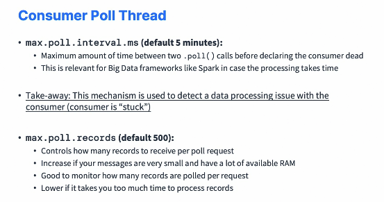

### OpenSearch Consumer and Advanced Consumer Configurations

#### OpenSearch Consumer : Project Overview

* So we're first going to set up the project and the goal of it is to create a Kafka consumer that will take data from our topic and send it into an OpenSearch database. So OpenSearch is an open source fork of ElasticSearch. And to set it up, we have a couple of options. Either we can use a managed solution online available, for example, at bonsai.io, which is a very easy setup to do. 

  

* Or if you know Docker, you can run locally OpenSearch using Docker and I will show you how to do both just to make sure that I address the needs of everyone. Also, you can use Java libraries to write this Kafka consumer, for example, the OpenSearch rest high level client, which I think is nice to use and very explicit. All right, good luck and I will see you in the next lecture for the implementation.

#### OpenSearch Consumer : Project Setup

* So I create a new module, I go with Gradle Java, and then I will name it Kafka consumer OpenSearch. And this is necessary because we're going to have our files in this project. Okay. So we're good to go. Next, I'm going to have two ways to start OpenSearch on this project, okay, on this course. We can either use Docker or we can use a managed OpenSearch. So to do the Docker way, what I'm going to do is I'm going to leave it right here a Docker compose file. So docker compose.yaml. Now if you don't know Docker, that's fine. You can just skip that and go to using bonzai to create a your Elasticsearch, your OpenSearch excuse me cluster. Okay. But if you like Docker then you will for sure appreciate this file. So this file you can find directly on the GitHub project of this course. So we have created this file and I will show you how to use it in the next lectures. 

  ```groovy
  plugins {
      id 'java'
  }
  
  group = 'com.syrisa.tr'
  version = '1.0-SNAPSHOT'
  
  repositories {
      mavenCentral()
  }
  
  dependencies {
      // https://mvnrepository.com/artifact/org.apache.kafka/kafka-clients
      implementation 'org.apache.kafka:kafka-clients:3.5.1'
      // https://mvnrepository.com/artifact/org.slf4j/slf4j-api
      implementation 'org.slf4j:slf4j-api:2.0.5'
      // https://mvnrepository.com/artifact/org.slf4j/slf4j-simple
      implementation 'org.slf4j:slf4j-simple:2.0.5'
      // https://mvnrepository.com/artifact/org.opensearch.client/opensearch-rest-high-level-client
      implementation 'org.opensearch.client:opensearch-rest-high-level-client:2.9.0'
      // https://mvnrepository.com/artifact/com.google.code.gson/gson
      implementation 'com.google.code.gson:gson:2.10.1'
  
  }
  
  test {
      useJUnitPlatform()
  }
  ```

  ```yaml
  version: '3.8'
  services:
    opensearch :
      image: opensearchproject/opensearch:1.2.4
      container_name: opensearch
      environment:
        - compatibility.override_main_response_version=true
        - discovery.type=single-node
        - plugins.security.disabled=true
      ulimits:
        memlock:
          soft: -1
          hard: -1
      volumes:
        - opensearch-data:/usr/share/opensearch/data
      ports:
        - 9200:9200
        - 9600:9600
      networks:
        - opensearch-net
    opensource-dahboards:
      image: opensearchproject/opensearch-dashboards:1.2.0
      container_name: opensearch-dashboards
      ports:
          - 5601:5601
      environment:
        OPEN_SEARCH_HOSTS: '["https://opensearch:9200"]'
        DISABLE_SECURITY_DASHBOARDS_PLUGIN: 'true'
  ```

* In the meantime, we need to set up our dependencies for our project. So this is a Kafka project. So let's go into Kafka basics and then copy my dependencies from here into build.gradle file. Okay, so this is good. Now, other dependencies I need to set up are going to be around the OpenSearch rest clients. So what I'm going to do is just go over here and type OpenSearch high level rest clients and then I will type it Maven as well. So we have this Maven repository OpenSearch for high level client. This is perfect. We're going to choose the latest version in the 1.x x type of realm, so I know that 1.2.4 is working, so this is the one I'm going to use and we're going to use the gradle groovy DSL. I will copy this, going back into my code and I will paste this in. Okay. So this is the opensource dependency and I can just copy this page actually just to have a link to it. Okay. Next we need the JSON with a G, gson from Google. And this is to deal with JSON manipulations of objects in our code. So I will copy this one. Use the gradle groovy DSL. And paste this in as well as copy the URL so we can get back to it if we need to. Okay. So once I have this, I will click on the little load gradle changes icon. We're going to build a model, download my dependencies and then we're good to go. Finally, we're going to create our main Java class, okay, for this and then we're going to click on the right click new Java class. It's going to be an OpenSearch consumer and the package is io. conductor.demos .Kafka.OpenSearch.this. Okay, perfect. So we have this class ready. I'm going to have the main press tab and run this code just to see if everything is good. And the code is running perfect. So now we have set up our projects for the Kafka consumer OpenSearch implementation. We have set up our dependencies, we have the Docker compose file if we ever need to. 

#### Setting up OpenSearch on Docker

* So I've created this docker dot compose yaml file and you may have already these signs in your InteliJ community IDE. If not, you need to go and install a plugin. So to do this you need to go to preferences and then you go to plugins and in this plugin you will type in Docker and you will find the Docker plugin and click on install. This is just to enable you to use Docker directly from IntelliJ, which is quite nice. And then make sure you have Docker started and then the next thing you have to do is just click on these two arrows and then you can start your Kafka Consumer ElasticSearch and start your containers. And the goal of this is just to have two things started on your computer. The number one thing to be starting is Opensearch, which is going to be your database, and the other one is Opensearch dashboards, which are going to be able to give us a console access to the database. So let's test that Everything is working. So number one, I can go to my Web browser and I can type localhost 9200 and this is going to give me this JSON output saying that yes, my opensearch version is correct. And so everything looks good. I did set up a few properties in here to have a single node, so this is of course good plugin security disable true. So to disable any sort of https and logins because this will give us some problems otherwise in our code we are in development mode anyway. And finally this override main response version true is necessary when we get to the Kafka Connect version. This is so that the version number is 7102 available here and not the 1.2.4. So leave it as is. But everything like here is expected. Next we have Opensearch dashboards, so it's available at localhost and then 5601. And then it's going to say loading Opensearch dashboard is going to give you a welcome, and then you can just explore my own. And the one thing we're going to use for this is going to go to the dev tools. And then on the dev tools we get this console. Okay. So this is the URL that I copied right here. You can copy this URL and paste it as well as you want to get to it quickly. But this is going to allow us to run REST API queries against ElasticSearch. All right. So once you have this running, you're good to go and you can go straight into the programming section.

#### Setting up OpenSearch on Cloud

* let's go to bonsai.io and here we are able to go to the pricing page and actually start on the free tier, a Free Sandbox Cluster that will have ElasticSearch or Opensearch and we need to have Opensearch. So let's select this tier. Then you need to enter your contact details. Next, you can answer a few questions around what you're going to do, but I will just click on no thanks and then click on Next. Finally a cluster name. I like to have it as KAFKA_COURSE. Now very important. We need to choose Opensearch 1.0.0 or whatever version of open is available, but in the one point something range. Okay? Do not choose ElasticSearch. So Opensearch 1.0.0. We're good to go and then we're going to use the AWS, EU West Ireland region just because I'm close to it. But again, you could, for example, use one of these other regions if you're close to the US or if you're in the Asia Pacific, you can go to Sydney. So let's provision this cluster and there is an email confirmation link before we get started. So I have validated my email. Now I have access to my Kafka course cluster, which is running opensearch, so we're good to go. Let's click on Kafka course and there we get access to the console. And the console is similar to what we had with Opensearch dashboards in which we can actually run some commands in here. So what you need to do is just, for example, do a get and then click on play. And if you get a 404 message cluster not found, it may take a few minutes for new classes to be created. Please contact support if it doesn't work. So don't contact the support. Okay. Wait about 10 minutes and then after 10 minutes this command would succeed. And as you can see, it's less than 10 minutes now. My opensearch cluster is started and we're good to go. 

#### OpenSearch 101 (e.g ElasticSearch)

* We're going to practice using OpenSearch, which is use which is the same as ElasticSearch. Okay. We'll use the REST API using OpenSearch dashboard or the online console bonsai.io to send some commands and see how ElasticSearch or Opensearch works. We're going to follow this tutorial right here, so let's go to the URL. So I have open the quickstart instruction on the right hand side and we're going to customize them a little bit just to make sure they work both on this console right here and this console right here. Okay. So we're going to first run a session to get information about OpenSearch. So you just do get on slash and then empty contents. You click on play and then you have access to some information around OpenSearch. Same here for the dev tools we can do is you can do just get star and then click to send request. And it's again going to give you some information around OpenSearch. 

  

* So, so far, so good. All right. Next, we can create our first index. So indexes are where data is going to be stored in OpenSearch. And so for this, we need to look at this command and we go to /my first index and it has to be a put. So let's do put /my first index and press click to send request. And as you can see, it's going to create my first index. It was acknowledged and it was created. So this worked on OpenSearch dashboards. And if you do a put here of my first index and then click on the play button again, the index is also created. Okay. So both these things worked. Now we can add some data to the newly created index so we can send some JSON documents into the index to be indexed, of course. So we'll go to /my first index/_doc/ one to create a doc with ID one. So /my first index/ _doc/ one. It's going to create a documentation, a document with ID one and my first index. And then for the content type, it's JSON. We going to specify it and here we can copy all of this, which is the JSON. So I'll copy it, paste it here. So there's a description to be or not to be. That is the question. Cool. We press on play and then here we go. The result was that it was created and then in it we have access to some information. All right. So this is good. This worked here so we can just copy and paste that here. And then we need to do a put and then add in the JSON document right under. Click on play. And yes, again, it was created. Cool. Now we can retrieve the data to make sure that it was added properly. And to do so, we need to do a get. We don't need any JSON, so I can remove this. We press click on send and here send. And now we have some information. So this belongs to the index my first index, the ID is one, and then we have the source, which is a source of the document which contains the JSON we just send. So description to be or not to be. That is the question. And this request right here is also valid here. So get and we're going to remove the contents and then play and as well we get some source information with the description. So we are able to add some data, to retrieve some data and then we can delete the document. So we just do a delete right here. Play and it has been deleted. Results deleted. Good. And here as well I do a delete. Play and then it has been deleted as well. Very good. And finally, we can also, if we wanted to delete the index, so you remove this, you delete the index, and then you remove this and the index has been deleted. So it looks like a very simple database operation. So we create an index, we add some data, we retrieve the data, we delete the data, and finally we delete the index. Okay. So fairly easy, but this is a good introduction to ElasticSearch or OpenSearch because then in the next lecture I'm going to show you how to do this from our Java code. And this is where we'll start writing some code to take data from Kafka and send it to OpenSearch.

#### OpenSearch Consumer Implementation : Part 1 

* We're going to go ahead and implement our OpenSearch consumer. So let's click on OpenSearch Consumer and we have to start writing some code. So typically what we want is to first create an OpenSearch clients then we'll create our Kafka clients, then we'll have our main code logic and then we'll close things. Okay. So at the high level, this is what we want. So to create an Opensearch client, it's not very interesting for me to just go through that because this is not Kafka related knowledge. And honestly, the code is quite complicated because sometimes we connect to a secure OpenSearch, sometimes not. So the recommendation is for you to copy this block of code and paste it. So this code that I wrote here, I will still walk you through it, is to create an OpenSearch client, also called a rest high level clients. Okay. So there's a connection string and if you're using Docker, you should connect to HTTP: //localhost9200. If you're using bonsai, I will show you how to edit this right after when we start running some code. Okay. So then we are extracting some information and then we're building the rest high level clients based on the proper security here without security, so it's simple and here with security so it's a bit more complicated. So let's not waste any time on this. This is all set up. Okay. So the next thing we have to do now is to actually create this client. So we're going to say rest high level client, okay, limit OpenSearch clients equals create OpenSearch clients. This the function that I just created right now. Okay. We still need to have a logger, so let's create a logger. So logger log equals logger, okay, and we'll have SFL4J logger .Logger factory, Of course, .get logger and then OpenSearch. Consumer.class. get simple name. Okay. So we have access to a logger on this OpenSearch consumer and we have our OpenSearch client. So before we go into all the Kafka parts, let's first deal a little bit with how the OpenSearch client works, okay? So what I'm going to do is that I'm going to say, Hey, we need to create the index on OpenSearch if it doesn't exist already, right? So for this, we need to first do our first OpenSearch queries. And so to do so, we have to use a create index request to send that request, of course. So we'll name it a create index request. And it's going to be a new create index request. And we need to provide an index name. For this, We're going to use Wikimedia as our index name. Okay. And now we need to actually execute that request. Okay. So for this, you do clients. So OpenSearch clients that indices to do a request on the index domain. And then you do .create. And this takes the create index request as a result. So let's have the create index request and then some request options. And for this you can just type in defaults, default and press enter and you're good to go. So this request right here is going to create the Wikimedia index. So there is an error here. It says that it can be into a ioexception, So we're going to add throws ioexception to the top. Okay. And this after this we need to close the OpenSearch client so we can do OpenSearch Clients.close and this works. But something I like to do even more is that we can do a try block in Java with the parentheses. And in the try block, you just pass in the OpenSearch client. And that means that if the try block succeeds or if it fails at the end, no matter what, the OpenSearch client is going to be closed by this block. So it's a bit of Java magic, but this works. Okay. So perfect. We're good to go. So we are doing a create index requests. I'm going to run this code right now. And it exited properly. So let's maybe add a little bit of logging. So logger.info and then the wikimedia index has been created. Let's run this again. And we're getting an exception now. Well, because the resource already exists. So we need to have a little bit more logic in here. So we need to check whether or not the things exist. So for this, there is clients.indices, .exists and we need to pass in a get index request. So we'll do a new get index requests and it takes an index as a result as an input. So Wikimedia is my index and then again, the default request options. So this returns a boolean. Okay. And so I'll call it bool index exists equals this. And it's not bool, it's Boolean. Okay. And now I can say if the index exists, if it doesn't exist, so if not index exists, then run this code. Else maybe do log.info. The wikimedia index already exists. Okay. So let's run this code right here. So it says the Wikimedia index already exists. This is good. And then let's practice running this against bonsai. So to do so, let's go into the bonsai URL and then let's go on to settings. Not here. Excuse me. I'm going to access credentials. And in here I have some credentials with full access. So you copy this entire URL right here, which contains your username, your password, and so on. And I'm going to regenerate this at the end so that you don't have access to my credentials. Okay. So you copy this and you paste this in all the way to the top of your code. So I will have it here and I will comment this line. So now a change. I have a long connection string, Okay, paste it right from bonsai. But this is going to allow me to run this code, right, against bonsai. So let's run the main again. And this time it should say that we are recreating the Wikipedia index because it was not created already on bonsai. And cool. The Wikimedia index has been created. 

  ```java
  package com.syrisa.tr.kafka.opensearch;
  
  import org.apache.http.HttpHost;
  import org.apache.http.auth.AuthScope;
  import org.apache.http.auth.UsernamePasswordCredentials;
  import org.apache.http.client.CredentialsProvider;
  import org.apache.http.impl.client.BasicCredentialsProvider;
  import org.apache.http.impl.client.DefaultConnectionKeepAliveStrategy;
  import org.opensearch.client.RequestOptions;
  import org.opensearch.client.RestClient;
  import org.opensearch.client.RestHighLevelClient;
  import org.opensearch.client.indices.CreateIndexRequest;
  import org.opensearch.client.indices.GetIndexRequest;
  import org.slf4j.Logger;
  import org.slf4j.LoggerFactory;
  
  import java.io.IOException;
  import java.net.URI;
  
  public class OpenSearchConsumer {
  
      public static RestHighLevelClient createOpenSearchClient() {
          String connString = "localhost:9200";
  
          // We build a URI from the Connection String
          RestHighLevelClient restHighLevelClient;
          URI uri = URI.create(connString);
          // Extract login info from the uri if it exists
          String userInfo = uri.getUserInfo();
  
          if (userInfo != null) {
              // Rest client without security
              restHighLevelClient = new RestHighLevelClient(RestClient.builder(new HttpHost(uri.getHost(), uri.getPort(), uri.getScheme())));
              // Create the client with the username and password
          } else {
              // Rest client with security
              String[] auth = userInfo.split(":");
              CredentialsProvider credentialsProvider = new BasicCredentialsProvider();
              credentialsProvider.setCredentials(AuthScope.ANY, new UsernamePasswordCredentials(auth[0], auth[1]));
              restHighLevelClient = new RestHighLevelClient(
                      RestClient.builder(new HttpHost(uri.getHost(), uri.getPort(),
                                      uri.getScheme()))
                              .setHttpClientConfigCallback(
                                      httpAsyncClientBuilder -> httpAsyncClientBuilder.setDefaultCredentialsProvider(credentialsProvider)
                                              .setKeepAliveStrategy(new DefaultConnectionKeepAliveStrategy())));
  
          }
          return restHighLevelClient;
          // Create OpenSearch Client
      }
  
      public static void main(String[] args) throws IOException {
          Logger log = LoggerFactory.getLogger(OpenSearchConsumer.class.getName());
          // First create on OpenSearch client
          RestHighLevelClient openSearchClient = createOpenSearchClient();
  
          // we need to create the index on OpenSearch if it doesn't exist already
          try (openSearchClient) {
              boolean indexExist = openSearchClient.indices().exists(new GetIndexRequest("wikimedia"), RequestOptions.DEFAULT);
              if (!indexExist) {
                  CreateIndexRequest createIndexRequest = new CreateIndexRequest("wikimedia");
                  openSearchClient.indices().create(createIndexRequest, RequestOptions.DEFAULT);
                  log.info("The Wikimedia index ha been created");
              }
          } catch (Exception e) {
              log.error("Error creating index", e);
          }
          // Create Kafka Client
  
          // Main Code logic
  
          // Close the client
      }
  }
  
  ```

* So once we're there, what we've confirmed is that we were able to start writing some code, start writing some API calls against Opensearch, either locally or on bonsai. So we're good to go. And now in the next lecture we're going to spend some time writing our Kafka consumer so that we can start processing some data from Kafka and sending it into ElasticSearch or OpenSearch efficiently. 

#### OpenSearch Consumer Implementations : Part 2

* We are going to set up our Kafka consumer and improve our code. All right. So we need to create our Kafka clients and I will do this right next to the rest high level clients. Okay. So here I have a consumer, a Kafka consumer. And it's going to be consuming string string. And I'll call this one consumer. And we kind of want to have a function as well called create Kafka consumer that is going to do just that. Okay. To externalize and to keep our code a little bit clean. So let's go ahead and create that function. So I'm going to go right here and click and create a private static function which returns a Kafka consumer that I need. So I'm going to copy this and paste it here. And it takes no arguments will keep it very simple. Okay. So what we need to do is to set up a few things for our Kafka consumer, but thankfully we already have that. So if you go to Kafka basics and then source, main, Java and then consumer demo. And we take these properties and so on. Then we have all we need. So let's go back to our code control tab and find the OpenSource consumer. I will paste this in. So bootstrap server is correct. The group ID could be consumer, for example, consumer OpenSearch demo. The topic we're going to be reading from, we don't need it right here, so it's fine. Then we have some properties, so the bootstrap server sets the key serializer value serializer is good, the group ID config is good as well. Auto offset resets earliest. Let's set it to the latest to just only read the latest data by default. So this way we don't have that much history. So this is good. But you could set it as earliest as well. It's just a matter of taste. Then we have a consumer that is created as a new consumer properties and I can just actually return that. Okay. So our Kafka consumer is now created pretty much the same from what we did, and now it is available right here in our main function. Cool. So now in the try block, you can actually also try and add in the consumer in here to have them both closed in case of exception. So it's best practice in Java. You can do this. Cool. So we have this we have created our index. And next what we need to do is to start consuming some data. So to do so, we do a while and then, while true, we'll keep it very simple. We will not have any shutdown hooks right now just to keep things as simple as possible and just focus on the consumer part in to ElasticSearch or OpenSearch. I will keep on saying this, by the way. So what we need to do, if you remember, is to get consumer records. So they're going to be of type string string. And I call these one records and we'll do consumer poll and the timeout will set this time duration of milliseconds and I will set 3,000 in case there is no data Let's just block on this line for 3,000 seconds. That's fine. Next, we're going to get some records, so we need to know whether or not we have some records. So I will have a record count. Call records dot counts. Cool. And then we can log it. We can say log.info received and then record counts records. Okay. So now that we have this, we can actually send these records into ElasticSearch. And to do so, we can send them one by one. So it's called an index request. So let's do a for consumer record and I'm doing it bad at first. Just I know you can be triggered by this approach, but step by step, okay. So for each consumer record called record in my collection of records, then what we want to do is send the record into. OpenSearch. Great. So to do so, we need to create an index request, okay, to index some data. So I'll name it index request. And then we'll do a new index request. And in here we need to pass in an index name. So we have already created it from before. It's Wikimedia. Then I will do a new line and I will do source. And this is to specify what is the source of my data. So it's actually comes from my record itself. My Kafka record here is going to contain a value and the value is JSON document and that JSON we're going to send into OpenSearch. So therefore I do record a value, which is what I'm passing. And then we need to specify the type. And here you type Xcontent dot JSON to tell OpenSearch that we're sending some JSON data into opensearch. Next, we need to send this request into OpenSourc so we do OpenSource client dot index and then we pass in the index request as well as the default request options. We can either log, for example, say inserted one documents into OpenSearch. Okay. So this is pretty good. Now let's test our code and see if it works. So let's run this. And we get an exception because the consumer is not subscribed to any topics or assigned any partitions. So this makes sense. What I have to do is to actually go in here and subscribe my clients. So we need to do consumer dot subscribe and collections dot singleton and then pass in the topic which is Wikimedia dot recent change. Perfect. So we here we subscribe the consumer. And one last thing we should do actually from this, we're going to get a response. So it's an index response. 

  ```java
  package com.syrisa.tr.kafka.opensearch;
  
  import org.apache.http.HttpHost;
  import org.apache.http.auth.AuthScope;
  import org.apache.http.auth.UsernamePasswordCredentials;
  import org.apache.http.client.CredentialsProvider;
  import org.apache.http.impl.client.BasicCredentialsProvider;
  import org.apache.http.impl.client.DefaultConnectionKeepAliveStrategy;
  import org.apache.kafka.clients.consumer.ConsumerRecord;
  import org.apache.kafka.clients.consumer.ConsumerRecords;
  import org.apache.kafka.clients.consumer.KafkaConsumer;
  import org.apache.kafka.common.serialization.StringDeserializer;
  import org.opensearch.action.index.IndexRequest;
  import org.opensearch.action.index.IndexResponse;
  import org.opensearch.client.RequestOptions;
  import org.opensearch.client.RestClient;
  import org.opensearch.client.RestHighLevelClient;
  import org.opensearch.client.indices.CreateIndexRequest;
  import org.opensearch.client.indices.GetIndexRequest;
  import org.opensearch.common.xcontent.XContentType;
  import org.slf4j.Logger;
  import org.slf4j.LoggerFactory;
  
  import java.io.IOException;
  import java.net.URI;
  import java.util.Properties;
  
  public class OpenSearchConsumer {
  
      public static RestHighLevelClient createOpenSearchClient() {
          String connString = "localhost:9200";
  
          // We build a URI from the Connection String
          RestHighLevelClient restHighLevelClient;
          URI uri = URI.create(connString);
          // Extract login info from the uri if it exists
          String userInfo = uri.getUserInfo();
  
          if (userInfo != null) {
              // Rest client without security
              restHighLevelClient = new RestHighLevelClient(RestClient.builder(new HttpHost(uri.getHost(), uri.getPort(), uri.getScheme())));
              // Create the client with the username and password
          } else {
              // Rest client with security
              String[] auth = userInfo.split(":");
              CredentialsProvider credentialsProvider = new BasicCredentialsProvider();
              credentialsProvider.setCredentials(AuthScope.ANY, new UsernamePasswordCredentials(auth[0], auth[1]));
              restHighLevelClient = new RestHighLevelClient(
                      RestClient.builder(new HttpHost(uri.getHost(), uri.getPort(),
                                      uri.getScheme()))
                              .setHttpClientConfigCallback(
                                      httpAsyncClientBuilder -> httpAsyncClientBuilder.setDefaultCredentialsProvider(credentialsProvider)
                                              .setKeepAliveStrategy(new DefaultConnectionKeepAliveStrategy())));
  
          }
          return restHighLevelClient;
          // Create OpenSearch Client
      }
      private static KafkaConsumer<String, String> craeteConsumer() {
          String groupId = "consumer-opensearch";
          // Create Producer Properties
          Properties properties = new Properties();
          properties.setProperty("bootstrap.servers", "127.0.0.1:9092");
          properties.setProperty("key.deserializer", StringDeserializer.class.getName());
          properties.setProperty("value.deserializer", StringDeserializer.class.getName());
          properties.setProperty("group.id",groupId);
          properties.setProperty("auto.offset.reset","earliest");
  
          return new KafkaConsumer<String, String>(properties);
      }
  
      public static void main(String[] args) throws IOException {
          Logger log = LoggerFactory.getLogger(OpenSearchConsumer.class.getName());
          // First create on OpenSearch client
          RestHighLevelClient openSearchClient = createOpenSearchClient();
  
          // Create Kafka Client
          KafkaConsumer<String, String> kafkaConsumer = craeteConsumer();
  
  
          // we need to create the index on OpenSearch if it doesn't exist already
          try (openSearchClient;kafkaConsumer) {
              boolean indexExist = openSearchClient.indices().exists(new GetIndexRequest("wikimedia"), RequestOptions.DEFAULT);
              if (!indexExist) {
                  CreateIndexRequest createIndexRequest = new CreateIndexRequest("wikimedia");
                  openSearchClient.indices().create(createIndexRequest, RequestOptions.DEFAULT);
                  log.info("The Wikimedia index ha been created");
              }
              // Subscribe consumer to our topic(s)
              kafkaConsumer.subscribe(java.util.List.of("wikimedia-recent-changes"));
              while(true){
                  ConsumerRecords<String,String> records =  kafkaConsumer.poll(java.time.Duration.ofMillis(1000));
                  int recordCount = records.count();
                  log.info("Received "+recordCount+" records");
                  // Bulk insert into OpenSearch
                  for(ConsumerRecord<String,String> record:records){
                      try{
                          IndexRequest indexRequest = new IndexRequest("wikimedia")
                                  .source(record.value(), XContentType.JSON);
                          IndexResponse indexResponse = openSearchClient.index(indexRequest, RequestOptions.DEFAULT);
                          log.info("Record inserted with id: "+indexResponse.getId());
                          Thread.sleep(10);
                      } catch (InterruptedException e) {
                          //e.printStackTrace();
                      }
                  }
              }
          } catch (Exception e) {
              log.error("Error creating index", e);
          }
  
  
          // Main Code logic
  
          // Close the client
      }
  
  
  }
  
  ```

* And this response equals this. This response has an ID and so we can just have the ID here. So instead of having this, we can have just the response dot get ID. And why? Well, we just know that we are sending some data into OpenSearch and we get back the ID it gets inserted with. Okay. So this is pretty good. Now let's run this. So the consumer is starting and then it's going to subscribe to the topic. And so far we're going to receive, receives your records, receives your records, and so on. Well, this makes sense because, well, if we have a look at it, we are reading from the latest. And so we have a lag of zero. To verify this I can go into conduktor under consumer groups and see that for my consumer OpenSearch demo, the lag is zero. So what I can do to create some data is to run my producer. So if I go into Wiki, Kafka producer Wikimedia, find it, I can actually run this one And run it continuously. So it's going to be running. The data is now inserted into Kafka. And if I go into my OpenSearch consumer, as you can see, some data is written into OpenSearch very quickly, which is quite nice. So I can stop the consumer. And as you can see, some data is written as we speak with different IDs, which is, I think pretty impressive. And if we go into conduktor and look at the consumer groups and have a look at the lag, so it's 552, but the more I refresh it, the more the lag is increasing because, well, we are producing and it will decrease when we launch a consumer. So I'm going to keep on refreshing now. So we have this lag of 6,000 and so on, but the more I refresh, the more the lag decreases. We're at 3,000 and so on because we're catching up with the topic and we're committing offsets. So there was an exception. We'll have to deal with this exception later on. But at least from a high level, everything is working. And if I get one of these ID, for example, this one, I can go into my dev tools and I can do a get into my wikimedia index. Okay. And then we can do ID this. And if I remember correctly, this is going to give me my files, so let's have a look. And of course, it's not this. It's underscore doc and then the ID, So let's try again. Here we go. So we have wikimedia underscore doc, then the ID, and we can see the fact that under source we have the entire JSON document that went from Apache Kafka into OpenSearch. So really nice. Everything is working fine. And then this exception right here. We'll deal with it later on. So there's an OpenSearch that is exception. So what I'm going to do is just a very simple try block to fix this. So I'm going to take this request and I'm going to do try in this whole block. And just try it and then catch any exception e and we'll just do nothing. Okay. Just very simple. We are going to improve this code anyway later on. So right now this works. And so if I just run my OpenSearch consumer, then everything should be working as is. It should not crash and we should keep on sending data into ElasticSearch quite, very quickly, as you can see. So this is pretty good. We have a very good way of already sending some data into ElasticSearch.

#### Consumer Delivery Semantics

* Let's have a look at delivery semantics in Apache Kafka. So we have first at most once and at most once is when offsets are committed as soon as the message is received and if the processing goes wrong, then the messages will be lost because they won't be read again. So let's have an example. So we are reading a batch from our consumer, from our consumer group, and then right after reading this batch, we commit the offsets. Then we start to process data, for example, sending an email. So we send it for this one, this one and this one. And then all of a sudden this consumer from the consumer group goes away. 

  

* What happens is that this measured message and this message are not being processed because the consumer crashed before processing them. So the consumer restarts and when it restarts, it's going to read from where the data was less committed. 

* That means that the data is going to be read from here, here and so on. So that means that indeed in this case, we have not processed two messages because we crashed and we committed offsets too early. So this is why this message, this message mechanism to read is called at most once, because each message is going to be seen or processed at most once, never twice, but sometimes zero. Then we have at least once and at least once is when messages are committed, after the messages are processed and in case the processing goes wrong, then the message is going to be read again. And therefore, because we have a chance of reading messages twice, then we need to make sure the processing is idempotent. 

  

* That means that when you process the same message twice, you don't impact your systems. So let's have a look. Again, we have a topic and a consumer from a consumer group. We're going to read a batch and then we're going to process the data. So we read this batch and so on, and then we commit the offsets. So this is the normal use case. Then we keep on reading and processing the offsets. Everything goes good and then the consumer crashes. When it crashes is going to restart and then we're going to read again from where the offsets were less committed. Therefore, we're going to see and process again these messages and so on. So as we can see in this instance, three messages are read and processed twice. 

  

* Therefore, we are in an at least once setting. And this is why we need to make sure our processing is idempotent. Okay. So if we have a look at the summary of delivery semantics, we have most once where we don't see we receive messages at most once. We have at least once, which is preferred, where we see messages at least once, maybe twice. And we need to make sure the processing is either idempotent and we'll see how to do this in the next lecture. And obviously the dream goal is to be in exactly once. And this is achieved only when you take data from Kafka and put it back into Kafka using the transactional API. And this is quite easy to do using the Kafka Streams API. If you're doing Kafka to async, for example, to OpenSearch, then you need to use an idempotent consumer and I will show you how. So the bottom line is, I think for most processing applications that you have, you should use at least once processing. We'll see how to do it. And we need to ensure that our operations or transformations are idempotent.

#### OpenSearch Consumer Implementation: Part 3 Idempotence

* We will make our consumer idempotent. So the reason our consumer is not idempotent right now is that in case we see the same message twice, it will get new ID because we don't send any ID right now to OpenSearch. And so therefore, if we see the same message twice, it will be inserted twice into OpenSearch, which may not be a behavior we want. We may not want to have duplicates into OpenSearch and therefore we need to send the ID into OpenSearch. How? Well, we have two different ways. Okay. So we have two strategy. The strategy one is to define an ID using Kafka record coordinates. 
* What do I mean by that? Well, we can say string ID equals and then the record dot Excuse me, the record .topic plus the record that partition plus the record.offsets. Well, this is unique because, yes, there's going to be only one message that has a defined topic partition and offsets. So no matter what, even if the message itself does not contain any ID, then Kafka will contain a coordinate of that record. And we can use this as an ID when inserting it into our target database. So this is strategy one, and we can use it. And if we do so, then we need to add the ID into the index request. And to do so you just add a new line right here, you do.id and then we pass in the ID. So that's strategy number one and it will work fine. But the better strategy is that if your data itself provides you with an ID, then use that. So let's have a look at our data. And if we look at one of these messages, for example, and do a drill down in it, as you can see, there is a meta ID field in here. So this ID field right here represents the ID that we're going to use for our program. 
* You'll notice there's another ID right here. But this ID, in my experience, is not there on every single message. So we're going to keep just doing the ID underneath Meta. Okay. So that means that we need to create a function that is going to extract the ID. So therefore I can do string ID equals extract ID and we need to pass in the JSON so record .value with parentheses. And I'm going to remove this. This is my strategy two where we extract the ID from the JSON value. So now we need to write this function extract ID. So let's go up outside of our main and in here I'm going to do a private static string called extract ID that gets a string JSON as an input. And next we need to use a library from Google to actually deal with extracting the ID. So therefore, what I'm going to do is I'm going to do return and this is directly from the GSON library. So we use a JSON parser and make sure you import com.google.gson Then we can do parse string JSON and then we do get as JSON object because well this string, everything here is a JSON objects, then we need to go one level down. So we do .get and then meta. And the meta is right here. This is meta and again, this is a JSON object. So let's do .get as JSON objects, then .get ID well, because the ID is within meta and the ID itself is a string. So in here what I can do is .get as string. And here we go. We have a found a way to extract the ID, So this is good. We are here scrolling down. We extract the ID right here, we add it into our index request, and then in our index response we get this ID, And so therefore that means that if we see twice the same message, ElasticSearch is just going to update the one in place because we have provided an ID. So it's quite nice. Now if I run my OpenSearch consumer just to try this out. As we can see, the IDs right here are good looking. They are the ones we expect. And they are coming directly from our data sets. 
* So this is pretty nice. It works really, really nicely. And now if we were to, for example, rerun our consumer because maybe these offsets have not been committed, these offsets or these messages have not been committed. When we rerun our code, we're going to find the same ID and OpenSearch is smart enough to just update and not have duplicates. So effectively what we've done here is that we've made our consumer idempotence and therefore we are in at least once plus idempotence, which means effectively once, effectively exactly once setting.

#### Consumer Offset Commit Strategies

* We're going to have a look at the consumer offset commit strategies available to you. So there are two common patterns for committing offsets in your application. The first one is the easy one that we've been using so far, which is that enable auto commit is true, and then we get a synchronous processing of batches. And this is what we've been doing in our code. And the second one is to disable, enable auto commit and to manually commit offsets. There may be some advantages there, but you need to be aware of the trade offs you're making. So let's dive in. So first, let's do a deep dive into the auto offset commit behavior. So when you use the Java Consumer API behind the scenes, the offsets are going to be regularly committed as you've seen before. And this enables at least once reading scenarios by default under certain conditions. So these offsets are going to be committed whenever the poll function is going to be called in your code. 

  

* And then the auto commit interval millisecond has passed. For example, if auto commit interval millisecond second is five seconds and then auto commit equals true, that means that it will commit every five seconds. Whenever we call .poll. For this, we need to make sure that of course, all the messages were successfully processed before we invoke poll again. If you don't, then there's going to be some messages that are not going to be in an at least one scenario. And so you will lose messages in case your consumer crashes. So in that rare case, if you do like to do this, then you need to go and disable enable auto commit and then you need from time to time to call, commit, sync and commit async based on how far you've been processing. This is quite advanced and I will not go over this. Okay. We go over either the strategy one or strategy two. 

  

* Strategy one is to have enabled to commit equals true and to process stuff synchronously.  So we poll then we start a timer, we poll again, three seconds of the elapsed, we poll again, maybe six seconds total have elapsed and therefore automatically behind the scene, the consumer is going to asynchronously commit the offsets for all the messages that were processed before the last call to poll. Okay. This happens behind the scenes and then the timer starts again, etcetera, etcetera. So this is pretty good. And so therefore, our code should look like this. We have a loop, then we do poll and then we do something synchronous with this batch of data. 

  

* That means that the next time we call poll, then we have the guarantee for sure that we have successfully processed our batch of data. So this makes sense and this is how your code should look like. And this is what the code we have coded so far looks like. So with auto commits, the offsets are going to be committed automatically for you at regular interval as I said. And again, I repeat myself, but if you don't use a synchronous processing, you will be in at most once behavior. Okay? The next is if you want to disable enable auto commit and still do synchronous processing of batches. Therefore, it looks like this. The batch is something that you accumulate with consumer.poll. And then if there's an is ready function, for example, if the batch is big enough or if enough time has elapsed, then do something synchronous with the batch and then commit your offsets asynchronously or synchronously, whatever you prefer. In that case, you're going to control whenever offsets are committed. And what is the condition for committing them? 

  

* For example, the batch could be a buffer. You want to accumulate as many records as possible into the buffer and then flush the buffer to database, and then only when it is done successfully, then commit the offsets. Okay. So there's another option you can do is to disable auto commit and store the offsets externally. And this is very, very advanced. Okay. It's not something I'm going to demo you in the code because then we need to have a manual consumer and use the seek advanced API to start reading where we need to read. And then these offsets need to be stored in the target database and it becomes quite advanced. We also need to implement the consumer rebalance listener interface and so on. 

  

* So this is complicated and if you do go this route, you're going to get exactly once processing and you're going to have to commit both the data and the offsets as part of the single transaction in the target database. So if you don't understand anything I'm saying, this makes sense. 

  

* It is quite advanced and this is not a strategy I would recommend unless you're knowing exactly what you're doing.

#### OpenSearch Consumer Implementation: Part 4 Delivery Semantics

* This is Stephane from Conduktor and we have our group and still some data to read. So let's go into our code and what we're going to do is around offsets commit. So if we run this code right here, just as is and I'll press tab, we have a look at the fact that we have enabled auto commit equals true. And then the auto commit interval milliseconds equals 5,000. That means that every five seconds the offsets are going to be committed. So I'm going to run this and show you. So it's running. So one, two, three, four, five. The lag has gone down. One, two, three, four, five. The lag is going down again. And then every five seconds you will see the lag going down. So this means that the auto offsets commit interval is about five seconds. So back in my code, I've stopped the consumer, so we'll still have some data to process. And what I'm going to do now is that I'm going to commit offsets manually. So what I have to do is to do enable auto offset config and we'll have this one as false. So as soon as I do this, the consumer is not going to commit offsets automatically. So let me show you what happens. So I'm going to run my consumer and it's going to consume thousands of messages. Okay? So I'm going to let it run for a while and wait for it to see consuming all these records and insert them into OpenSearch, although it's not very efficient and we'll have a look at the performance improvement right after this. Okay. But if I go into my code, my ConduKtor right here and refresh, this has changed because it was from before, but actually it doesn't change, the lag doesn't change at all. But if I look at my consumer right now, it doesn't receive any more records because it has caught up with the end of the topic. So even though I am at the end of the topic, of course if I refresh, the lag is still the same. Why? Well, because we don't have anymore auto offset commit and so therefore the offsets are not going to be committed. So therefore if I stop my consumer, so you see it says your records, if I stop it and then rerun it, then you'll see very soon it's going to read again all the data I have. So one moment is going to synchronize into the group. It takes sometimes like a few seconds. So let's wait. And these things can happen. And I'll leave it running because it's good because of a consumer timeout. So because my consumer did not gracefully shut down, because I just press the stop button and we don't have the graceful shutdown code, then it takes a while for the old consumer to be timed out and then for this one to come on in. So it takes a while. So here we go. It took over. And now, as you can see, we are reprocessing the same data. So obviously, something wrong here. We need to start committing offsets. And so therefore, we need to change our code a little bit. So we're going to go right here. We have while true then we are receiving some records. We are consuming these records. We are inserting them into OpenSearch. And so I would say that after the whole batch is consumed, then we can commit offsets. So commit offsets after the batch is consumed. And in that case, what I need to do is just consumer .commit sync or async, whatever. I'll do sync so that the offsets are synchronously, synchronously, committed, and then I will do log.info offsets have been committed. Perfect. So we can get this kind of log, I'm going to comment this log.info response.get ID and run my code again. And so we're going to be consuming data from the topic. Okay. Received 500 records and then we get offsets have been committed. Then after they've been committed and so on. So that means that, yes, offsets are being committed. And of course, if I go into the consumers group review and refresh now the lag is zero and now we have stopped reading records, so we're good. So obviously the offsets shouldn't be committed unless there was something to commit. So I could probably improve my log line. But you get the idea. And if we look at the consumer code itself, we are in at least once because what we do is that we commit the offsets only after we've successfully processed the entire batch. And so therefore we are at least once strategy.

#### OpenSearch Consumer Implementation : Part 5 Batching Data

* So I'm going to show you how we can improve this to use bulk request. So we can see right here we are doing an index request for every single message that comes in and that is really, really not efficient. What we would like to do instead is to do a bulk request. So to do so, right after we receive some records, we're going to create a bulk request. And I will name this one bulk request equals new bulk request. Okay. And this one takes no constructor. Next on the bulk request, I'm going to add every index request. So instead of doing this one to insert the index into OpenSearch every time we have one, we're going to do bulk request.add and then we pass in the index request. So as we go through our records, we're going to fill up this bulk request. And after the for loop is done, after only the for loop is done, then we're going to do bulk requests and then we have to execute it. Okay. So to execute this bulk request, it's fairly simple. You need to just do client, so OpenSource clients dot bulk and we pass in the bulk request with the default request options. Now, this gives you a bulk response called response. Okay. I'll call it maybe some bulk response. And this is fairly handy. And what I'm going to do there is only do this bulk request if my bulk request actually has a number of actions greater than zero else, there's no need and you would get an exception. Okay. So this bulk request now is being done. And then once we have this, we can do log.info inserted and then we have bulk requests dot bulk response maybe. Oops. Excuse me. Bulk response dot get items dot length. And then we can just keep on adding a little bit to the log. So records. Perfect. Okay. And then we, for example, can add a little bit of delay to increase our chances of getting a bulk action. So we can do try thread dot sleep and say, for example, 1,000 milliseconds and then we're just going to catch that oops, which is going to catch that exception right here. So up I will catch it here and we're good to go. And why is it not happy? So the catch should be here and it should be happy. So it's good. And then the offsets should be committed only if we're doing actually a bulk request. Perfect. So we have something pretty good in running, and now we should test it out. So what I'm going to do is I'm going to click on this OpenSearch demo and I'm going to reset the offsets to the earliest so that now the new offset is going to be zero. And as you can see, we have some lag appearing on screen. So we're going to be able to rerun our consumer. And let's see how fast it goes now to go through the entire topic for our consumer, because now we're using bulk requests. So let's run it. And now we're receiving one on records and inserting 500 records at a time. So it's quite a very high cadence. And we're also sleeping one second in between every single calls. But as you can see, we are sending a lot of data very, very fast. And so if I go in here and refresh this, the lag is going down pretty fast as well. And if I were to remove this thread dot sleep, it will go even faster. So that's it. We have done a bulk request so we are more efficient into the way we go from the Kafka consumer to ElasticSearch and this will give us great performance improvements.

#### Consumer Offset Reset Behavior

* We're going to learn about consumer offset reset behavior. So the consumer is expected to read from a log continuously and we've seen the process far enough now. But in case your application has a bug, then your consumer can be down. And by default, Kafka has a retention of seven days for the data. That means that if your consumer is down for more than seven days, then the offsets it wants to read from become invalid. Which brings us to the behavior of the consumer offset resets. 

  

* So we have auto offset reset equal latest that we've been using before, which makes the consumer read from the end of the log. We have auto offset reset equals earliest, which is that the consumer will be reading from the start of the log and then none which will throw an exception if no offset is found because maybe you don't want to keep on processing. Maybe you want to maybe find a way to recover some data before you start processing again. Okay. So now it shed some light into how this auto offset reset works. Additionally, it's possible for your consumer offsets to be lost. So if you have an older version of Kafka than 2.0, then in case the consumer has not read any new data in one day, offsets are lost. Or if the consumer hasn't been reading data in seven days for Kafka over 2.0, then the consumer offsets can be lost. 

  

* So this is a setting you can control with the broker setting offsets retention minutes, and it is something that I've seen many people adjust, for example, to at least a month. Now to replay data for a consumer group, you need to first take all the consumers from the specific group down then you use the Kafka Consumer Groups command to get the offsets of what you want and then you restart your consumer. Bottom line, I would suggest that you set proper data retention period over seven days if you need to, and proper offset retention period. 

  

* You need to ensure that the auto offset reset behavior is the one you expect or want for your consumers. And in case of unexpected behavior, use the replay capability in Kafka. 

#### Opensearch Consumer Implementation: Part 6 Replaying

* So if we go back into our Kafka basics and then we go to consumer demo we've shut down, we can copy the part around the shutdown. So we have the thread right here that I'm going to go back and copy right underneath my consumer. So we have a reference to the main thread. Then we have a try already. So we have the try around the while. So this is perfect. So what we need just is the part around the catch. So let's catch some exceptions. So back into my open source consumer at the very bottom of my try, which is right here, I'm going to paste things. So in case of a wake up exception, the consumer is starting to shut down and another exception then we'll print it to the log. And here we finally closed the consumer and we may as well close the OpenSearch client. So let's do this dot close to close both my clients. And now this should be enough to have the closing logic and have a graceful shutdown. So if I run my consumer right now and then we'll be able to play with some offsets. So if I run the consumer right now, as you can see, I receive some records. So let me wait until I'm fully caught up with the log. And now I receive zero record. So I'm fully at lag zero so I can exit my program. And as you can see now, we have a clean shutdown of our consumer. So that means we can go in Conduktor, for example or you could use a CLI and you can refresh this. 
* You can see that the group is empty and we can reset offsets. So we've seen before how to reset offset to the earliest to have like 0, which would allow us to reprocess the entire topic. But we can play, we can play with latest or latest will be the exact same offsets we are at right now because we are at the end of the topic. We can also have a specific offset, for example, offsets 500 or we can do a shift by to shift by 500 or a datetime. So let's do shift by and say 500 as a minus, So -500. So that's going 500 back for many different offsets. So we'll reset and we can do the exact same thing of course with the CLI, but it's a little bit quicker visually with the interface. So now we have an overall lag of 1,500 and of course if I restart my consumer, what's going to happen is that I'm going to consume these messages. So as you can see, 500, 500 and then one more time, 500 and then I'm back at zero. So my offsets have been fully committed and I've caught up with the data. And if I refresh this, the lag is now zero. And we know that this is a safe operation to rewind because the way we inserted data into ElasticSearch OpenSearch was by using an idempotent operation because we leveraged the ID field from the record itself. 

#### Consumer Internal Threads

* I don't blame you if you don't hang on till the end, that describes how consumer work in Kafka and what can happen when you run with them for a long time. So you have a consumer group application with three consumers and the consumers in a consumer group they talk to something called a consumer group coordinator, and there is an acting broker, and this is used to detect whether or not your consumers are still up. So there is a heartbeat mechanism, okay, and there's a poll mechanism. So the heartbeat thread is going to be your consumers sending messages to the broker once in a while saying they're still alive. Okay. And the poll thread is going to be other brokers thinking your consumers are still alive because there are still requesting data from Apache Kafka. So these two mechanisms together capture a lot of issues that can happen with your consumers. And so we'll have a look at these in details. Okay.

  

* But overall, it is very encouraged for you to process data fast and poll often versus the opposite. So let's talk about the consumer heartbeat thread. So the heartbeat thread sends data to Kafka just a heartbeat every once in a while to tell the consumer is alive and by default, the interval of the heartbeat is 3 seconds. So you can control it and it says how often to send heartbeats, and usually you set it to one third of session timeout millisecond. Session, timeout millisecond by default is 45 seconds in Kafka three and before it was 10 seconds. And so the idea is that the heartbeats are sent to the broker periodically and then if no heartbeat is sent during the timeout millisecond, then the consumer is considered dead. Okay. So you would set session timeout milliseconds to something really low for faster consumer rebalances in the cases where you consumer are exiting the group unexpectedly and they stop sending heartbeats. 

  

* So this mechanism, the heartbeat thread is used to detect the consumer application being done. So if you want to have a consumer being killed and then the group to rebalance very quickly, I would set heartbeats, for example, to one second and I would set the session timeout millisecond to say four seconds, for example, and it would work. So that's one mechanism and the other one is the poll thread. So we have the max poll interval millisecond, which is by default five minutes, which is how long is allowed between two poll before thinking that the consumer is dead. And this is very relevant for example, when you have a big data framework that uses a consumer, for example, Spark and the processing takes time. So if youre processing takes more than five minutes, then Kafka is going to think that your consumer is dead. So this is used to detect whether or not there is a data processing issue. And for example, the consumer becomes stuck in the processing. So tweak for your needs. If it's a very fast application, maybe you want to set this max poll interval millisecond to 20 seconds. But if it's a very low, slow application, maybe you want 10 minutes, I don't know. 

  

* Then you have Max poll records, which is how many records you pull at a time. So per poll request. And so if your message is very small, you can of course increase it. But if your messages are very big, you need to decrease it because it may take you too much time to process the records. So it's good for you to check it out. How many records are being polled per requests and how big are your records and how long it takes you to process these records? Next there is fetch min bytes by default one, which is how much data you want to pull at least from Kafka on each request. And if you increase this, it helps improve throughput by decreasing the request number at the cost of latency. Because you're saying, Hey, at least give me a megabyte of data before returning data to my consumer otherwise I don't need it. And fetch max waits millisecond by default is half a second, which is the maximum amount of time the Kafka broker will block before answering the fetch request if there are not enough bytes to fulfill in the fetch min bytes.

  

* So that means that if you search, for example, fetch min bytes to one megabyte, then even if one megabyte is not here, it will take at most 500 milliseconds of latency before the fetch request is returned to the consumer. So all these settings can help you really like tweak your consumer behavior. Defaults are fine, but if you ever get to this stage, then this lecture should help. 

  

* Next we have max partition fetch bytes by default one megabyte, which is the maximum amount of data per partition that the server will return. And if you read from 100 partitions, that means you need at least 100 megabytes of RAM. So adjust it based on what you need. And fetch max bytes, which is the maximum amount of data returned for each fetch request. And if you have available memory, then increase it to allow your consumer to read more data in each request. So these are advanced settings and only to be modified if your consumer is maxing out on throughput and you want to improve it. 

#### Consumer Replica Fetching : Rack Awareness

* In this one we're going to look at the default behavior with partition leaders of the consumer. So we've seen this before. We know that the consumer reads by default from the leader of your partition. But if you have multiple data centers, you probably have maybe a higher latency and also high network charges because, well, your consumer may be in a different data center from your broker. So if you have the same AZ, for example, the same data center in AWS, a Cloud computing platform, then you have no cost. But if they are in different AZs, then there is a cost for moving the data from one AZ to the next. Therefore, it becomes very interesting to look at Kafka consumer replica fetching. So since Kafka 2.4, it is possible for you to configure your consumers to read not from the leader replica but from the closest replica. 

  

* Two reasons; it may improve latency and also decreased network cost if using the Cloud. So this is an example. So we have three data centers and a partition with a replication factor of three and replication may happen or will happen between your brokers. So no matter what, you're going to pay some money to replicate data between your partition leader and your ISRs because the data is going, the network is going to go across two data centers. But then your producer produces to delete your partition, but your consumers, instead of reading from the leader and incurring again some cost to replicate, to pull the data from another data center, a consumer in data center 2 can then read from the ISR in data center two and incur no cost, so it will be free of charge. 

  

* And of course the read will be with lower latency because your consumer and your broker 102 are in the same data center. So this applies for a consumer in data center 3 and a consumer for example, in data center 1. So as you can see with this setting, we have lower network costs and lower latency as well. So how do you set up consumer rack awareness? So you need to tell your brokers that they must be on version 2.4 and you need to tell them which rack ID they're on, which represents the ID of the data center, which if you're using AWS is the AZ ID. So for example on AWS the AZ ID is going to be USW2 minus AZ1. 

  

* Then you need to set up a replica selector class and you set it to rack aware replica selector. And then your consumers have to have client.rack as a setting also to be equal to the same data center that they're launched on. And therefore, once the consumers are authenticating to Kafka, thanks to the replica selector class, the consumers will be reading from the replica that is closest to them. 