### Kafka Extended APIs for Developers

#### Kafka Extended APIs : Overview

* This section on the Kafka extended APIs for developers as an introduction. So the idea is that we did a lot of programming and we have seen how Kafka, consumers and producers work in depth. But they've been here for a long time and to me they're considered low level because we are dealing with receiving and sending each message. But the Kafka ecosystem has evolved and there are some higher level APIs that solve a specific set of problems. For example, we can use Kafka Connect to solve the problem of taking data from an external source and sending it to Kafka or from Kafka into an external sink. 

  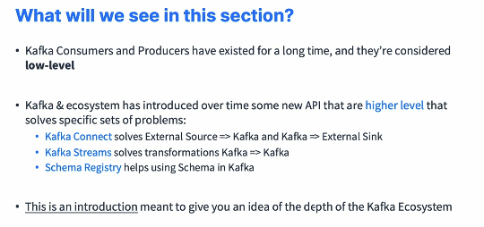

* If you want to do a transformation from a Kafka topic to another Kafka topic, instead of chaining a producer and consumer, you can just use Kafka streams. And the schema registry is helping using schemas in Apache Kafka. So this section is just an introduction, and it's meant to give you an idea of the depth of the Kafka ecosystem, and we'll see how we can leverage these components. So we will put in place this architecture where the Wikimedia data is going to be sent to Kafka using a source connector, the Kafka SSE Source Connector. We'll use Kafka streams to do a counter application and compute some statistics on top of our data sets. 

  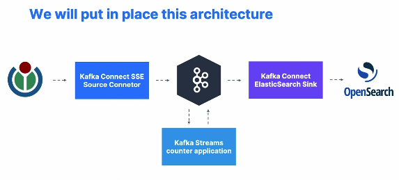

* And we will be using Kafka Connect ElasticSearch Sink to send data into OpenSearch. 

#### Kafka Connect Introduction

* So let's do an introduction to Kafka Connect. You think you're not the first person out there that is going to try to find a way to get data out of Twitter or Wikimedia or maybe you're not the first person in the world who's trying to send the data into a database, for example, from Kafka to PostgreSQL or ElasticSearch or MongoDB or OpenSearch or whatever you want. And the bugs you'll have, maybe someone else will have them as well and have them fixed before. 

  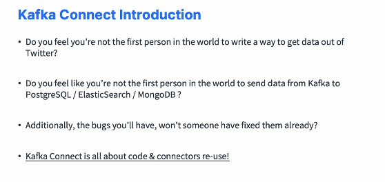

* So Kafka Connects comes in because it's all about reusing code and reusing connector to simplify your life. So why Kafka Connect? Well developers in the end they kind of want to import data always from the same sources. So databases, JDBC Couchbase GoldenGate. You can read them all here. Okay. And there's obviously a lot more. And programmers usually want to store data in the same targets, the same sinks. So S3, ElasticSearch, GFS, JDBC and so on. So this is where Kafka Connect comes in, where you use a source connector to get data from a source and a sink connector to send data into a sink. 

  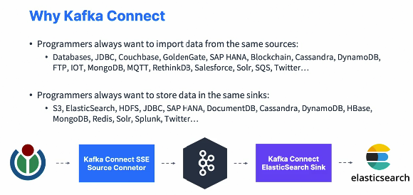

* Now the architecture looks like this, so we'll have a Kafka cluster made of brokers and topics and partitions. The sources can be diverse. It can be Twitter, Wikimedia, Postgres, MongoDB and we'll create a connect cluster made of workers. And these workers are going to take data from the source and send it into a Kafka cluster. The same connect workers can also be used to deploy sink connectors and create tasks for that where they're going to read data from a Kafka cluster and then send it to the sinks we want, for example, MySQL, ElasticSearch, Amazon S3, Redis, and so on. 

  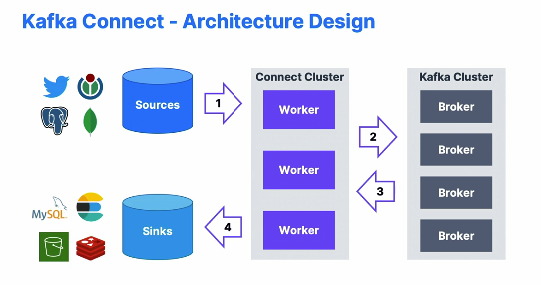

* So at a high level we're going to have Kafka Connect source Connectors to get data from common data sources, sink connectors to publish data in common data stores. And it's a very easy way, as you'll see in the demo, for non experienced devs, to quickly get the data reliably into Apache Kafka, it becomes part of your ETL pipeline, so extract, transform and load and scaling is made easy from small pipelines up to company wide pipelines by adding connect compute capability into your connect cluster and your tasks. So this is the idea that other programmers may already have a very good job of doing a connect connector. So it's reusable code and you should just leverage that. So don't try to implement your own connector. 

  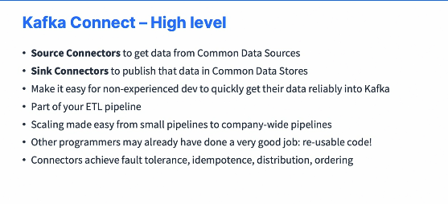

* Find first if there is a connector for you because these connectors on top of it, they achieve fault tolerance, they achieve idempotence distribution and ordering of the bat and for you that is, of course, something you may want to leverage. All right. That's it for an intro to Kafka Connect. 

#### Kafka Connect Wikimedia and Elasticsearch hands on

* We're going to have a look at Kafka Connect. So we will first run a Kafka Connect Wikimedia source connector that I programmed myself to take data from Wikimedia and insert it into Kafka. And then we'll run a connect ElasticSearch Sink Connector to send data into OpenSearch. Overall, there are more than 80 connectors available and I will show you the websites. This is a demo to show you how easy it is to get started, and then we'll download the Connect Wikimedia Source Connector at this URL. So let's get started. So I am on the confluent hub, and this is where you're going to find Kafka connector. 

  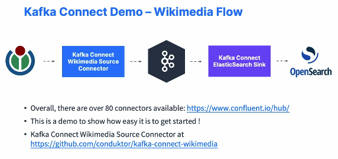

* So at the time of recording, we have over 212 Kafka connectors. You can really filter them by sink type source types and so on. And then for example, here is a Zendesk source connector, a Salesforce and so on. So we're looking for one called a Sink Connector. And this is the ElasticSearch Sink Connector, so I can click on it. And as you can see, I get straight into the download page for the ElasticSearch Sink Connector. So we get some installation information, some support information. What I need to do now is just download this using the download button and this downloads a zip file. The second thing you need to do is to go into conduckor/Kafka connect wikimedia and this is where we have I have written the code for the wikimedia Connector. And this what we'll do is they'll take data from Wikipedia into Kafka. So to run it very simple, you click on this link to download the jar. So we click here and we download the jar, which will be running to do the running of their Kafka connect cluster connector, sorry. And then under connector, you're also going to download wikimedia.properties. So take this file and then do a copy and paste. Or if you go to raw, you can do Control S and this will allow you to download the wikimedia.properties file. Okay. 

* https://www.confluent.io/hub/confluentinc/kafka-connect-elasticsearch

* https://github.com/conduktor/kafka-connect-wikimedia/releases

* Connect-standalone-properties

  ```properties
  key.converter=org.apache.kafka.connect.json.JsonConverter
  value.converter=org.apache.kafka.connect.json.JsonConverter
  key.converter.schemas.enable=true
  value.converter.schemas.enable=true
  offset.flush.interval.ms=10000
  
  # EDIT BELOW IF NEEDED
  bootstrap.servers=localhost:9092
  offset.storage.file.filename=/tmp/connect.offsets
  plugin.path=/Users/isasayar/kafka_2.13-3.5.1/connectors
  ```

* Wikimedia-properties

  ```properties
  name=wikimedia-source-connector
  tasks.max=1
  connector.class=io.conduktor.demos.kafka.connect.wikimedia.WikimediaConnector
  topic=wikimedia-recent-changesc
  url=https://stream.wikimedia.org/v2/stream/recentchange
  errors.tolerance=all
  errors.deadletterqueue.topic.name=wikimedia.connect.dlq
  ```

  ```sh
  connect-standalone config/connect-standalone.properties config/wikimedia.properties
  ```

* So we're good to go. Then what I have to do is to go into my Kafka installation directory in here and we have multiple folders and I'm going to create a folder called connectors. I will go. So now you can see the folder connectors has been created right here and I will go into the connectors folder. And currently there are no directories. So we'll create one called Kafka connect. wikimedia. And within this I'm going to copy the file that I've downloaded from before. So let me do this. I will copy the file. So it was in my downloads and you can do this using your finder if you want. And then it was the wikimedia. So Kafka connect wikimedia Jar and I will copy it here. So now if I look at it, my Kafka connect wikimedia jar is properly copied. I will also do the same for the Kafka Connect ElasticSearch. So first I need to unzip in my downloads the ElasticSearch folder. So it was called. if I remember correctly, let me check. It was called Kafka. connect confluent inc. Kafka Connect ElasticSearch 11.1.8. So I will unzip this. I have clear my stream. Now if I look at it, my folder has been unzipped correctly. I'm just going to rename it, so I'll do a move to rename this into Kafka Connect ElasticSearch. So within this Kafka Connect ElasticSearch now, if I look at it, I have the lib directory, which is the interesting one for me. And within this lib directory I have all the jars that are necessary to run this connector. Okay. So things are looking good here. I'm going to keep it like this. And so now I need to configure Kafka connect. So next I need to run these connectors. And so to do so, we're going to use in the binary folder this command called connect standalone, and it's something should be able to access. Okay. And then the connect standardalone command needs to be referring connect standalone properties. So weare going to create them. And if you are in the bin folder, you can do connect standalone.sh to get the exact same thing. Okay. So these connect standalone properties are in the code download section and I've created them under the config folder. So don't worry too much about the settings. I'm trying to keep things simple, but we're going to get data as of JSON. We connect to the localhost 9092 for the bootstrap server and then the plugins path is the most important thing you need to change. You need to edit this to be equal to the path of the connectors directory we just created. So if I go one level up into my connectors directory and do pwd, this is the current working directory that you need to copy and paste under plugins path. Okay. So once this is done you need to run the command and the command is outlined right here. So to do so I need to open a terminal. So I'm going to open a terminal right here just to figure out where my code is. So I'm going to clear this and then I'm going to do a pwd to get my terminal. That's perfect. I'm going to copy all of this into here. And then I'm going to go into the two Kafka extended directory and I'm good to go. So we have the config directory and with the config we get this connect standalone.properties. Okay. So the next thing you need to do is to look at this Wikimedia source connectors.properties file and it says that it references the conductor IO wikimedia connector that you just downloaded. The topic is Wikimedia recent change connect. So this is a new topic we'll create where we get data from the Wikimedia stream recent change stream and then we can just run it. So to run it, we go here, we copy this command. And it should work. So, by the way, just make sure that you're good. So this works, okay? And just make sure that you're good so that this file is here. If you get a file not found error, then this command for sure that I do above is going to fail. And it's really not easy to look into the logs of Kafka connect. So this is why I'm telling you to check this command first. Okay. So I'm going to clear this and I'm going to run this command. And this is starting a Kafka Connect cluster locally and is going to run my producer. So as you can see, the producer is now running and we have now run our first Kafka Connect source connector. So to verify this, I can go into my console, refresh this page and we can see the wiki media recent change connect topic, and I can click on it and look at the data in one of these, uh, the values. So if we have a look at it now, the payload is a little bit different because we have the schema type string optional file. So this is something that gets added by Kafka Connect and underneath payload we have a string of the entire JSON documents coming out of Wikipedia. So it's a slightly different thing that you're going to obtain with Kafka Connect, and this becomes extremely helpful when you use something like Avro, for example, as a schema or JSON as a schema, which we don't right now, which is why you see this kind of weird payload. But at least this shows you that Kafka Connect was able to take data from the Wikipedia stream and put it into your Apache Kafka. And what I had to do is I had to program myself the Kafka connector. But once programmed, you only had to do some configuration to do this kind of transformation, which is the whole power of Kafka Connect. And if you go now in the next step of this hands-on, so we're going to take the Wikipedia recent change topic that we created from before, not the one from connect, but the one from before. And we're going to put that topic into an Opensearch cluster. So I'm going to go back in here and I'm going to stop this and clear my screen. And now what I have to do is to go to Kafka Connect ElasticSearch. And we have again one other command. It's using the same connect standalone properties file, but this time the config is elasticsearch.properties. So if you have a look at it, we are using the connector class io dot confluence dot all the way to ElasticSearch Sink Connector. The topics we read from is Wikipedia recent change with the topic that we had created from before. Key ignore true, and then the connection URL is this one and the type is Kafka connect. So this only works with currently ElasticSearch OpenSearch on Docker because I configured it to do so. Bonsai doesn't currently work, but if there is a workaround I will show you in this video and edit this video. Okay. So we have this. We connect to a locally ready made OpenSearch and then we just have some more configuration for Kafka Connect. So what I do now is that I will run this command, so I will run this connect standalone and then I will paste it here. Press "Enter". And if the connector is loaded properly, this is good. So now we have this connector and it created the index Wikimedia dot recent change in OpenSearch and now it's actually sending data to it. So we can verify this by going under my consumer groups and find my connect ElasticSearch sink in here. And as you can see, the lag is already zero. So it was a much more efficient implementation of sending data from my Wikimedia topic into ElasticSearch using this connector, then writing my own, which is why it's always, I would say, better to use Kafka Connect because someone may have done a much better job at writing code to send data from Kafka to somewhere else, for example, OpenSearch. So all the data is now inserted into OpenSearch and we can verify it by doing a get query. So I'm going to just uncomment this and do a get query. So I go into my OpenSearch dashboard. So it's localhost and then 5601 and I go to Dev tools, I do a get of Wikimedia.recent change/search. And as you can see, yes, we are getting some data directly coming from our connector into OpenSearch. So it's pretty amazing. And once you get the hang of it, then it becomes very, very easy to manage. Kafka Connect and run connectors. So this was just an intro though, and I know this can be a lot, but I just wanted to show you a full flow. Of course, I have a full course dedicated to understanding and learning Kafka Connect, so it takes a few hours to actually master what I did, but hopefully you get the idea of connect.

#### Kafka Streams Introduction

* We're going to do a small and quick introduction into Kafka Streams. So we know that our Kafka cluster currently has a topic called wikimedia recentchange and we want to perform some computation on it in real time. For example, we want to count the number of times a change was created by a bot versus a human, or analyze the number of changes per website, for example, if it's ru.wikipedia.org or en.wikipedia.org Also, we want to know the number of edits on the 10 second slice as a time series. 

  

* So we could use for this a producer and a consumer and you can achieve it, but it's going to be very low level, not developer friendly and very not easy to do. Instead, we can use a Kafka Streams application. So Kafka Streams application is going to be reading from this topic. You can write your DSL, so we'll write some code for Kafka Streams application and then it will be outputting the stats for the bots, the stats for the websites and the stats for your time series. So it looks magical, right? But what is Kafka Streams? It's an easy data processing and transformation library that exists within Kafka. So you can do digital transformations, you can do data enrichment, you can do fraud detection, you can do monitoring and alerting pretty much anything you want. You write it as a standard Java application. 

  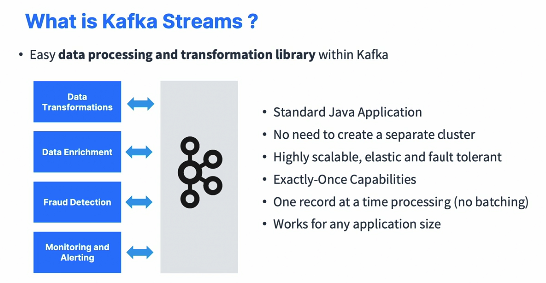

* You don't need to create a separate cluster to deploy the standard Java application. It's highly scalable, elastic and fault tolerance. Provides you exactly once transformation capability because it's a Kafka to Kafka workflow and it will leverage the transactional API and it's one record at a time processing. There is no batching. It works for any application size, and it's super easy to write. Now it takes a whole course to learn Kafka streams, but in the next lecture I will already wrote a Kafka Streams application that we're just going to run and observe its behavior. 

#### Kafka Streams Hands - On

* We're going to run a Kafka Stream application. So we know we have the Wikimedia recent change topic and the way it works that we have a Kafka producer that reads a stream from Wikimedia and sends it into this topic. Now we're going to run a Kafka Streams application alongside and this streams application is going to compute some statistics on this topic. It's going to compute if we have a bot or not a bot. It's going to compute the stats for each website and compute a time series of how many events we get per second. So let's get started and run this Kafka Streams application.  

  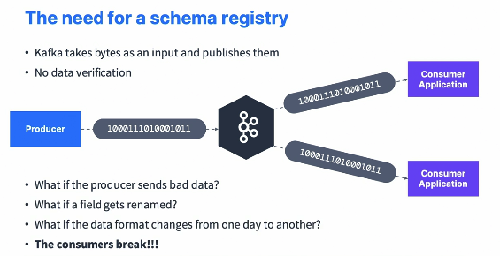

* So on the code course you have downloaded, there is a Kafka Streams wikimedia directory that I've created. And if you're going to build.gradle, we see that as a dependency, there is Kafka streams 3.1.0 that I've added. This is what's necessary to write a Kafka Streams application. If we look in the code, this is where events have a course, of course, dedicated to learning Kafka streams. But this is what a Kafka streams application look like. Okay. So we still need to configure Kafka stream, so we see the same kind of properties we've seen from before. And then what I do is that I create a topology, what's called topology. And then when the topology is done, I start it and run it. Now each topology is pretty complicated and this is why I've created processors. And so we have, for example, a topology for computing, whether or not something is a bot, we have a topology for counting events and we have a topology for doing the website counts. So these are quite complicated and I don't expect you to understand at all what these are doing, okay, because it requires a full course to do it, but the code is ready to be run. And what we're going to do in this lecture is just see the fact that, yes, there is some code for Kafka streams and we're going to run it. You click here and you run your Wikipedia streams processor and your Kafka Stream application is going to be processing all the historical data that you have. So you'll see a lot of log output, as you can see right here. And it's going through a lot of stuff as you can tell, and to make sure that it actually processes data in real time, what we should do is that we should also run our own wikipedia producer in the background as well in parallel, so that we know that everything is running in real time. So let's run the wikimedia change producer as well. Perfect. So now we know that data is being produced in real time as well and processed in real time by our streams application. So to verify the output, let's go into conductor and refresh this page. Now we see 13 topics and so we have a few output topics. So we have the Wikipedia stats bot which represents how many bots and non bots we see over time. So as you can see, we saw 9,000 bots and 20,000 non-bots and this will get updated over time. So I'm going to wait a little bit to get a new update here. And now, as you can see, the values have been updated for this topic. So this is good. We can go into another topic, for example, the time series topic. This gives you information into as we can look at the events, how many events we had in the last ten seconds. So we had 38 events in the last 10 seconds. And this is where the start time and the end time of my window. So this is what has been computed by my Kafka Streams application. As you can see, this changes over time. So we have 38, 245 and so on. So this gets updated as we go along with the time series computation. And finally, wikimedia Stats websites, which gives you some statistics around how many comments dot wikipedia.org we have. So 75 and then eo we have one, en we have 27 and so on. So this gives you the number of messages received per sub website of Wikipedia, which is very, very handy. And because this is the streams application, all the topics you see right here are what's called internal topics. They're topics created by our Kafka streams application to function correctly because it process data into Kafka, and you don't have to worry about too much the value of these. These are internal topics because they end with minus change log, minus repartition and so on. So that's it. We've run our first streams application. Now there's a whole course dedicated to understanding how that works. But to just finish this hands on, just make sure you stop the producer and just make sure you also stop the streams application. 

#### Kafka Schema Registry Introduction

* I'm going to show you what is the schema registry and why we need it. So Kafka is very efficient because it takes bytes as an input and then publishes them to consumers. Okay. So there is no data verification done. Your producer is just produces a series of zeros and ones and then your consumers read these zeros and ones. And then the producer to produce the zeros and ones, they will use a serializer and the consumer to consume them, they will use a deserializer. But what if the producer starts sending bad data, for example, a different format? Or what if it feels get renamed? What if the data format changes from one date to another? Then all consumers will break because they are not aware of this. 

  

* They expect a specific deserializer and then they will crash at runtime because while the deserializer is failing. That means you need a schema registry. We need data to be self describable. We want to be able to evolve data over time without breaking the downstream consumers. So we need schemas and a schema registry, and schemas describe how the data looks like. So what if the Kafka brokers themselves were verifying all the messages that received? It would break what Kafka what makes Kafka so good? Because Kafka doesn't even read or parse your data. So there is no CPU usage. It doesn't try to interpret it. It just takes bytes as an input without even loading them into memory. It's called zero Copy. So Kafka just takes in bytes and distributes bytes. And so as far as Kafka is concerned, it doesn't care if you have an integer, a string, whatever you want. Kafka just takes it in. So Kafka cannot do the guardrail of being a schema registry. 

  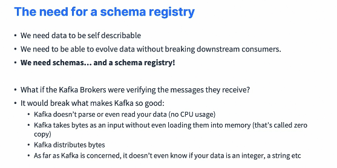

* So instead, the schema registry needs to be a separate component, and the producers and consumers will need to be able to talk to the schema registry. The schema registry should be able to reject bad data before it is sent to Kafka, and a common data format must be agreed upon by the schema registry so that data format needs to support schema. It needs to support schemas evolution to change the schema over time and it needs to be lightweight. So you have schema registry and then you have Apache Avro as the data format, but now you also have protobuf and JSON schemas also supported by the schema registry. 

  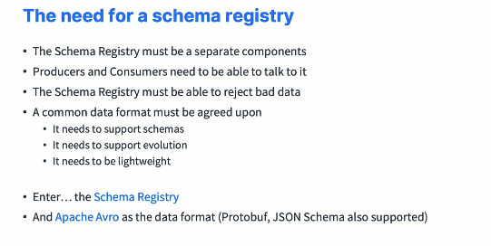

* So if you look at a pipeline without a schema registry, it looks like this. Source sends to producers sends to Kafka, sends the consumer sends to target. Here we don't have a concept of schemas. But if we have a schema registry, things will change. 

  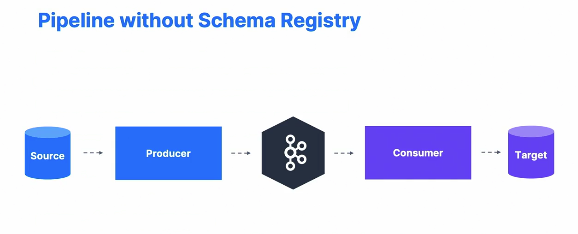

* So the schema registry will store the schemas for your producer and your consumer. It will be able to enforce backward, forward and full compatibility on topics if you want to evolve your schemas and you can decrease the size of the payload sent to Kafka. 

* So we have Kafka now and we have also a schema registry that is a separate components. Now the producer, before sending to Kafka, will send the schema in the schema registry if the schema is not yet inserted. Then the schema registry is going to validate the schema itself with Kafka. And then if all good, then the producer is going to send Avro data to Kafka. But the schema is externalized in the schema registry. Now, when a consumer reads data from Kafka, it's first going to receive Avro data and the deserializer will say, Well, you need a schema to read the data with. So the consumer is going to retrieve the schema from the schema registry. 

  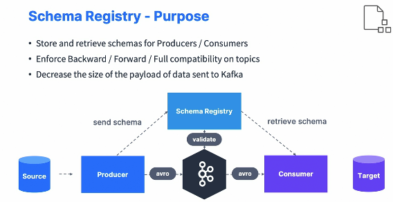

* The consumer can now produce your object and you can write to your target. So this one little optimization actually is very efficient and very useful. So using a schema registry has a lot of benefits, but it implies you to set it up well, make sure it's highly available because it becomes a critical component of your architecture. And then you need to, of course, change the producer and consumer code. But actually it becomes even easier to use them. Apache Avro as a format is awesome, but it has a learning curve and you can also learn alternatively protobuf or JSON schema, but nonetheless you have to learn something. 

  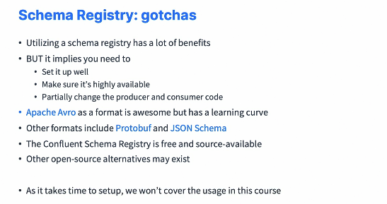

* The schema registry is distributed by Confluent, for example. It's free and source available and that means it's not open source, but the source is available, a little bit different. And there are other open source technologies that may exist out there in the world, but I don't have references here. Okay. Now it takes time to set up a schema registry and we don't cover the usage in this course of the schema registry, but we're still going to do a small demo. 

#### Kafka Schema Registry Hands-On

* We're going to start the schema registry and start using it. So using the Docker file we had from before, we can start Kafka and the schema registry and Conduktor configured properly. So once we'll be using the conductor platform, we'll be able to play with the schema registry. So we will create a schema and then we'll send data using a producer into Apache Kafka using that schema, and we'll consume the data using a consumer as well. So this is the type of architecture we'll be having and we'll be using the Avro type of data in our exercise and we'll look as well as schema evolution to see whether or not our producer or consumer can send and retrieve data from Kafka. 

  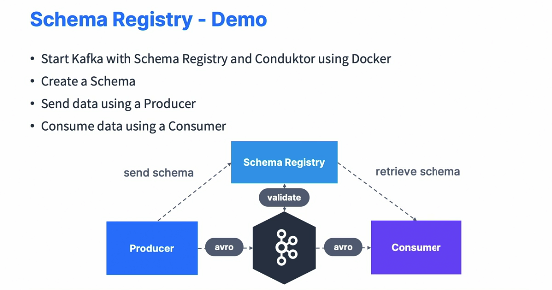

* So just as a reminder, under Conduktor platform and docker-compose.yml, you have started the services. If not, click on this button to make sure the services are running and you will have Zookeeper. Kafka is here and of course in the bottom we have the schema registry that we set up as well automatically. So it's way easier for you to get started. So then when you're on conduktor, you can go on the left on schema registry and this is where we'll be dealing with our schema. So currently we have zero schemas, but we'll be adding them very shortly. So let's first create a topic and this topic is going to be called demo schema registry. So we create this topic. And as you can see right here, there is no schema yet for this topic under the schema tab. So let's go in the schema registry and we're going to create a schema. So the type is going to be Avro and the strategy is going to be topic name. We're going to create a schema for the value of the topic. So we need to enter a topic name is going to be demo schema registry. And so the computer name is demo schema registry value. Here we have to copy the actual schema itself. So this is a called an Avro definition in JSON format. And so to enter our own definition, go into two Kafka extended, schema registry, schema V1 dot JSON. You copy this entire JSON and this is where we define our record called my record. So if you have a look in here, the name is my record, the type is record, and we have one field called F1, field one and the type is string. So this is defining how the data should look like in our Kafka topic. So let's create this. So we have created this demo schema registry value schema, and we have a summary of the schema itself and we have the structure in here saying that there is one field called F1 and the type is string as well as the format being Avro. So this is enough to get started. So back into our topic, I can refresh this page and as you can see now, the schema get populated for this topic and we have the schema we saw from before. So that means we can start producing data into our topic using that schema. So under the produce tab, just go and choose for value Avro schema registry and you can be very quick and do generate once to generate some fake data. Or you can also go to producer v1 dot JSON right here and copy and paste this value. So we have F1 of value, value one, which is a string. And if you try to produce right now this is working. The data has been produced and accepted because the schema of this get converted into Avro and it was compliant with the schema we have defined from before. But watch what happens if I try to send another value and it contains the field F2 and the value is value one. So we have changed the field name from F1 to F2. If I try to produce, I get a server error and it's saying that it cannot do it because it should be F1. And so that means that the data we are trying to send doesn't respect the schema we've defined for our topic. And so therefore it's going to be refused and we cannot send the data to Kafka. So it's a really nice safeguard. So it protects against field names but also against data type. So if I change from value 1 to 1, 2, 3 for example, to have an integer and try to produce again, we're going to get another error. It says that the field F1 is expected to be of type string, but we don't have the type string right now. We have the type integer. So again, we cannot send data to Kafka that does not respect the schema for the types as well. So the only way to do it is to actually send the field F1 with a value that is of type string. So value two and here it gets accepted. So now if we go under the consume tab, as you can see, the messages are consumed automatically and conductor is smart enough to know this was our format and to display it as a JSON document. But as you can see, the value is Avro and this was possible thanks to the schema registry. So something else we can do is to go under the schema three and we can make this schema evolve. So we have version one, but we're going to update it with a different value. So back in here we have schema V2 and I'm going to copy and paste this, but what we're doing here is that we're adding a second field named F2 of type integer and the default value is zero. So we have made our schema evolved because now we're defining new fields. So we can check the compatibility and it says success. Your schema is compatible because we're trying to make sure that any evolution of your schema is compatible so that the producers and the consumers can keep on reading and writing data. Okay. So let's update it now that the schema is compatible and now we are on version two. So back in here, if you look at the structure, we now have two different fields. We have F1 of type string and F2 of type int and on top of it, F2 has a default of zero. So now if I go back to my topic and I go and produce, as you can see, I'm still using the Avro schema, but now I can generate my data and we have F1 that's a string, so I'll have it as value one and f two is an int I'll have it as 1, 2, 3. Now if we do produce this, as you can see this works. So I can now add a field F2, and that's perfect. And if I don't have F2 as well, I just remove it. Let's see if that works. That works too, because F2 had a default of zero, so automatically the zero value will be added. So let's get convinced by this. So if you go under the consume tab and have a look at it, as you can see now, the F2 was added 1, 2, 3. But then when we did not specify F2, then the value zero automatically gets added because it is a default. And finally, if I try to enter F2, but to be a string for example, I'll just have it as 1, 2, 3, 4 but in a string with an A, B, C, D whatever, and I produce this, I'm going to get an error because while F2 is expected to be an integer. So we really see the power of the schema registry. There is a whole course around it as well. But this really is important when you want to have safety and make sure that your Kafka data follows a specific format and a specific schema. 

#### Which Kafka API should you Use ?

* Just a quick lecture to show you to conclude the section and find out which API is right for you. So let's take an example. If you have a source database and your data already is somewhere and you want to put it into Kafka, you would have to think about using Kafka Connect source. If you want to produce the data directly into Kafka, for example, because the data originates from your trucks and you want to send it directly into Kafka as your source of truth, then you would use a Kafka producer, which is what we've been programming. Then to do Kafka to Kafka transformations, you would use Kafka Streams, which is a library that we just saw, or ksqlDB, which is a database that allows you to do SQL queries on top of Kafka by also leveraging internally Kafka streams. Then if you wanted to send data into a target for storage and for analysis later on, then Kafka Connect Sink would be your main API. 

  

* But if you have for example, the final goal of just sending an email and then it just goes away, then a Kafka consumer would be a perfect API for you. And behind the scenes, obviously you would use something like a schema registry to make sure your data is correct and your data types are going to be accurate alongside your pipelines. 

* 