### Real-World Insights and Case Studies: Big Data and Fast Data

#### Choosing Partition Count and Replication Factor

* We're going to have a look at real world architectures and ask ourselves real world questions. So the first one is around choosing the partitions count and the replication factor. So to me, they are the two most important parameters when you create a topic because changing them over time or changing them has an impact on performance and durability. Here is a topic with two partitions and replication factor of two. What happens if you don't get the parameters right the first time? For example, if you have a partition count increase during a topic lifecycle, you will break your keys ordering guarantee, which is bad if you're using keys to send data into Apache Kafka. Also, if you increase the replication factor during a topic lifecycle, you're going to put more pressure on the system because you're going to have more network communication and more disk space use. Have a look. I'm adding one partition and one partition here because we just augmented the replication factor to three. 

  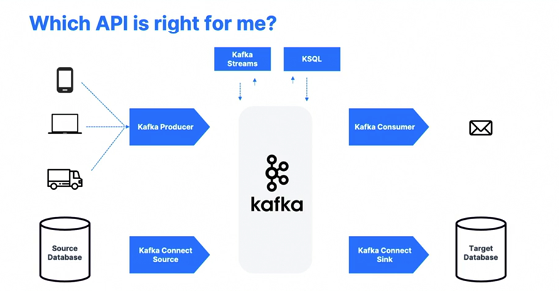

* And as you can see, well, more data space use and of course didn't represent it here, but more replication happening. So how do we get these numbers right from the get go? 

  

* So to choose the partition count, you have to figure out that each partition can handle a throughput of a few megabytes per second and you need to measure it for your setup. So if you have more partitions, that means you have better parallelism, better throughput. You can also run more consumers in a group to scale. Remember, you can only have a maximum number equal in the consumer group that are active equal to the number of partition in your topic. So high number of partitions means possibly a high number of consumers. You can also leverage more brokers if you have a very large cluster. But if you have more partitions, you are going to have more elections to perform in case a broker goes down using Zookeeper if using Zookeeper. And that problem is going to be solved by using Kafka on its own with craft mode. But also more files opened on Apache Kafka. So guidelines to choose the partition counts is to meet the million dollar question. And intuitively I would say if you have a small cluster of less than six brokers, then choose three times the number of brokers. If you have a big cluster, for example, over 12 brokers, then choose two times the number of broker. 

* Overall you need to adjust that number up if you need to know if you know, you need to have a lot of consumers within a group to be able to accommodate peak throughput in parallel. So of course, test it out, test it out and also adjust for producer throughput. So if your producer is very high throughput or is going to increase a lot in the next two years, then have more partitions from the get go. Overall test over time test. So each Kafka cluster is going to have different performance based on the machine you have. 

  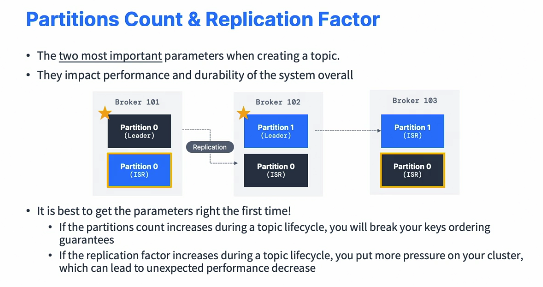

* So test, test, test, test and test. And overall, don't do the beginner's mistake of being like, okay, I'll just create topics with 1,000 partitions every time and I'm good, right? Don't do that. Find the right partitions number for your topic. Now for replication factor, it should be at least two in production, usually three in production and maximum of sometimes four. So the higher the replication factor, the better durability of your system because n minus one brokers can fail and your data will still be out there. 

  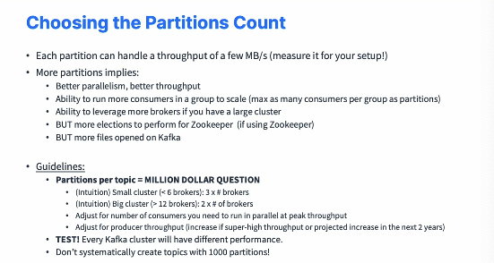

* Better availability for your system as well because you have N- min in-sync replicas as availability. If producer acks equals all, which is now the default with Kafka 3.0 and over. But the higher the replication factor, the more replication you have. And so higher latency if acks equals all because you wait for all the replicas to acknowledge the write. Also, if you add a replication factor, you're going to use more disk space on your system. So 50% more if you use a replication factor of three instead of two. 

  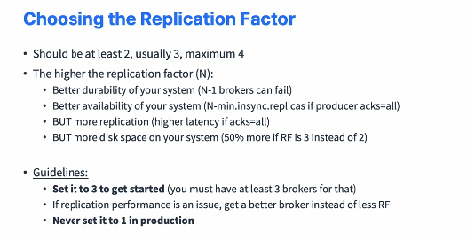

* But overall, it's easy to add disk space overall today. So guidelines is I would set it to three to get started. And for this you must at least have three brokers for that in production. But that is the baseline. And if replication performance is an issue, I would suggest to get a better broker instead of less replication factor. Never ever set it to one in production. That is one of the biggest mistake I see. Now from a Kafka cluster overall perspective, what is the guideline? The total number of partitions in your cluster should be a maximum of 200,000 partitions, which then hits the Zookeeper Scaling limits. It's still recommended to have up to 4,000 partitions per worker as a soft limit. That means that if you have 200,000 partitions in your cluster, you may have 50 brokers overall in your cluster. Now, when you use Kafka with craft, which is not yet production ready when I record this video but may become later on, the ideas that we've craft, we can potentially scale to millions of partitions in Kafka. And this is why craft mode was invented to go over the Zookeeper limits. 

  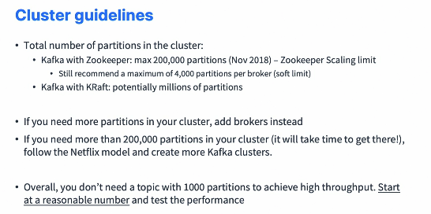

* So if you need more partitions in cluster, you add brokers, and if you need more than 200,000 partitions in your cluster and honestly, it's rare for you to get there, It will take you some time. Then you can follow the Netflix model in which they just create more cafe clusters that are going to be independent. Overall, as I said, don't do the beginner mistake of creating every topic with 1,000 partitions just to achieve quote unquote high throughput. Start at a reasonable number, test the performance and go from there. 

#### Kafka Topics Naming Convention

* So naming a topic is what I call free for all. You can do whatever you want, but it's better to enforce guidelines in your cluster to ease management. So you're free to come up with your own guideline and there's a very nice blog post that I'm going to describe here that describes how you can name topics and has some good recommendations. So from this link, you have the idea that you can do message type .dataset name, .data name, .data format. Message type could be, for example, logging, queueing, tracking, streaming, whatever you want, okay, push user you have different things. Then the data set name is similar to how you would name a database in a traditional RDBMS system. So it's used as a category to group topics together, and then the data name itself would be similar to what a table would be in a database. And it's fine to use dot annotation, but you can use whatever you want. You can have as many dots in your data sets as well if you wanted to have some kind of a hierarchy. And finally, for data format, it's my little addition. But you can say .avro, .json, .text, .protobuf, .csv, .log, which is going to be helpful, for example, for you to understand what type of format you have to deal with. And use snake case. 

  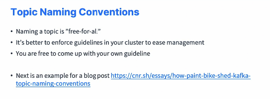

* So it would be message type with an underscore dot and then data set with an underscore dot and so on. Okay. So this is just a recommendation. You're free to come up with whatever you want, but this will be truly helpful if you start using security on Kafka because you need some kind of hierarchy or pattern recognition.

  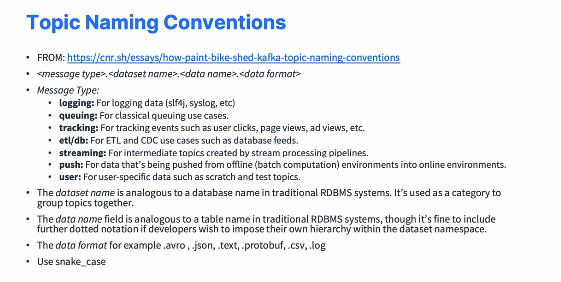

#### Case Study : MovieFlix

* So first case study for us is going to be for MovieFlix. And what is MovieFlix? Well, it's a company that allows you to watch TV shows and movies on demand. And the business comes to you and they want the following capabilities. They want to make sure the user can resume the video where they left it off. They want to build a user profile in real time. They recommend the next show to the user in real time. Store all the data in the analytics store. So my question to you is how would you implement this using Kafka? Now I want you to pause this video and just take some time with a sheet of paper to figure out what you need. Producers, consumers, Kafka Connect, Kafka Streams. Anything you think is useful, just put it on a sheet of paper. Take five minutes, then come back to this video and then I'll show you the response

* So I hope you've done it. Now let's get started. So we have Kafka in the middle. And first topic that I think should be interesting is show position. And so it basically is a topic that tells us how far the users have consumed a TV show, even within a video. So something needs to produce to that show position. So I'm thinking that there is a video player on people's browser and they're playing videos and while the video is playing once in a while it will send some data to something called the video position service. And it's kind of a proxy. And that thing is a producer and it will send the data it receives from the video players to Kafka to the show position. So the video position service, most likely we'll have to do some work to make sure that the data it receives is correct before sending it to Kafka. Okay. So from that well, to implement the resume capability, the resume service where we can have a resuming service. 

* So a consumer of that topic show position, which is going to have a database of how far basically each user for each show, how far they've been consuming. They don't need to know every consumption point. They just need to know the latest. So that's how I see my resuming service. And so basically when someone opens up their browser because they just start playing a video and they want to restart it two days later, then the video player does a request to the resuming service to say, Hey, where was the last time I read the video? And the resuming service says, Hey, this is it and this is it. So that's for the resume and storing position. Now we need to think about recommendations. So we have data from the show position about which user, which is which show and how far? So that's actually really good data because we know exactly which users what they like as far as shows. And if they go all the way to the end of the season for the show, well, they must have liked it. If not, if they stop it for five minutes and never get back to it, they must have hated it. 

  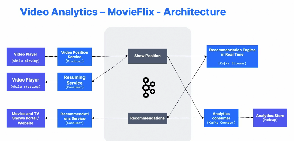

* So I'm thinking there could be a recommendation engine in real time that is maybe powered by Kafka streams that takes the show position, perform some really good algorithm on all these metrics, and then from there creates recommendations in real time. Now these recommendations are consumed by a recommendation service, and basically whenever I quit my video player and go back to those portal websites of MovieFlix, well, the recommendation service is going to say this TV show is the right one for you next. Just an idea, right? Finally, all this data is really good data and shouldn't stay in Kafka. So I'm thinking there should be an analytics consumer powered by maybe Kafka Connect to put this into an analytics store for further processing such as Hadoop. And so even that analytic store can actually power our recommendation engine in real time. I haven't drawn the arrow, but you can think of this. So this is an interesting Kafka architecture. Now let's have some comments about it. For the show position topic, it's a topic that can definitely have multiple producers. 

* All around the world people are going to watch my TV shows and so multiple producers will put data into that topic. To me, it should be highly distributed because there's going to be high volume, there's going to be some data sets every 20, 30 seconds. So I would say at least 30 partitions. But again, I would need to measure it before saying such a number. Now, if I were to choose a key, I would choose user ID for that topic. And the reason I would choose the user ID key is that I probably want all the data from my users to be in order. Okay. I don't really care about ordering across users, but I care about ordering for one user, so I would choose user ID as a partitioning key. Now for the recommendations topic, the Kafka streams job I say may source data from the analytical store for historical training or to train the model yeah, once in a while. And to me the recommendations topic is more of a low volume topic, right? 

  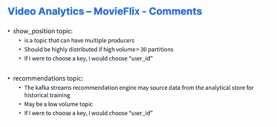

* There's not going to be as many recommendations. There's not going to be any recommendation in every 30 seconds. Definitely not. So if I were to choose a key, I would choose user ID as well and partitions, I would choose definitely less partitions than the show position topic. 

#### Case Study : Get Taxi

* So new case study and this time our company is GetTaxi, and GetTaxi is a company and it allows people to match with taxi drivers on demand right away. And the business comes to you and say, we want to build a business and we want the following capabilities. The user should match with a close by driver. The pricing should surge if the numbers of driver are low or the number of users is high, and all the position data before and during the trip should be stored in an analytics store so that the cost can be computed accurately and we have access to the data for whatever data science we need to do. So again, take some time to pause and figure out how you would implement this using Kafka. Got it? 

  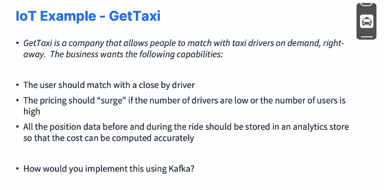

* So just a proposition of the architecture, but I'm thinking there should be a user position topic. And user position is a topic that contains all the user's position when they open their app and leave it open, because we need to know where the users are. Right. So here's my user application and it needs to get into Kafka. So we never connect applications, mobile phones directly to Kafka. We always use a service as a proxy. And so I'm thinking there should be a user position service receiving data from the user application, and that service is going to be a producer for our user position topic. So we get high volume of data here. Then there should be the taxi driver application. Similarly, that's going to produce a service to the taxi position, Kafka topic. So these two, these two feeds are going to be quite high volume, to be honest, probably even more volume from taxi than users, but very, very good volume and that shows to make them two separate topics because I think that a user and a taxi driver are very two different entities. 

  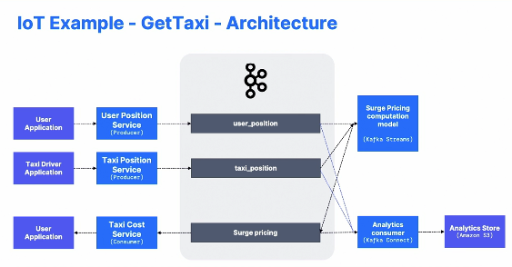

* Now what we're going to get out of it is the search pricing topic. And so for search pricing topic, we need to take user position and taxi position into account. So I'm thinking that we should have a search pricing computation model with simple or maybe complicated rules using Kafka Streams or Apache Spark if you want to. So this user position and taxi position will both be read by the Kafka streams application and it will output to one topic, which is search pricing. So something you note with Kafka streams is that it can take as many input topics as it wants and perform whatever computation on them. Now that we have a search pressing topic, we can definitely feed it, feed it back into the user application to give them a cost of the service or an estimated cost of the service. And for this, we'll create a taxi cost service, which is going to be a consumer of our search pricing. And finally, to make our data science super happy because they really want to get all this information as well into their analytics databases and stores to just do whatever they want. Then we'll should use maybe Kafka Connect and this time instead of Hadoop, maybe our analytics store is Amazon S3. So there is also a Kafka connector for doing this. So this is, this is a typical one. I think this one is different from the other one because we get a Kafka streams that reads from two topics, not just one. 

  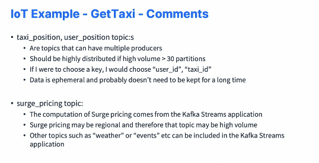

* But it is still a very interesting example and now a few comments. Taxi position and user position topics are topics that can have multiple producers. To me, they should be highly distributed, especially on high volume. Imagine how much there must be demand for Christmas or New Year's Eve, that kind of stuff. If I were to choose a key for the user position, I would choose user ID, and for the taxi position I would choose taxi ID because I definitely want to get my data for my users and my taxis in order. And data is quite ephemeral and probably doesn't need to be kept for a long time in Kafka. So I don't need a really, really long retention period. Okay. And that probably helps me because I don't need to store as much data in Kafka. Now the search pricing topic is something that comes from the Kafka Streams application, and it may be regional, and so that topic may be high volume, for example, and maybe other topics that were not represented before, but such as weather or events, they can definitely be included into the Kafka streams application for better accuracy and enhancement of our model. 

#### Case Study : MySocialMedia

* So a new case study for MysocialMedia and will use CQRS, which stands for Command Query Responsibility Segregation, which I think is an interesting model to know about. So MysocialMedia is a company and it allows people to post images and others to react by using likes and comments. So just, you know, a social media websites and the business wants the follow in capability. The user should be able to post, like, and comment and the user should be able to see the total number of likes and comments per post in real time. And there is a high volume of data to be expected because we're going to launch on day one and we need to have crazy high throughput. Now the user should also be able to see trending posts. So there's a lot of requirements, right? How would you do this in Kafka? 

* So think about it for a minute. Get to the drawing board and get back to this video. Okay. So let's have a look at a possible architecture using CQRS. So we have three topics that I think are going to be necessary in Kafka, posts, likes, and comments and post is going to be its own topic, lights its own topic and comment, its own topic. And that's just a decision that I'm making as an architect. So I need to get the user post. So the user is going to create some post and it's going to be a posting service. So maybe it's going to add some tags, some links, who knows, some hashtags. And so this posting service on its own will basically create and send all the data when validated to the post topic. Now for my likes and my comments, there's going to be a user likes and comments service and it's going to be a producer as well. And so the users are going to like in comments and this will basically send data to my likes and my comments topic. 

* And I could have made it the same topic, but I think the data is different enough to have it for two topics. It's up to you. But here we have an example of a producer that produces to two different topics. Now what we want at the end is a post with counts of likes and comments, but we have to realize that the data comes from all over, right? And it could be multiple people liking at the same time or commenting at the same time. And so if we were doing this against a traditional database, the database would be swamped and there would be some race conditions, et cetera, et cetera. So using Kafka, we're able to decouple the production of data to the actual aggregation of data. And for this we'll use Kafka Streams. So Kafka Streams will basically read the data from the post, the likes, the comments topic, and it will perform some aggregations, such as how many likes for my posts, that kind of stuff, and put this into the post with counts topic. Now similarly, if we want training posts, for example, I know which ones are going to be, you know, very liked and very commented. 

  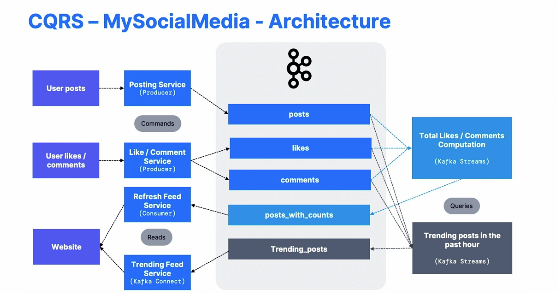

* Well, we could have a new application, a new basically a new query using Kafka Streams that figures out the training post in the past hour. So it may be the post with the most likes or the most comments or a combination of both, and output this with a trending post. And so these are going to be consumed by what I call a refresh feed service, which is a consumer and a trending feed, which is also a consumer, could be consumer, could be Kafka Connect, Sink, could be whatever you want. And finally put this into our website so that the user can see it. So why is it called CQRS? Well, here on the left hand side, we have the commentss. Comments are basically saying user does this, user likes a comment, that kind of stuff. And on the right hand side we have the queries and they're very different from the comments. They're basically decoupled. And that decoupling is what makes this solution architecture scalable for a lot of users. Finally, on the left hand side, once we have figure out the queries results, we're free to read it any way we want and to whatever store want. And so the website really reads from a decoupled read store as well. And so even if there is a high like or high comments pressure on the website, the read store itself is just fine. Okay. Now a few comments. This is CQRS two minutes. So this is obviously not enough, but it's a give you a small introduction to it. And because the responsibilities are segregated, we can call this CQRS. Now for the post topic, we can see that it can have multiple producer to mutually be highly distributed. If I were to choose a key, I would choose user ID because I definitely want to get my post by user ID in order and I want to get probably high retention of data for this topic. For likes and comments, to me, their topics with multiple producers and their should be highly distributed because the data volume is going to be much greater than the post. So maybe 100 partitions, you know, if it's a big social website because there's such important feed. And if I were to choose a key this time, I would choose post ID. And the reason I choose post idea and not user ID is that I kind of want to have all the likes and all the comments for each post to be in the same partition. That will help my Kafka streams application to make the aggregation properly. And finally, just to comment the data in Kafka when it's produced, it should be formatted as events to make things easy. 

  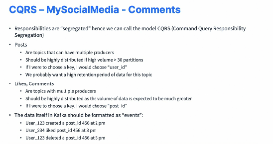

* So an event, what is it is basically saying user 123 created a post ID 456 at 2 p.m. That's an event. And obviously you need to have more information will contain the post et cetera. et cetera. Then liked a post and deleted a post. So basically it's an event and it should describe what happened. So let's say small introduction into CQRS. But Kafka does help into creating these kind of architectures and solving these problems.

#### Case Study : MyBank

* And MyBank is a digital bank that allows real time baking for its users. And it wants to deploy a brand new capability to give users alerts in real time in case there is a very large transaction that happened and it's probably a fraud, right? So the transaction data already exists in one of the databases. It's a SQL database and it's already there. The thresholds can be defined by the users through their apps, they can be changed at any time. And obviously the application should react to it right away. And alerts must obviously be sent in real time to the users. If they're sent with a bit of delay, the users can't take action fast enough and people lose money. So how would we implement this in Kafka? 

  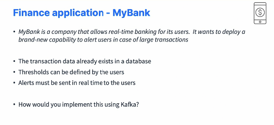

* I'm thinking there must be a bank transactions topic, that's for sure. Right. But someone told me that all the bank transactions is already in a database, an SQL database. So what I really want is to get that information from the database into Kafka. And for this, I'm going to use Kafka Connect Source. And there is something called the CDC Connector, which stands for Change Data Capture. And one of those is called Debezium, and you can look at it on Google, which basically allows us to read all the transactions in real time from the database and put them right away in Kafka in some very, very nice formats. So these Kafka Connect source connectors are super powerful. And this is why I wanted to have this example to just show you that sometimes you don't have to write a producer. Sometimes you can use Kafka Connect source and get a lot with little work. Now additionally I want to user settings topic and so the users will set the thresholds in the apps. Something they should be talking to an app threshold service which is going to be a proxy producer which sends data to the user settings topic. Now we need to create a user alerts topic as a result, right? 

  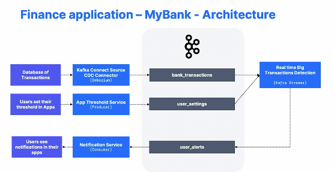

* And so I'm thinking a Kafka streams application that takes all the bank transactions and the user settings and does a little match, you know, is the transaction greater than the user threshold? If so, create a message in the user alerts topic and send that to the user. Now to send it to the user, I'm thinking of small consumer notification service, and then the consumer will basically trigger a notification in the user's apps. So that's that's an easy architecture, I think. But what I really wanted to draw your attention on is Kafka Connect, the fact we're using source CDC connectors such as Debezium. Now, a few comment for the bank transaction topic, as I said, connect which is awesome and there's a ton of CDC connectors out there on the market for Kafka Connect. There's Postgres, Oracle, MySQL, SQL Server, MongoDB and others. Probably I don't have the exhaustive list, so you may find a very easy way for you to expose all your data already in your company in Kafka very, very quickly. 

  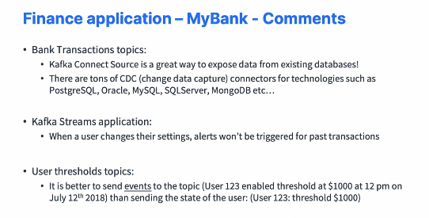

* the Kafka streams application. Basically, when a user changed their setting, the alerts won't be triggered for past transactions because we only read from the new transactions onwards. And for the user threshold topic, I would think it's better to send events to the topic than sending states. So for example, user 123 enabled threshold at $1,000 at 12 p.m. on July 12th versus just user 123 threshold 1000, which is a bit more stateful and just assumes that we won't need that information in the future, which I think is wrong. Okay. So in your events, put as much information as you can. But the big attention right here is on CDC and lots of capability here. 

#### Case Study:  Big Data Ingestion

* So Kafka historically was created to do big data ingestion. So it's a very common in the old days to have generic connectors that will take data and put it into Kafka and then from Kafka to offload it into HDFS, Amazon S3 or ElasticSearch, for example. So Kafka can serve a double purpose. In that case, it can be a speed layer for your real time applications while having a slow layer that will have applications extract in a batch manner in data stores that are going to be helpful, for example, HDFS and S3 when you want to do analytics. So Kafka as a front to big data is a very common pattern in the big data world, and it's also used as an ingestion buffers in front of other stores if you need some kind of buffer. 

  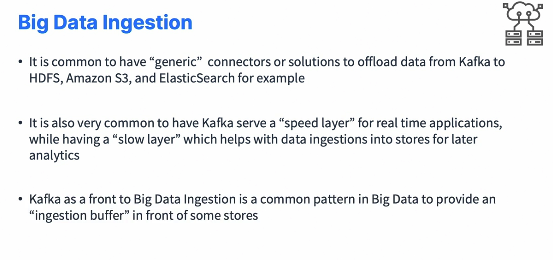

* So this is the architecture you would strive for. So you have your data producers could be any kind of data within your company that sends data into Kafka. There you would have a speed layer, so it could be your Kafka consumer, but also big data frameworks such as Spark, Storm, Flink, et cetera, et cetera, that will allow you to perform real time analytics, create dashboards and alerts, apps and consumers. 

  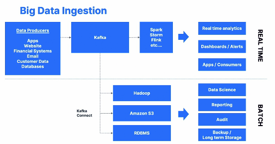 

* But then that's if you don't want to do stuff in real time, but you want to analyze things in batch, then you could have Kafka Connect or a cafe consumer to take all your data from Kafka and send it to Hadoop or HDFS, Amazon S3 or an RDBMS database or Elasticsearch or whatever you want. This way, on top of it, you can perform data science, reporting, audits or just for backup and long term storage. So these are very common patterns with Kafka, and I just want to show you that it exists and it is a common architecture. 

#### Case Study : Logging and Metrics

* So one of the first use cases of Apache Kafka was to do logging and metrics application. So all these applications will send it into Kafka. And then in this kind of deployment, we usually want like high throughput and you have less restriction regarding data loss or replication of data. And so this is why you used to have like acks equals zero and lower replication factor and so on. 

  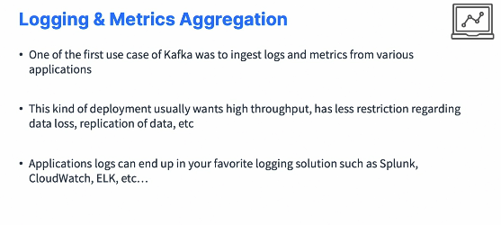

* So then from the logging metrics aggregation, then you're going to send your data into your favorite logging solution, such as Splunk, CloudWatch, the ELK stack and so on. So the architecture is simple. It looks like this. 

* You have Kafka in the middle and you will create, for example, topics for your application logs and other topics for your metrics. Then your application would have some kind of log forwarder, which is a producer that will send all the logs into Apache Kafka. And so this is a very high throughput type of producer. And then you also have metrics collectors. This is also some kind of producer that will be sending all the metrics data into your application metrics topic. 

  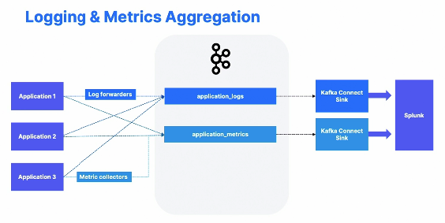

* From there you would have, for example, Splunk and you use Kafka Connect Sink to send data from the logs topic and the metrics topic into Splunk. A very simple architecture, but you have to see it once.