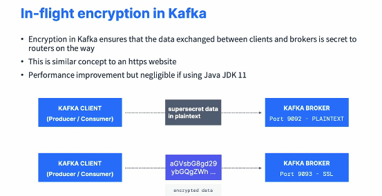

### Kafka in the Enterprise for Admins

#### Kafka Cluster Setup High-Level Architecture Overview

* I'm going to describe you how Kafka is used in the enterprise as Kafka administrators. So this is just an introduction and I think each content is its own course. So talking about a course, I have a course dedicated to you the Kafka cluster setup, but I'll give you a high level overview of how it works. So you want brokers in multiple data centers also called racks in order to distribute your load and make sure you are not centralizing your failure points. You also want to use a cluster of at least three Zookeeper if you're using Zookeeper. So this is a classic Kafka setup in AWS where we have three availability zones. So US Eat 1A, US East 1B and US East 1C, and then in each AZ we have one Zookeeper and two Kafka brokers. So this is a cluster with three Zookeeper and six brokers. Now the Zookeeper is our helped, our helping just to manage the Kafka brokers. But you can have more than six Kafka brokers if you want to. 

  

* Usually if you were to add Kafka brokers into the setup, you would add them three at a time. So when you set up a cluster, there are things you need to know. First of all, it's very not easy to set up a cluster because it requires a lot of synchronization, some DNS management, some sizing, some failure and backups and so on. So it's difficult and this is why a full course is dedicated to it. You also want to make sure that Zookeeper and each broker are on separate servers. Otherwise, if they're linked, you could like again, entangle your failures. But setting up is not everything. You also need to implement monitoring and you need to master Kafka operations. So you need to have an excellent Kafka admin or to be an excellent Kafka admin to set up Kafka cluster and manage it along over time. And so this is why you have a lot of Kafka as a service offerings out there from various companies such as MSK, Confluent Cloud, Alven, CloudKarafka, Instacluster, Upstashr and so on, because these give you no operational burden because the updates, the monitoring, the setup, all of that is done for you and you just have to use Kafka. So how many brokers you have in your cluster?  

  

* But you need to compute your throughput data retention and replication factor and then test for your use case. And the good thing is that if you need more brokers over time, it's very easy to add brokers in your Kafka cluster. But Kafka brokers are not the only thing you'll have to set up on your cluster. You need to set up Kafka Connect Cluster, the schema registry to make sure that atleast you have two for high availability. You need to have UI tools for ease of administration, for example, conduktor or admin tools for automated workflows. 

  

* And then overall, your entire infrastructure should be as automated as possible so that you've understood how processes work and you simplify the task on your end. So it's quite a bit of work to set up a Kafka Cluster as you can see.

#### Kafka Monitoring and Operations

* So once you have set up a Kafka cluster, you need to enable monitoring and also master operations. So first let's talk about monitoring. So Kafka is exposing all the Kafka metrics through JMX, which is an interface to get these metrics. And these metrics are very, very important to monitor Kafka and to ensure that your brokers are behaving correctly on their load, because sometimes you can have issues and so the metrics will help you understand what part of Kafka is failing. And so there are common places to host your Kafka metrics. For example, it could be the ELK stack, such as ElasticSearch and Kibana or Datadog, NewRelic, Confluent Control Center, Prometheus and many others. 

  

* So Kafka monitoring overall have some very important metrics. And this is just a sampler. There is a lot more than what I'm giving you right now, but to give you an idea of some metrics that are important. So the first one is URP or under replicated partitions, which are the number of partitions that have problem with the ISR. And so the partitions that are not in sync. So if you have a lot of URPs that may indicate a very high load on the system, which is why it's good to monitor it. Also you have request handlers, so it gives you utilizations for threads for the IO operations, the network and so on, and gives you metrics into the overall translation of a Kafka broker. And if that metric is too high, then may mean that you need a better broker or more brokers. 

  

* Also, you have request timing, which is how long it takes to reply to the request. And obviously lower is better because latency will be improved. And again, you have metrics to monitor all of that. Monitoring is a big subject and I have a whole course dedicated to Kafka monitoring and operations. 

  

* But there are some references you can find here in the documentation that gives you some pointers into how you can set up monitoring for your Kafka cluster. Next, you have to master Kafka operations. So whatever operations you have, you must be able to perform the following tasks. So rolling restart of your brokers, updating configurations for your topics and your brokers. Rebalancing the partitions all across your cluster increase or decreasing the replication factor of a topic. 

  

* Adding a broker, replacing a broker, removing a broker, and also upgrading a Kafka cluster with zero downtime. So it's important to know how to do all of these because once you have your own cluster, you will at some point have to do these kind of operations. And again, this is something I teach directly in a specific course that I think is like 4 to 5 hours. Okay. So hopefully that gives you a good overview again, into what comes in as a Kafka admin once Kafka is set up. So you have to perform operations and also enable monitoring.

#### Kafka Security

* So I'm going to just give you an intro to Kafka security again. It takes a whole course to really dig deep into it, but I want to give you a high level overview which explains the need for security. So the way we have Kafka set up is that currently any client can access your Kafka cluster, so that means we have no authentication. Then any clients can publish and consume on any topic data. That means we have no authorization and all the data that is transmitted between your clients and Apache Kafka is going to be non-encrypted. It's going to be fully visible on the network. So we have no encryption. So that means that the risk of running Kafka as is on plaintext 9092 is that someone can intercept the data being sent, someone could publish bad data or even steal data from your Kafka cluster, and someone, for example, could delete topics. So all these reasons is that as soon as you have a Kafka cluster in production, you need to have some level of security as well as an authentication model. So first let's tackle encryption. 

  

* So encryption in Kafka ensures that the data exchanged between clients and brokers is going to remain secrets to any routers on the way. This is very similar to when you connect to an https website. You ensure that your communication is encrypted and therefore, for example, you can pass in sensitive information to the websites such as your username, your password or your credit card details. So the way it works is that right now our Kafka clients, when they produce or consume to our Kafka brokers, they're going to send data over the network and it's going to be plaintext. That means no encryption. So if you pass in super secret data, then anyone can read it. But if you enable encryption, for example, SSL based encryption and you declare a new port for that, for example port 9093, then the Kafka client and the Kafka brokers are going to agree on an encryption scheme and then send encrypted data to each other, which guarantees the safety of your data on the flights. And so there is a performance cost, of course, to enabling encryption. 

  

* But if you're using Java JDK 11, then it becomes negligible because the SSL implementations in Java got a whole lot better. So once we have encryption, we need to set up authentication and this is either SSL based authentication or SASL. So when you are dedicated in Kafka, that ensures that the clients can prove their identity when connecting to your Kafka cluster and so the Kafka cluster knows who the clients are. This is very similar to when you go to your website and you have a login, for example, username password. And so the website knows that you're you. So the way it works is that Kafka clients will be sending authentication data in encrypted form, usually because this goes hand-in-hand with SSL encryption into a Kafka broker. The Kafka broker will verify the authentication and then if all good, the client is authenticated and will have an identity with the Kafka broker. So multiple forms of authentication, as I said, the first one is SSL authentication, where the clients authenticate to Kafka using SSL certificates, and we have other mechanisms such as SASL plaintext, where the clients will authenticate using username and password. 

  

* It's weak, but it's easy to set up and you must enable SSL encryption broker side as well to make sure that everything is encrypted along the way. And if you want to change the passwords of your clients, it requires a broker reboot. So it's good for development only. Then you have SSL SCRAM. So again, it's username and password, but there's a challenge with the salt. It's considered way more secure. Again, we need to enable SSL encryption and the authentication data is in Zookeeper until Zookeeper gets actually removed. And so that means you can add and remove users without restarting your Kafka brokers. We have Kerberos, SASL GSSAPI, so this is very common if you're using something like Microsoft Active Directory in house. So it's a strong type of security, but it's very hard to set up. It's very secure and more towards enterprises who already have Kerberos in house and want to integrate Kafka with it. But for having done Kerberos myself, I can tell you it is very difficult. Finally, we have SASL OAUTHBEARER, which is to leverage OAUTH2 tokens for authentication and you need to refer to the Kafka documentation for a bit more information on this. 

  

* So next, once our client is authenticated into Kafka, Kafka knows its identity, and so we can combine it with authorization so that Kafka knows which client can do what. So ACLs, Access control list are maintained by Kafka administrators to onboard new users and application. So let's take an example of a Kafka cluster with two topics. We have the topic finance and the topic trucks, and we have Alice and Bob. So Alice has an ACL that allows her to access the topic finance, whereas Bob as an ACL that denies him to access the topic trucks. So we can have sensitive topics and we can control who can access what, which is of course what we need when we talk about security. 

  

* So if you put it all together, we have a mix of encryption authentication and authorization to allow your clients to communicate securely to Kafka through encrypted communication, to authenticate against Kafka and finally Kafka to authorize clients to read and write two specific topics. Overall, it's difficult to set up security in Kafka. It requires significant understanding of security and a whole course dedicated to understanding what these settings are and how to use these commands

   

* And if you were to use a Kafka as a service, then the security would already be set up and they would give you instructions on how to leverage security. The best support for Kafka security is with the Java clients. Although now new clients for other languages over time have matured and many of them support Kafka security. 

#### Kafka Multi-Cluster and MirrorMaker

* So we know that Kafka operates well, but only within a single region. And so if you're an enterprise that has data all over the world, it is very common to have Kafka clusters all across the world, and you will set up some level of replication between them. So here's a map of the world and you would have different Kafka clusters of different sizes in different regions. And then what you would do is that you have your applications locally talking to these clusters, but you would set up some level of replication between the cluster. It can be both ways or one way. So a replication at its core is just a consumer and a producer and there are different tools to perform replication. 

  

* So the most used one now is going to be Mirror Maker 2, which is an open source Kafka Connector that ships with Apache Kafka and allows you to replicate data between one cluster to another. Netflix internally uses Flink, as far as I know, and their own application. Uber wrote something called uReplicator, which addresses some performance issues with the previous version of Mirror Maker. So Mirror Maker 1, not Mirror Maker 2. Comcast has their own open source, Kafka Connect source, which is, I think, how Mirror Maker 2 came to be and then Confluent have their own Kafka Connect source as well. But it is a paid offering as part of their license. 

  

* Overall, I would start with trying Mirror maker 2 and then if it works for you, is great and you should otherwise try them all. And if really last resort, then write your own. But it's quite a difficult thing. Also, replication doesn't necessarily preserve offsets. There are some settings sometimes to preserve assets, but usually replication just preserve data. So that means that you have to be very careful. Data at an offset in one cluster may not necessarily be the same at data at an offset in another cluster. So let's talk about active active replication. So that means we have two Kafka clusters and producers and consumers are operating locally and so that means that both Kafka clusters can be written to. And that means we can set up two way replication between my clusters. And this is why it's called an active, active replication, because we can write to both clusters. 

  

* So the advantages of this architecture are the ability to serve users from a nearby data center, which has typical performance benefits. Also, you can produce from anywhere. It gives you redundancy and resilience. That means that because every data center has the same functionality, then if one data center becomes unavailable, your producers could produce to another Kafka cluster with a bit more latency, but still the ability to write to a Kafka cluster. The disadvantage is that you need to avoid conflicts in data reads. And because while data is synchronous both ways, you may have some asynchronous things happening in your application, so be careful. The other way to do replication is active passive. 

  

* That means that your producers are actually producing to the active Kafka cluster and then that cluster is being replicated to another Kafka cluster. This is called the passive Kafka cluster because it cannot be written to. So the advantages of this architecture is that it's simpler to set up because you can just have one main Kafka cluster and then replicate it everywhere you want. And then you don't need to worry about access to data, handling conflicts and topics and other complexities. It's good for cloud migrations as well to just replicate an entire cluster into the cloud. You can also read have consumers read from local Kafka clusters, so that means you have enhanced network costs and enhanced latency. 

  

* This advantage is that, well, you can have a waste of a good cluster because one cluster is only used for reads and not for writes. But even though the other cluster obviously is replicating into it. And so there is some write still happening into that cluster. And also in case you have like an issue with the main cluster, you may have a problem in terms of failover without losing data or having duplicates events. So just something to be mindful of. And then there are some resources to understand replication. So I'll link all these links, okay, in the resource section of this course, which is going to give you some information into what can be done, what is the best in class and some literature and so on to really do replication well. 

#### Advertised Listeners : Kafka Client and Server Communication Protocol

* We're going to understand communications between the clients and Kafka by looking at one very, very important setting called advertised listener. So let's take an example and I will explain to you how that works. So in the real setting, obviously your clients and your Kafka broker are on different machines and your Kafka broker has a public IP maybe, it has a private IP for sure. And then you set up something called the advertised listener that are just set up as advertised host here to make it simpler. So when the client connects to Kafka, for example, using the public IP because the Kafka broker has a public in my example, then the Kafka client can access the broker, of course, but then the broker will reply. 

  

* if you want to keep on communicating with me, you need to use my advertised hostname. And if you look at this example, well, the advertised hostname is one 172.31 .9.1 and the Kafka broker says you have to use this advertise host, you cannot use the public IP you just connected with. So the client okay is going to say, okay, I'm going to try to connect using one 172.31.9.1 now. And so if the client is on the same private network as your Kafka broker, this is great. Otherwise, if it's not on the same network, it cannot find the IP and it will not work. And this addresses the most common failure or mistakes people have, they make a Kafka broker public but the advertised host is set to a private address and they say, Well, I cannot connect from my client to my broker. It doesn't work, even though the broker is accessible from a network perspective. So if you understand this diagram, you will understand your mistake. So what if I put localhost? It works on my machine. So if you have the same example but now advertise the host is called localhost, then we have the same process. So we connect using the public IP. Then the broker says you have to use my advertise hostname and its localhost. You have to use it. Now the Kafka client is going to try to use localhost, which happens to be the same machine the Kafka client is. 

  

* And so of course if the Kafka client is on the same machine as the broker, it works, but usually it's not. And so therefore you will get a connection issue. So what if you use the public IP instead as your advertise host? So this works. Your Kafka broker has a public IP and the private IP and the advertised host is set to the public IP. So in this case, the connection, the connection dense is going to say, Hey, you need to use my advertise hostname, my advertise hostname is the public IP. And because this is the same public IP we've been using to connect to our Kafka broker, this works great. But sometimes you will stop and start your Kafka machine and the public IP will change. 

  

* For example, instead of being 0.90, it will become .12. And so therefore what happens? Well, if the public IP has changed but we haven't changed the advertise host, we still connect to the broker using the public IP, but then the broker says you need to use my advertise hostname and it gives you the old IP for this. And so the client, when trying to connect to the old IP, of course cannot find a network route to the Kafka server and things fail. So this setting advertised listener is super important to understand. 

  

* So if your clients are on a private network, you either set the internal private IP of your broker or your internal private DNS host name of your broker, and then only clients on the same private network can access your brokers. You will not be able to access your broker over a public network. 

  

* If your clients are on the public network, you either set the external public IP or the external hostname pointing to the public IP, and then the clients must be able to resolve these hostnames and they will be able to connect to your cluster. But now you need to be aware of that the cluster is going to be publicly accessible, which can be based on your enterprise, a security risk. 