### Advanced Topics Configurations

#### Changing a Topic Configuration

* So the brokers, they come with defaults for all the topic configuration parameters and these parameters will impact the performance as well as your topic behavior. And so therefore, for some topics you may need to set a different values for these configurations than the defaults coming with the brokers. So it could be a different replication factor, a different number of partition, message styles, compression level, log cleanup policy, min insync replicas as well as other configurations. So a list of all the Kafka configurations for your topics can be found here on this URL. And so in this lecture I'm going to show you how to set a topic configuration. We will be setting the min insync replicas to 2 to 4 one of our topics. So to set a topic configuration, let's first create a topic. So we'll do a create, we'll set up will pass in the bootstrap server to be localhost 9092. We'll have a topic, I'll call this one configure topic, we'll set a replication factor of one and we'll give it three partitions. 

  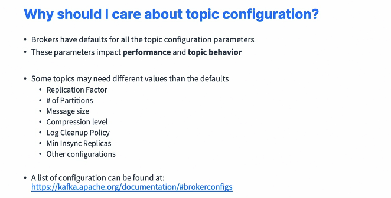

* So my topic is now created. Next, what I have to do is to check whether or not that topic already has some existing configuration. So I can use the same command. I'm going to remove the create. I don't need the replication factor and I don't need the number of partitions and then I'll just do a minus minus describe on it. And when we describe a topic, we get some information on the topic name, the topic ID, the partitions count, the replication factor and the configs and the config currently are empty. So we are going to add a config to our topic and see what happens. So for this we have a command called the Kafka config command and you can have a look at all the documentation right here, okay, of that config. 

  ```sh
  kafka-topics --create --bootstrap-server localhost:9092 --topic configured-topic --replication-factor 1 --partitions 3
  kafka-configs --bootstrap-server localhost:9092 --entity-type topics --entity-name configured-topic --alter --add-config min.insync.replicas=2
  kafka-configs --bootstrap-server localhost:9092 --entity-type topics --entity-name configured-topic --describe
  kafka-configs --bootstrap-server localhost:9092 --entity-type topics --entity-name configured-topic --alter --delete-config min.insync.replicas
  ```

* But as you can see, Kafka configs allows you to add a config. And if you look at all these okay, for entity of type topics, we have all these configurations right here and we can even set up a configuration for our brokers and we have all these rights here. So as you can see, it is a lot of configurations and we have type users, type clients, type IPS and so on. Okay. So I will not go over the documentation for you. I'll just show you how to use it. So first we need to pass in a bootstrap server, which is localhost 9092 and then an entity type. So we are trying to configure a topic. So let's pass in topics. Then an entity name, and this is the name of the topic we're trying to configure. So this one is called Configured topic. So let's press enter. And it doesn't work well because we need to actually provide more information. So we need to either describe the configuration alter it. So if we do minus, minus describe. As we can see, we have currently zero dynamic configuration for this topic. So we need to alter it to start adding some configurations. And so when we alter it, okay, we need to specify a type of configuration. So we'll do minus, minus, add config to add a configuration and then you specify the config name. So min isync replicas equal two. We press enter and now we get a updating config for this topic. So now if you redescribe this topic and we have a look at the dynamic config sets, we have min insync replicas equals two. Okay. And we see that the default config was one, but we have set it dynamically to two. So we override the broker default. So you can also use the Kafka topics command with describe to also view the config. So if I describe my topic, as you can see now on the config min insync replicas is equal to two. So finally we can also delete a config with the Kafka configs command. So we have this one and then we can do alter and then minus minus delete config and then min insync replicas and you don't you specify the value of it. Press enter. The topic has now been updated in terms of configuration and if we redescribe it as you can see, the config is gone. 

#### Segment and Indexes

* So topics are made of partitions, we already know that. But partitions are made of segments and files and I promise you these files are the end of it. Okay. So your partition is made of multiple segments, multiple file, and each segment will have a range of offsets. So the segment 0 may have offset 0 to 957. The segment 1 may be from upset 958 until 1675 and so on. And the last segment is called the active segment and it's being written to. And so therefore we don't know what the last offset is going to be. And the writes happens sequentially for that segment. So at any one time for a partition, there is only one active segment. This is the latest segment and the one the data is actually being written to. So we have two very important segment settings to control these segments. The first one is log segment bytes, and this is the maximum size of a single segment in bytes. And the default is one gigabytes. 

  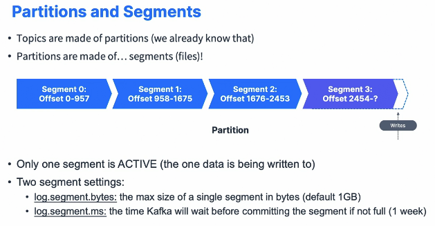

* That means that each of these files, each of these segments is of maximum going to be one gigabyte. If it becomes over, one gigabyte is going to be closed and then a new segment will be created. Alternatively, we have log segment millisecond, which is how long Kafka will wait before closing a segment anyway, if it's not full, if it doesn't reach the size of one gigabytes. And by default, it is one week. That means that if you send data into Kafka over a week time, but you still haven't reached one gigabytes of data, Kafka will say, no matter what, I will close the segment because it's been a week and I will open a new segment for you. So Kafka, as you can see, keeps on creating new segments or new segments, new files based on either bytes and or time. So these segments don't come alone. They come with two indexes or files. So we have two indexes per segment. We have an offset to position index, which helps Kafka find where to read from to find a specific message at a specific offsets and also a timestamp to offset index, which helps Kafka yet again find messages with a very specific timestamp. And these optimizations is what Kafka makes Kafka efficient. So we have a partition, and then each partition is going to have a, each segment is going to have a position index. 

  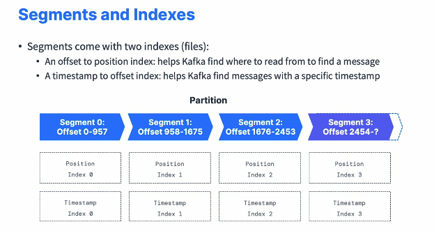

* So you have different position indexed as you can see right now. And then we'll have a timestamp index again one times that index per specific segments. So why should you care about segments? Well, if you set a smaller log segment bytes than the default of one gigabytes, that means you're going to have more segments per partitions. Log compaction is a process that will describe it to you in a future lecture is going to happen more often because new segments are appearing. But Kafka needs to have more files open because, well, you have more segments and Kafka keeps track of all the files on your disk, and therefore you may have an error called too many open files. So the question is how fast we'll have new segments based on throughputs? If you have a very high throughput, no need to change that setting. If you have a very low throughput, maybe you need to change that setting so that you can have more segments and trigger log compaction more often. If you set a smaller log segment millisecond than one week, that means that you're going to set up a maximum frequency for log compaction because more segments means more triggers. 

  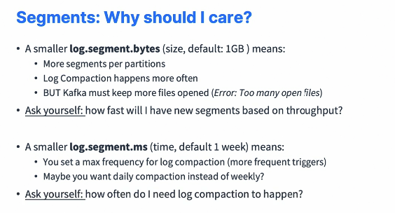

* And maybe, for example, if you set it to one day you're going to have daily compaction instead of weekly. So by setting up this value to your lower number, we trigger more compaction, more cleanups. So I'm telling you all this just so that you know that segments and indexes are a thing and you understand better what needs to happen. If you look at the data folder in Kafka, you'll see these appearing within folders, so you know what I mean. But again, these settings are not to be modified in the beginning or at all. And I will explain you very, very soon what are log cleanup. 

#### Log CleanUp Policies

* So we've seen that Kafka topics have data that expire and according to your policy and the concept of making data expire is called log cleanup. So we have two policies in Kafka we'll have a look at. The first one is log cleanup policy equals delete, which is the default for all the users topics and is when we delete data based on the age of the data and by default it is a week. So what I've told you before is that, hey, after a week your data in Kafka is gone. This is because of this log cleanup policy delete. You can also delete your logs based on the max size of a log. We'll see this in the next lecture. By default, it's minus one. That means that the size can be infinite, but you only have one week of data. The second one is log cleanup policy compact, and that is actually the default for a specific internal Kafka topic named the consumer offsets topic. 

  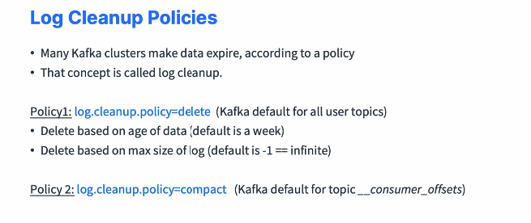

* So if we have a Kafka topics describe command. So I'm going to set up a bootstrap server to be localhost 9092, I'm going to describe and then the topic is going to be the consumer offsets topic. So we can see we have a lot of partitions, but more importantly, what I want to show you is under configs right here we have compression type equals producer and clean up policy equals compact. 

  ```sh
  kafka-topics --bootstrap-server localhost:9092 --describe --topic __consumer_offsets

* So this is showing you right here that this specific topic has a different cleanup policy and will understand why in a few lectures. So with the log cleanup compacts policy, that means that you're going to be deleting your messages based on the latest occurrence of a key. And that means that old keys that you'll find before that key are going to be deleted after the active segment is committed. This gives you infinite time and space retention and some interesting properties. Now I'm going to have a full lecture and the hands on compaction of the logs. So don't worry too much right now. So why do you need even log cleanup and when? 

  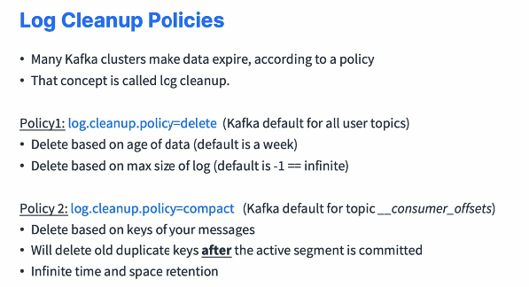

* When you delete data from Kafka, it allows you to control the size of all the data that is going through Kafka on the disk and to delete data that is supposed to have been consumed, and so therefore that is obsolete. Also, it helps you limit the maintenance work on the Kafka cluster because, well, the disk space is going to be somewhat constant and so therefore nothing to worry about. So how often does log come cleanup happen? Well, it happens whenever you have partition segments being created. 

  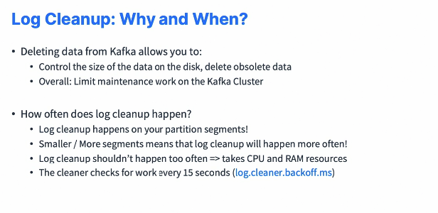

* And so if you have smaller, more segments, that means that log cleanup is going to happen more often. And though it happens more often, it should not happen too often because while log cleanup takes CPU and ram sources to figure out what to delete. So the cleaner there's a setting called log cleaner backoff milliseconds and it means that the cleaner is going to be checked for, checking for work every 15 seconds. 

#### Log Cleanup Delete

* That is the default one called delete. So we have two settings that will impact this log cleaner policy. The first one is log retention hours, which is the number of hours to keep your data for by default, it's 168 hours, which is exactly one week. So if you do a higher number, you're going to have a higher retention of your data. That means that you're going to use more disk space because you are retaining more data. If you do a lower number, you're going to have less data retained on disk, so less of a need of disk space. But if your consumers are down or not consuming for too long, for whatever reason, then they can miss data. 

  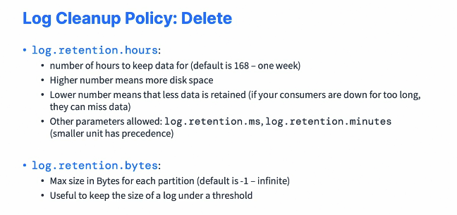

* So my recommendation is of course, to maybe increase the setting and increase the disk space because today disk is quite cheap but losing data with your consumers is really expensive. The other parameters you can look at that have an impact on this are log retention millisecond and log retention minutes and the smaller unit you set has a precedence over all the other settings. The other settings that you have in conjunction with log retention hours is log retention bytes, and this is the maximum amount of bytes for each partition in your topic. By default, it is -1, which means you have an infinite space retention for your topics. But it's useful to set if you want to keep the size of your topic log under a specific threshold. So here is an example of a topic. So we have multiple segments and the data is written to the active new segment, and old segments of your time are going to be expired, deleted. Well, because they are too old or your segment got too big. 

  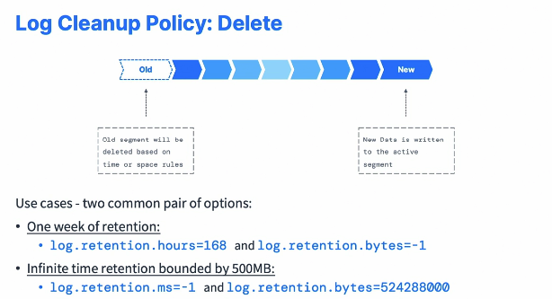

* So two very common pair of options for the log cleaner policy delete. The first one is to set one week of retention, which is the default, which is log retention hours equals 168 and log retention bytes equals -1. The second one is infinite time retention, for example, bounded by 500 megabytes of data per topic partition, in which case you will set log retention millisecond equals -1, and log retention bytes equals this big number that represents 500 megabytes.

#### Log Compaction Theory

* So this is log compassion and log compassion means that your log contains at least the last known value for a specific key within a partition. I will show you a diagram that will make a lot of sense for you. So log compaction is very helpful when you just require a snapshot of the current state of a topic with the latest value of each key instead of the full history, which is, for example, log compaction is similar to data table and database where you just have well, the state of the table right now, but you don't know all the changes that happen to your table over time. So the idea is that we want to only keep the latest update for a key within our log. So here's an example that we'll make it concrete. 

  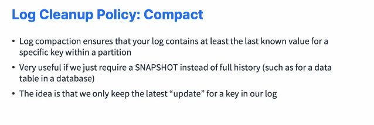

* Let's take an employee salary topic and you want to keep the only, only the most recent salary for employees. And what happens? Well, here is the order of rights from top to bottom. So we first write John. John has a salary of 80,000. He's our first employee. Mark has a salary of 90,000. He's our second employee. And then Liza is our third employee. She has a salary of 95,000. So at some point the segment is closed and this becomes the first segment. More writes happen over time, and then at some point, Liza gets a promotion. Now her salary is 110,000, and then John gets a promotion. His salary is 100,000. And so that makes it up for segment two. So then happens log compaction if we enable it, of course, on our topic. And after compaction, we're going to have one new segment created from both previous segments and on it Mark will be retained because this is the latest occurrence of Mark. His salary has not changed, so we'll stay 90,000. Then Liza will have the latest key available. So 110 as the salary and then John will have a salary of 100,000. This is the latest salary. But as you can see, your data from before for offset zero and offsets two have been deleted. So because John has a newer salary and Liza has a newer salary. So log compaction does not change offsets, it just deletes keys when there are newer keys available in the topic. So some guarantees about log compaction is that any consumer reading from the tail of a log, which is the most current data, is still going to see all the messages sent to the topic in order. 

  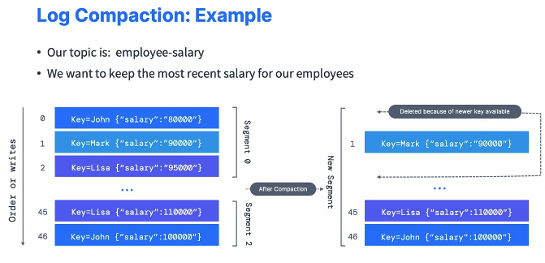

* Also, even after log compaction, the ordering of messages is kept and log compaction only removes some messages but does not reorder them. The offset of a message as well does not change. It's immutable. So in case an offset has been deleted, it's just skipped by the consumer if a message is missing. And deleted records in your log from log compaction can still be seen by consumers with a grace period of delete retention millisecond, which by default is 24 hours. So here is a myth busting about log compaction. First of all, it does not prevent you from pushing duplicate data into Kafka because the deduplication, quote unquote, the fact of just removing keys over time is done only after a segment is committed. 

  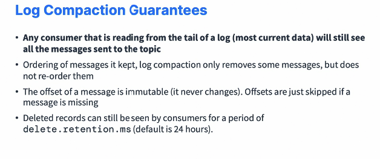

* So your consumer is reading from the tail of the topic, will still read the data as soon as it arrives. Also, it doesn't prevent you from reading duplicates data from Kafka because of the points from the above. And then finally, log compaction can fail from time to time. It's an optimization, so check it out and restart Kafka if log compaction is broker. And then right now we cannot trigger log compaction using an API call, but maybe that will change in the future. So how does it work for log compaction? 

  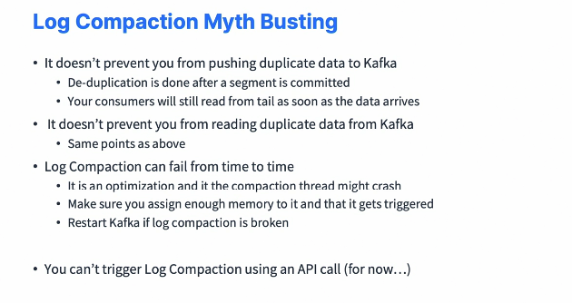

* Well, let's imagine we have a topic with multiple segments, so three segments and then an active segments and log compaction is going to take all the previous segments and rewrite them as new segments. So the setting log cleanup policy compact is going to be impacted by other settings. The first one is segment millisecond by default, seven days, which is the maximum amount of time to wait to close an active segment. Segment bytes, which is one gigabyte, which is the max size of a segment. And again, this is how long to wait until we close it. Min compaction lag, millisecond value of default value is zero, which is how long to wait before a message can be compacted and delete retention millisecond 24 hours we saw it before, which is how long to wait before data marked for compaction is deleted. 

  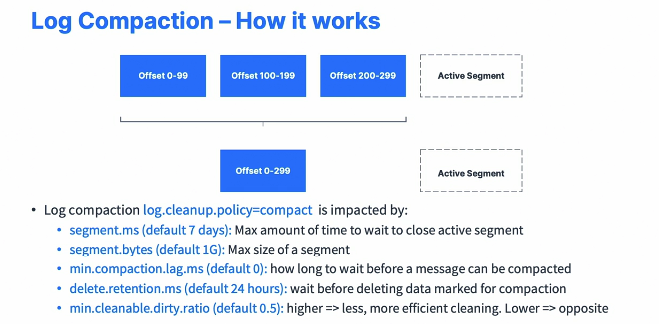

* And then finally, min cleanable dirty ratio, which by default is 0.5. But a higher ratio means less more efficient cleaning and a lower ratio means more cleaning, but less efficient. 

#### Log Compaction Practice

* So on Conduktor Kafkademy under Kafka topics advance, you will find a log compaction alongside a little tutorial. So what we're going to do is that we're going to practice, and for this, we're going to create a topic. We're going to configure it and we'll see log compaction in details. So Windows users, you must be very careful, even if you use Conduktor to start Kafka, you cannot use log compaction. If you use log compaction, you're going to have a bug called Kafka 1194 and it's going to make Windows crash. Okay. So here, if you are using WSL2 on Windows for Kafka, you're good to go. But if you're not using WSL2, then I'm sorry you cannot do the log compaction exercise, otherwise you will make Kafka crash. Okay. So next what I'm going to do is just create a Kafka topic. So here is the command and you can remove the n.trailing slash if it doesn't work for your system and just write it as one very long command. But I have the Kafka topics. I specify the bootstrap server. I create a topic named employee salary with one partition, a replication factor of one, and then clean up policy compact to make sure we have log compaction enabled. Min cleanable dirty ratio of a very low number to make sure we have a log compaction triggered very, very quickly and segment millisecond five seconds which allows us to create new segments very quickly again to trigger log compaction because there is no API to trigger log compaction. So we create this topic with the proper configs and we can verify it, for example, with the Kafka topics command. So if we have a look at this and we'll just do copy this and paste it and do topic employee salary. And then the describe is going to show us indeed that, yes, our configs are set correctly. Perfect. So next, what I'm going to do is I'm going to create a Kafka console consumer. So right below I'll have a consumer and this consumer is going to read from the topic and also going to print the key and the value. So let me just remove the .sh from my system. Okay. My console consumer is created and I'm going to clear the screen. On the top side, I'm going to create a Kafka console producer, and this time this producer is also going to produce data. We're going to parse the key and the key separator is a comma. Just press enter and I'm going to clear the screen. Here we go. So now I have to just write in some data. So first one is Patrick. Patrick has a salary of 10,000, so I'll press enter and it's sent. And as you can see, my consumer sees Patrick with a salary of 10,000. So we're good to go. Then we have Lucy with a salary of 20,000. We have Bob with a salary of 20,000. And then we have an update for Patrick. So Patrick has an update of 25,000. And then we have Lucy again with an update. So she has a salary of 30,000. And then we have Patrick with a salary of 30,000. So as you can see, Patrick has three times the salary updated. Lucy has two entries and Bob has one entry. And as you can see, our Kafka console consumer right here was reading all the messages as they have been sent into my log compacted topic. So the consumer perspective, nothing has changed, right? So I'm going to wait a little bit more time and then I just pasted in Stephane salary zero. And I do this because I want to trigger some sort of log compaction. So what I'm going to do is I'm going to stop the consumer in the bottom and I'm going to start a new one. And we again, fetch messages from the beginning. So it's going to create a new consumer group and hopefully fingers crossed because with log compassion you never know, I should see only the latest update of all my entries in my topic. So press enter. And yes, indeed it is working. So Bob has a salary of 20,000. Lucy has a salary of 30,000, Patrick as well, and me a salary of zero. So as you can see, this is reading the topic from the beginning and some data has been deleted from the topic and the only data that has been kept is the latest entry for the specific key. So key Lucy has a salary of 30,000, key Patrick A salary of 30,000. This is why you see them right here. Bob only has one entry. And me, I'm the last entry. So we've seen how log cmpaction works. It happens in the background and you can look at the Kafka logs to see whether or not log compaction has happened. 

#### Unclean Leader Election

* We're going to learn about unclean leader election enabled. So in case all your in-sync replicas go offline because of whatever reason, but you still have some out of sync replica up, then you have some options. Either you wait for an ISR to come back online, which is the default behavior and your topic is going to be unavailable until then. Or you set unclean leader election enabled equals true. And then what's going to happen is that non-ISR partitions are going to become the leader and you can start producing to them. 

  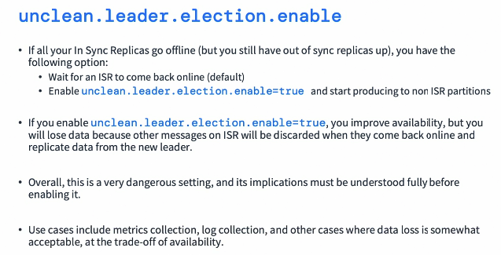

* So if you enable this setting, unclean leader election enabled true, you improve availability because you can still produce to a non-ISR partition, but you run the risk and you will lose data because well, when other partitions come back up, data will be discarded and they will replicate data only from the new leader. So overall, this unclean leader election enabled true is a very dangerous setting and the implications must be understood before you enable it. So in which use case would you enable the setting? With a use case where it's okay, where it's acceptable to lose data at the trade off of availability? So where availability is more important than data retention. In that case, for example, for metrics collection, log collection, then you could enable unclean leader elections enabled. But this setting is now less and less used in Apache Kafka. It is, of course, false by default, and the normal Kafka behavior now is to really make sure that all your partitions are in-sync and only an in-sync replica can be elected leader. 

#### Large Messages in Kafka

* We're going to have a look at sending large messages in Apache Kafka. So Kafka has a default of one megabytes per message in topics, which is honestly a very, very good default. And because large messages so bigger than one megabytes, they're considered inefficient and somewhat of an anti-pattern. But in case you really do need to send large messages in Apache Kafka, you have two approaches. Number one is to use an external store. It could be sending your message into HDFS, Amazon S3, Google Cloud Storage or whatever FTP you want, and then you send the reference of that message to Apache Kafka. I will show you this in the next slide. Or you can modify Kafka parameters. 

  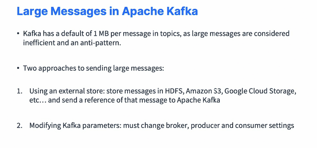

* You must change the broker, producer and consumer settings to make it work, and I will show you that in the following slides as well. So option number one is to send the large messages using an external store. So for example, say you want to send a video, an archive file in Kafka. It doesn't work, so you send it outside of Kafka. Then you send a reference to that message, to that file sorry, in a message to Kafka and then you would write custom code at the producer or consumer to handle this pattern. So we have Kafka and then HDFS, for example, and our producer is going to send the large message into HDFS and then send a small metadata message into Kafka that says, Hey, have stored the bigger message into a HDFS. 

  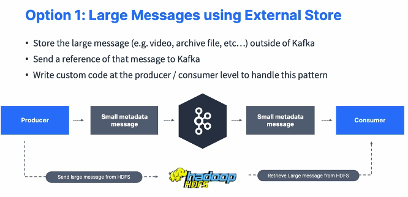

* Your consumer is going to read the small metadata message from Apache Kafka and say, okay, I know where to find the larger message. I'm going to retrieve it from HDFS. And this is a good pattern and you can send gigabytes of data if you wanted to with this pattern. Option number two is to increase the Kafka limits, to send a bigger message. For example, say we want to send messages up to 10 megabytes in size directly from the producer to the topic, to the consumer. So topic wise, Kafka said you need to set the broker side setting called message max bytes. And if you want to modify topic side, it's called max message bytes. It is meant that the words are reversed. I know it can be very confusing, but it's meant to be like that. So it's not a typo. They have similar names, similar effects, but different names. 

  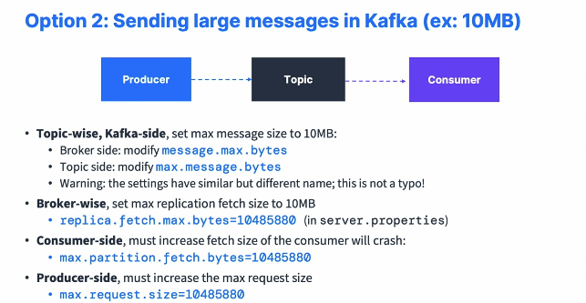

* Broker wise also, you need to set a max replication, fetch size to 10 megabytes. So the setting is called replica fetch max bytes and it's in server.property you have to edit it. Consumer side, you must increase the fetch size of the consumer, otherwise it will crash. So you set the max partition fetch bytes to 10 megabytes as well and producer side you set the max request size to 10 megabytes and all these settings together allow you to send larger messages in Apache Kafka. 

#### Conclusion

* Build your data pipeline and applications

  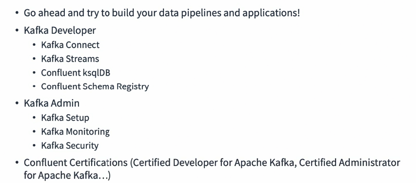


