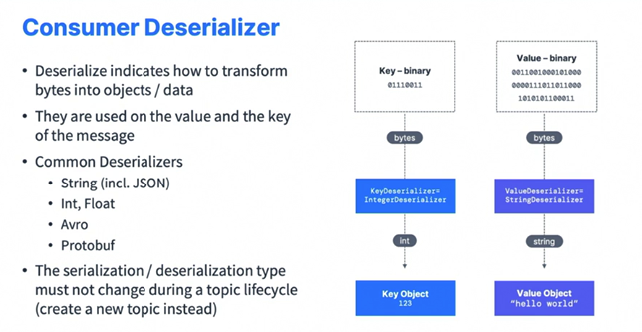

### Kafka Theory

#### Topics, Partition and Offsets

* So Kafka topics are a particular stream of data within your Kafka Cluster. So Kafka Cluster can have many topics. It could be named, for example, logs, purchases, Twitter, tweets, tracks gps and so on. So a topic in Kafka is a stream of data. And if you wanted to make a parallel to databases, well, a topic is similar to what a table would be in a database, but without all the constraints because you send whatever you want to a Kafka topic, there is no data verification and I will explain to you what it means later on. 

* So you can have as many topics as you want in your Kafka Cluster. And the way to identify a topic in a Kafka Cluster is by its name. That's why I have logs, purchases, Twitter tweets, trucks gps. Those are all names for my Kafka topics. So these Kafka topics supports any kind of message formats, and then you can send, for example, JSON, Avro, text file, binary, whatever you want. 

* The sequence of the messages in a topic is called a data stream, and this is why Kafka is called a data streaming platform. Because you make data stream through topics. You cannot query topics. So topics are similar to a table database, but you cannot query them instead to add data into a Kafka topic, we're going to use Kafka Producers and to read data from a topic we're going to use Kafka Consumers. But there is no querying capability within Kafka. 

  

* Okay, so these topics, they're general, but you can divide them into partitions. So a topic can be made up of, for example, 100 partitions. But in my example, I'm going to have a Kafka topic with three partitions; partition 0, 1, and 2. 

* Now the messages sent to Kafka topic are going to end up in these partitions, and messages within each partition are going to be ordered. So my first message send to partition 0 will have the ID 0, 1, and then 2 and then all the way up to 9. And then as I keep on writing messages into my partition, this ID is going to increase. So this is the same case when I go and write data into partition one of my Kafka topic, the ID will keep on increasing and so on. 

* So the messages in these partitions where they are written, they are getting an ID that's incrementing from 0 to whatever, and this ID is called a Kafka partition offsets. Okay. So you will hear me saying offsets a lot in this course. So as we can see, each partition has different offsets. Now Kafka topics are also immutable. That means that once the data is written into a partition, it cannot be changed. 

* So we cannot delete data in Kafka, you cannot update data in Kafka. You have to keep on writing to the partition. Okay. So now let's take an example of trucks gps to make it more concrete. 

  

* So say you have a fleet of trucks and each truck has a GPS and the GPS reports its position to Apache Kafka. Then each truck will send a message to Kafka every 20 seconds, for example, and each message will contain some information, such as the truck ID and the truck position, for example, the latitude and the longitude. So we have a bunch of trucks and they're going to be data producers, and they will send data into a topic, a Kafka topic named trucks_gps that will contain the positions of all trucks. So the topics send the data into the trucks GPS topic. And then because a topic is made of partitions, as we've seen, we choose to create a topic with 10 partitions. 

* For example, we want to have consumers that will consume that truck's GPS data and send it into a location dashboard so we can track the location of other trucks in real time. Or maybe we also want to have a notification service, consume the same stream of data, and the notification service will, for example, send notifications to the customers when the delivery is close. 

* So this is why Kafka is very helpful, because well, multiple services are reading from the same stream of data. Okay. So now let's note some important things about topics, partitions and offsets. So once a data is written to a partition, it will not be changed. It cannot be changed. That's called immutability. It's very important to understand this. 

* Data in Kafka is only kept for a limited time, and the default is one week, although that is configurable. That means that after one week your data will disappear. And the offsets only have a meaning for a specific partition. As you can see, the offsets are repeated across partitions. So offset 3 in partition 0 represents a message, but it doesn't represent the same data as offset 3 in partition 1. And the offsets are not going to be reused even if previous messages have been deleted. 

  

* Okay. So keep it keeps on increasing incrementally one by one as you send messages into your Kafka topic. Now that means also that the order of messages is guaranteed only within a partition, but not across partitions. And that is very important to understand, and I will repeat this later on in this course again. Okay. But what this means is that while the messages within each partition, they have offsets increasing. So that means they are in order and we read them in the order of the offsets. But then across partitions we have no control. Okay. So if we need ordering, we'll see how we can achieve this. And then the data, when sent to a Kafka topic, is going to be assigned to a random partition. Okay. For example, 0, 1. or 2 in this example, unless you provide a key and I will show you what this does when we have a key. And in a Kafka topic, you can have as many partitions as you want. Okay? With 3, sometimes 10, sometimes 100. And again, we'll see how we can determine what is the right number of partitions for our topic. 

  

#### Producers and Message Keys

* So we've seen that topics hold data, but for topics you have data written to it, well, we need to write a Kafka Producer. And so the Producers are going to write to the topic partitions. 

* So remember we have partition 0 for my topic name, topic A, then partition 1, partition 2, and the writes happens sequentially with data offsets. And then your producer is right before that is going to send data into your Kafka topic partitions. So the producers know in advance to which partition they write to and then which Kafka broker, which is a Kafka server, has it. We'll learn about Kafka brokers very, very soon. So that means that the producers know in advance in which partition the message is going to be written. Some people think that Kafka decides at the end the server which partition the data gets written to. This is wrong. The producer decides in advance which partition to write to and we'll see how. And then in case a Kafka server that has a partition has a failure, the producers know how to automatically recover. 

  

* So there's a lot of behind the scenes magic that I will explain over time that happens within Kafka. So we have load balancing in this case because your producers, they're going to send data across all partitions based on some mechanism and this is why Kafka scales. It's because we have many partitions within a topic and each partition is going to receive messages from one or more producers. So now producers have message keys in the message. So the message itself contains data, but then we can add a key and it's optional and the key can be anything you want. It could be a string, a number, a binary, et cetera, et cetera. So you have two cases. In this example, I've taken a producer that is writing to a topic with two partitions. So if the key is null, then the data is going to be sent round robin. So that means that it's going to be sent to partition 0, then partition 1, then partition 2 and so on. And this is how we get load balancing. Okay. Key equals null means that the key was not provided in the producer message. But if the key is not null, that means that the key has some value. It could be again a string, a number, binary, whatever you want. And the Kafka producers have a very important property. That is that all the messages that share the same key will always end up being written to the same partition thanks to a hashing strategy. And that property is very important in Apache Kafka. So when we specify a key, this is when we need message ordering for a specific field. So remember your example with trucks beforehand, we had trucks and it would be good for us to get the position of each individual truck in order. So in that case, I'm going to provide truck ID as my key of my messages. Why? Well, then, for example, truck ID 123, which is an idea of one of my trucks is going to be always sent to partition 0. And I can read data in order for that one truck. And truck ID 234 is always also going to be sent to partition 0 and which key ends up in which partition is made thanks to the hashing technique that I will tell you right after. And then for example, another truck ID, for example, 345, or 456 will always end up in partition 1 of your topic A. 

  

* So the key is part of a Kafka message. And here is what a Kafka message looks like when it's created by the producer. So we have the key and it can be null as we've seen, and it's in binary format. Then we have the value, which is your message content. It can be null as well, but usually is not, and it contains the value of your message. Then we can add compression onto our messages. So do we want them to be smaller? If so, we can specify a compression mechanism, for example. gzip, snappy, lz4 or zstd Then we can also add headers to our message which are optional list of key value pairs. Then we have the partition that the message is going to be sent to as well as its offsets. And then finally a timestamp that is either set by the system or by the user.

  

* And this is what a Kafka message is, and then it gets sent into Apache Kafka for storage. So how do these messages get created? 

* So we have what's called a Kafka Message Serializer. Because Kafka is a very good technology, and what makes it good is that it only accepts a series of bytes as an input from producers, and it will send bytes as an output to consumers. But when we construct messages, they are not bytes. So we are going to perform message serialization. And doing serialization means that we're going to transform your data, your objects into bytes. And it's not that complicated. I will show you right now. And then these serializers are going to be used only on the value and the key. So say, for example, we have a key object. Okay. So it's going to be the truck ID, so 123, and then the value is just going to be a string hello world. So these are not bytes just yet. They are objects within our programming language. But then we're going to specify the key serializer to be an integer serializer. And what's going to happen is that Kafka Producer is smart enough to transform that key object, 123, through the serializer into a series of bytes, which is going to give us a binary representation of that key. And then for the value object, we're going to specify a string serializer. As you see the value and the key serializer in this instance are different. So that means that it's going to be smart enough to transform the string, hello world, into a series of bytes for our value. And now that we have the key and the value has binary representations, that message is now ready to be sent into Apache Kafka. So Kafka Producers come with common serializers that help you do this transformation. So we have string, including the JSON representation of a string, integer, floats, Avro, Protobuf and so on. We can find a lot of message serializers out there. 

  

* So just for the curious about those who want to understand how the message keys are hashed and this is more advanced. Okay. Just for those who are curious, if you're not, you can skip this. But there is something called a Kafka Partitioner, which is a code logic, that will record a message and determine to which partition to send it to. So when we do a send, the producer partition logic is going to look at the record and then assign it to a partition, for example, partition 1, and then it gets sent by the producer into Apache Kafka. And the process of key hashing is used to determine the mapping of a key to a partition. And then the default Kafka Partitioner then the keys are going to be hashed using the murmur2 algorithm. And there is a formula right here that you don't need to know, of course, okay. But it means that it's going to look at the bytes of the key, apply the murmur2 algorithm, and then figure out things to it. What is going to be the target partition? This is just to stress the fact that producers are the one who choose where the message is going to end up, thanks to the key bytes. Okay. By hashing the key. that's it. It's just for those that I know want some advance content sometimes. 

  

#### Consumers and Deserialization

* So we've seen how to produce data into your topic, but now we need to read data from that topic. And for this, we're going to use consumers. Consumers implement the pool model. That means that consumers are going to request data from the Kafka brokers, the servers, and then they will get a response back. It's not the Kafka broker pushing data to the consumers, okay? It's a pull model. 

* So we have an example with three topic partitions that contain data, and then one consumer may want to read from topic A partition 0, and it's going to read the data just like this. And another consumer may choose to read for more than one topic partition. So it may choose to read data again from partition 1 and partition 2. So the consumers, when they need to read data from a partition, they will automatically know which broker, which Kafka server to read from. And in case a broker has a failure, the consumers are again very, very smart and they will know how to recover for this. Now the data or the read, the data being read for all these partitions is going to be read in order from low to high offset. So 0, 1, 2, 3 and so on within each partition. So the consumer, the first consumer is going to read data in order for topic A partition 0 from the offset 0 all the way to offset 11. Same for consumer two that is going to be reading data in order for partition 1 and in order for partition 2. But remember, there is no ordering guarantees across partition 1 and partition 2 because they are different partitions. Okay. The only ordering we have is within each partition. 

  

* So now that consumers read messages, they need to transform these bytes that they receive from Kafka into objects or data. So we have the key that is a binary format and a value that is a binary format which is corresponds to the data in your Kafka message. And then we need to transform them to read them and put them into an object that our programming language can use. So the consumer has to know in advance what is the format of your messages. And this consumer in instance, knows that my key is an integer and therefore is going to use an integer deserializer to transform my key that is bytes into an integer. And then the key object is going to be back to 123. Same for the value. We know that we need a deserializer of type string because this is what we expect to be in this Kafka topic and therefore this deserializer is going to take bytes as an input and then create a string out of it. So we're going to get back our value object, hello world. So obviously deserializers are being bundled with Apache Kafka and they can be used by your consumers. So it could be for string including JSON, integer, floats, Avro, Protobuf and so on. And as we see, we have a process of serializer at the producer side and deserializer at the consumer side. And the consumer needs to know in advance what is the expected format for your key and your value. 

  

* That means that within your topic lifecycle, so as long as your topic is created, you must absolutely not change the type of data that is being sent by the producers, because otherwise you're going to break your consumers because they're going to expect, for example, integers and string, but you're going to change them into floats and Avro, who knows, Right? And that will be a big problem. So if you want to change the data type of your topic, what you have to do is to create a new topic instead. And in this new topic, you can have whatever format you want and then your consumers will have to be reprogrammed a little bit to read from these new topics with this new format. Okay. So that's it for consumers and consumer deserializers.

#### Consumer Groups and Consumer Offsets

* So when we have Kafka and we want to scale, we're going to have many consumers in an application and they're going to read data as a group, and it's called a consumer group. 

* So let's take an example of a Kafka topic with 5 partitions and then we have a consumer group that is called Consumer Group Application. It's just a name I give it. And then that consumer group has three consumers; 1, 2, and 3. Then each consumer within the group, if they belong to the same group, are going to be reading from exclusive partitions. That means that my consumer 1 is going to read from partition 0 and maybe partition 1. My consumer 2 is going to read from partition 2 and partition 3. And finally my consumer 3 is going to read from partition 4. So as we can see, consumer 1, 2 and 3 are sharing the reads from all the partitions and they read all from a distinct partition. 

  

* This way a group is reading the Kafka topic as a whole. So what if you have too many consumers in your consumer group more than partitions? So let's take an example of a topic A with partitions 0, 1, and 2, and then my consumer group application has consumer one group, consumer 1, 2 and 3. So in this case, we know that the mapping is simple. We have each consumer reading from one partition. And then if we add another consumer into this consumer group and we can, it's possible, then that consumer 4 is going to be inactive. And that means that it's just going to be a standby consumer and it's not going to read from any topic partitions. And that's okay. But you need to know that it's normal that consumer 4 is not going to help consumer 1 to read from partition 0. No, it's going to stay inactive. 

  

* And also you can have multiple consumer groups on one topic. So it is completely acceptable to have multiple consumer groups on the same topic. 

* And let's take an example. So we go back to our topic with three partitions, and then we have our first consumer group that I've named, consumer grouped application 1, and it has two consumers. Now they're going to share the reads from our topic partition. So consumer 1 is going to read from two partitions and consumer 2 just from 1, and that's fine. And then we have a second consumer group application and this one will have three consumers and each of them are going to be reading from a distinct partition. And then finally, if we have a consumer group 3 with just one consumer, that consumer is going to be reading from all topic partitions. So as we can see, it's fine to have multiple consumer groups on the topic then each partition will have multiple readers, right? But within a consumer group, only one consumer is going to be assigned to one partition. And so why would you have multiple consumer groups? Well, if you go back to the trucks example that I gave you, we had a location service and a notification service reading from the same data streams of trucks gps. Well, that means that we're going to have one consumer group per service. 

  

* So one consumer group will be for the location service and another consumer group will be for the notification service. Now, to create distinct consumer groups as we'll see when we go to the programming section, we're going to use the consumer property named group ID to give a name to our consumer group, and then consumers will know in which group they belong. And these groups, they're even more powerful than what we think. So in this group, we can define consumer offsets. What are they? Well, Kafka is going to store the offsets at which a consumer group has been reading. And these offsets are going to be in a Kafka topic named consumer offsets with two underscores in the beginning because it's an internal Kafka topic. So let's take an example and we will understand why consumer offsets are so important. So we have this topic and what I represented right here vertically is an offset. So we've been writing a lot in this topic and now we have offset number 4,258 all the way up. So we have a consumer from within the consumer group and it's going to commit offsets once in a while. And when the offsets are committed, this is going to allow the consumer to keep on reading from that offsets onwards. And so the idea is that when a consumer is done processing data that it has received from Apache Kafka, it should once in a while commit the offsets and tell the Kafka brokers to write to the consumer offsets topic. And by committing the offsets, we're going to be able to tell the Kafka broker how far we've been successfully reading into the Kafka topic. And so this is what you do it once in a while, while you do this well, because if you're consumer dies then comes back and then it's going to be able to read back from where it left it off, thanks to the committed consumer offsets, because Kafka is going to say, hey, in this partition, partition 2, it seems you have been reading up to this offsets 4262. 

  

* Then when you restart, please, I will only send you data from this offsets onwards. And this is thanks to consumer offsets, consumer groups offsets that we're going to be able to have some mechanism to replay data from where we have crashed or failed. Okay. So that means that we have different delivery semantics for consumers and we'll explore those in detail later on in this course. But by default, the Java consumers will automatically commit offsets in an at least once mode. But if you choose to commit manually, you have three delivery semantics, and I will explain those in details later on in this course again. So we have at least once, which means that the offsets are going to be committed right after the message is processed. And in case the processing goes wrong, then there's a chance we are going to read that message again. So that means that we can have duplicate processing of messages in this setting. And so we need to make sure that our processing is idempotent. That means that when you process, again, the messages, it will not impact your system. The second option is to go to at most once. And the effect of this is that we commit offsets as soon as the consumers receive messages. But then if the processing goes wrong, then some messages are going to be lost because there won't be read again, because we have committed offsets sooner than actually processing the message. So that means that we see messages at most once. And then exactly once we want to process messages just once. So when we do Kafka through Kafka workflow, that means when we read from a topic and then we write back to a topic. As a result, we can use the transactional API, which is very easy to use if you use the Kafka streams API as well, for example, or if you go from Kafka to an external system, then you need to use an idempotent consumer. 

  

* So this is just to introduce these concepts. We will explore them in depth when we go into the programming section of this course. But just so you know, based on how and when you commit offsets, you're going to be either in at least once mode, at most once or exactly once mode. All right. That's it for this lecture on consumers and consumer groups. I hope you liked it and I will see you in the next lecture.

#### Brokers and Topics

* So a Kafka cluster is an ensemble of multiple Kafka brokers, and a broker is just a server. Okay. But in Kafka, they're called brokers because they receive and send data. So a Kafka broker is going to be identified with an ID, which is an integer. And so, for example, we're going to have broker 101, broker 102 and broker 103 in our cluster. Now each broker is going to contain only certain topic partitions. That means that your data is going to be distributed across all brokers, and we will see how in the next slide. And then there is a very specific aspect in Kafka that I will describe as well in the next slides, which is called that after you connect to any Kafka broker, also called a bootstrap broker, then the clients or the producers or the consumers will be connected and know how to connect to the entire Kafka cluster because the Kafka clients have a smart mechanics for this. So that means that you don't need to know in advance all the brokers in your cluster. You just need to know how to connect to one broker and then your clients will automatically connect to the rest. That means that your Kafka cluster can be made of as many brokers as you want, and a good number to get started is going to be three brokers. But some big clusters are going to have over 100 brokers in them. And in this example, we just chose to number brokers starting at 100 arbitrary because, well, this is just easier for me to talk about brokers with number 100 and then topic partitions with 0, 1, and 2. That's why. 

  

* Okay. So let's talk about how brokers and Kafka topics and partitions are related. And let's take an example in which we have a topic A with 3 partitions and the topic B with 2 partitions, and then we have 3 Kafka brokers, broker 101, 102 and then 103. So broker 101 is going to have the topic A partition 0, then broker 102 is going to have the topic A partition 2, and this is not a mistake, and then broker 103 is having topic A partition 1. So as we can see, the topic partitions are going to be spread out across all brokers in whatever order. And then for topic B, then we have topic B, partition 1 on broker 101 and topic B partition 0 on broker 102. So in this example, we see that the data is distributed and it's normal that broker 103 does not have any topic B data partition because the two partitions have already been placed on our Kafka broker. And this is the power of Kafka. In this example, as we see the data in your partitions is going to be distributed across all brokers. And this is what makes Kafka scale and what's actually called horizontal scaling, because the more partitions and the more brokers we add, the more the data is going to be spread out across our entire cluster. And we're noting the fact that the brokers don't have all the data. 

  

* Okay. The brokers only have the data they should have. So let's talk about this broker discovery mechanism I just told you about. So each Kafka broker in your cluster is called a bootstrap server. So let's take an example of five brokers in your Kafka cluster. And that just represented broker 101 as a bootstrap, but all of them are actually bootstrap servers. And you will see the bootstrap server arguments coming back when you use the command line interface or the Java programming. This is why I'm explaining this to you right now. So that means that in this cluster we only need to connect to one broker and then the clients will know how to be connected to the entire cluster. So our Kafka client is going to initiate a connection into broker 101, as well as a metadata request, and then the broker 101, if successful, is going to return the list of all the brokers in the cluster and actually more data as well, such as which broker has which partition. But more on that later. And then the Kafka client is, thanks to this list of all brokers, going to be able to connect to the broker it needs, for example, to produce or to consume data. So that means that each broker in your Kafka cluster is pretty smart and it knows about all the other brokers, all the topics and all the partition. 

  

* That means that each broker has all the metadata information of your Kafka cluster. And this is how clients connect to a Kafka cluster. All right, that's it. So in this lecture, we've seen brokers in depth. I hope you liked it, and I will see you in the next lecture.