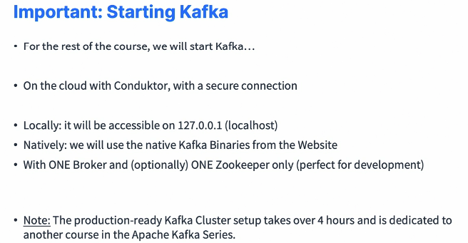

### Starting Kafka

#### Important: Starting Kafka and Lectures Order

* We're going to see how we can be starting Kafka. And this is one of the most complicated things you'll have to do with Apache Kafka. The instructions depend if you're using Mac, Linux, and Windows. And then for Windows, specific versions of Windows work and don't work. So it's quite a challenge. And we'll have a look at how we can solve this challenge in this section. 

  

* I have many, many, many videos for you. But the one thing I will be using in this course, that's a no brainer solution and that's why we created Conduktor is to create a Cloud Kafka cluster using conduktor. It will come with a UI. There is no setup to do on your machine and right away you will be able to access a Kafka cluster for free. So we'll be doing this and you will have a UI, which is great for learning Apache Kafka. Nonetheless, I will also show you how to start Kafka on macOS, so you will see how to start Kafka with Zookeeper locally or starting Kafka without Zookeeper. We'll also see how to install Kafka using Brew. We'll look at Linux. So again, start Kafka with Zookeeper or without Zookeeper in KRaft mode. And for Windows, we'll have a look at two different modes. So the WSL2 mode with Kafka and Zookeeper, the WSL2 mode with Kafka without Zookeeper, and finally Kafka on plain Windows, which is not recommended because you have lots of limitations. You cannot delete topics. It only works in Zookeeper mode, and overall I would say don't use it. Try if you have the chance to either use WSL2 or to start Kafka using conduktor on the Cloud. That's really important for you to not go crazy with your homework. So when you are starting, Kafka will use Conduktor with a secure connection. But nonetheless, I will provide you all the commands to do the exact same thing on localhost. So we'll have it on 127.0.0.1 on localhost if we do that and we'll use the native Kafka binaries to run commands either against the Cloud or on localhost. 

  

* We'll have one broker on localhost and optionally one Zookeeper, which is perfect for development. But on conduktor you'll have a full Kafka cluster with about 39 Kafka brokers. So you'll see what it looks like to have a real production Kafka. And to set up Kafka in production, it's a big headache. It's very complicated. It takes over four hours, and there's a dedicated course in the Apache Kafka series. So right now we're just looking at starting Kafka for development purposes. So here are the steps you need to do to start on Mac, on Linux and on Windows, and I will walk you through it so you know which videos to watch in this section. 

  

* By the way, all the steps of installation are available on our conduktor kafkademy so you can see how to start Kafka with Conduktor Mac, Linux, Windows and even Docker. Okay. So back here. So if you are on Mac, I would recommend for you to start Kafka on Conduktor on the Cloud. 

  

* That's very easy. And if you do so, you still need to install the Kafka CLI tools using either the binaries or using brew because we'll be using the CLI to run commands against our Cloud Kafka on Conduktor. If you prefer to go the local route, then you install the Kafka CLI tool using the binary or brew, and then we'll start Kafka using the binaries and then you're ready to go. On Linux, again, very simple. Either you start Kafka on conduktor and then we still need to install the binaries and you're ready to go or I will show you how to start Kafka locally and then we'll issue CLI commands again using the binaries. For Windows, this is where it gets extremely complicated. So if you have a Windows version that's actually recent, using this version 2004, build 19 zero 41 or Windows 11, then all you have to do is to install Windows WSL2 Then two options. Either you start Kafka with conduktor and then use the CLI on WSL2 to issue commands or you go and install everything on WSL2. So you need to install the Kafka CLI using the binaries and then start Kafka on WSL2. If you have a lower version of Windows, I would want 100% recommend that you use Kafka on conduktor because the setup is very difficult on Windows, and then you install Kafka binary tools still on Windows and you're ready to go. But if you want to run Kafka on your lower Windows, plain Windows, you can do it. But this will lead to lots of potential issues, and especially when you delete topics or when you leave it running for too long or whatever. So I do not recommend it, but I will still show you how to do it and then you'll be ready to go. So that's it. Hopefully that gives you some pointers into how to see the next lectures.

#### Starting Kafka with Conductor: Multi Platform

* How to start Kafka using well conduktor. To me, it is the easiest way for you to get started with Apache Kafka because it's free. You're going to be able to start Kafka online without a credit card, and it will come with a UI that we built to help you speed up your development. So this Kafka cluster is going to be personal to you and online with multiple brokers and so on. So it's like a production cluster, but you should only use it for personal usage and learning purposes, which is perfect for this course. So to get started with conduktor, we're going to go to this URL and sign up and then we'll have access to your own Kafka cluster for free. So after this lecture though, if you want to keep doing everything online regarding creating topics, sending messages, consuming messages, you can just use the conduktor UI. But if you also want to learn how to use the command line interface tools, the CLI tools, then please follow the next lectures to see how to install Kafka for your operating system. 

  

* And then I will show you how to connect your CLI tools into conduktor online. So here I am on the conduktor website and on the top right there is try for free. So you get started with conduktor and you go to conduktor Cloud for free. You enter your email address and click on "Create account". So after answering a few questions about yourself, such as your name, your phone number, and then you click on continue, then you have to create an organization so you can just name it whatever you want. For example, organization for me, it's data cumulus. Then you can invite your teammates if you want to collaborate with your teammates. So if someone is learning this course with you, you can enter the emails here, but I'm just going to skip it for now. And now, as you can see, you are in this UI right here, so I'm going to close everything. And on the left-hand side there is my playground. And my playground is your actual Kafka cluster that's available just for you. And here is the login URL. Here is your username and your password as well as the properties we'll be using to connect to our cluster. So we'll come back to this of course. And to view your cluster in the conduktor UI, it's very simple. Just go to console right here and under conduktor console you will see on the top right corner you have the option to choose my playground or the playground of your organization just created. This one is personal. This one is going to be shared with the people you invited. So we're going to use my playground and that's it. We're ready to start the course and we'll be ready to create topics and so on. So as you can see, this was extremely simple and you have a Kafka cluster available to you in the Cloud for your personal usage. 

#### macOS X: Download and Set up Kafka in PATH

* This lecture is necessary even if you have started Kafka using conduktor because we are going to launch CLI commands using this method. So please follow these steps no matter what. So we need to install Java JDK version 11 on our computer. Then we need to download Kafka from the Kafka website and have a binary version on our computer. We'll extract the content on Mac and then we'll set up the path environment variable for easy access to the Kafka binaries. 

* And this step can all be replaced with the brew utility on Mac. But I will demonstrate this right after we're done with all the Mac OS X set of videos. But if you just want to skip to that video, you can as well. Okay. So that's it. Let's get started. Okay. So we are going to follow the instructions on conduktor kafkademy because I wrote them and you have a written reference to them as well. 

  

* So first we need to install Java JDK version 11. And to do so, we need to go on the Amazon Corretto11 download page. The reason why I like Amazon Corretto 11 is that because it's a good distribution of the Java JDK 11 and it's been working great for me across multiple platforms. So what I'm going to do is just find in this download list the Mac OS x pkg file, which I'm downloading right now. It is downloaded and then from it I can just start it. Now, this is going to install Amazon Corretto, so I'll just go ahead and go ahead with all the steps. And then the installation was successful. Let's move this to the bin. 

* So now we should test whether or not Java was correctly installed, and to do so we can just go open a terminal and run the Java minus minus version command. And if you get Open JDK version, version 11 and then sometimes it say Corretto that means that you have installed the correct Java JDK version. Now if you don't use Amazon Corretto, this is fine. Whatever you want to get Java 11 JDK installed on your computer is fine by me. Okay. So next we have to download Apache Kafka from the Kafka Downloads page. 

* So let's go on to the Kafka Downloads page right here and I will download the latest Kafka version available to me. So I usually choose the binary versions and then the latest Scala version. So 2.13-310.tgz. Then I click on the first link they give me and then the download is finished. So what I have to do now is to go under finder, find my downloads, and then I have Kafka right here. I will double click it and it's going to extract Kafka on my computer. As you see, Kafka has multiple directories. We have bin, config, lib license, the site docs and so on. What I'm going to do now is copy this entire folder and I'm going to paste it one level up. So one level up for me is command and up and this is the Stephane a home directory. Okay. 

* And I like it here because this is where I like to have all my Kafka binaries. So I'm going to paste this in. And now we have Kafka 213 310 available here. So it was in downloads, but then one level up. So I did command and then the up key, I was able to paste it in here. So how do I know it's here? Well, if I go and do pwd is going to give you my current directory, which is slash users slash Stephane, which is the same as the one right here. Okay. And then if I do ls, oops, if I do not, I will clear this. If I do ls, then I see that my Kafka 213 310 is also the same as here, so it's perfect. We're good to go. Next, I'm going to have to set up my path environment because in this Kafka 213 310 there is, if you look inside, there is a bin folder. 

* And with this bin folder, we have a lot of .sh scripts. These ones, okay. And these .sh scripts are how I will start Kafka and run some command lines and so on. Okay. So I can invoke these scripts by just typing the full path to them. So if I do Kafka underscore, so I do ls and then I take so ./Kafka and then bin and then for example, Kafka topics.sh, if I type this command right here, okay, this is going to invoke the Kafka topics file right here. So if I press "Enter", as you see, the command is going to return something. But what I would like to do is instead of running the full path of this command, I would just like to have Kafka topics .sh because I will be using this across the course. But right now if I press "Enter", I get a zsh command, not found Kafka topics.sh. So to do so, I need to set up my path. Okay. And to do this path is very simple. I will just go ahead and edit. So a file called .zhrc So I do nano .zhrc and you may have nothing like me or you may have some stuff and on Mac it's zh by default, but sometimes it's bash. 

* Okay. You have to check. So for me is .zhrc and in it I need to set up the path variable. So if I go back to kafkademy, and there's a small mistake but I will correct it on the online version. So you need to set up the path and add this entire command right here. But you see, this still should be resolved to the full path already. So how do I do this? The easiest way is for me to go into my Kafka directory, into the bin directory. So I'm in it. And then you type PWD and this is giving you the full path to the binaries of Kafka. Okay. So what I'm going to do now is just copy this path equals. So I copy the first part up until the colon. 

* Then I copy the full path here that I got into here, and then I close it with the quotes. Okay. So I exit, press "Yes". And now to reload my terminal, I'm just going to open a new tab. So Command T opens a new tab and I'm going to close the other ones. And so now if I do echo path. I should be seeing that this is correct. So we have this user, Stephan Kafka 3.1/bin available to me. And so now if I do Kafka topics .sh and press "Enter". As you can see, the command is working from any directory. So once you have set up Kafka in the path, just like we did in Java, you're good to go. So if you started Kafka with conducktor, you're good to go on with this course. If not, I will show you how to start Kafka now using these command lines in the next lecture. So that's it. I will see you in the next lecture.

#### macOS X: Start ZooKeeper and Kafka

* I'm going to show you how to start Kafka with Zookeeper. So we'll have a Kafka cluster of one broker and one Zookeeper. For this, we'll first start Zookeeper using the Kafka binaries, and then we will start Kafka using the Kafka binaries, but in another process. So let's have a go at it. Okay. So back here we're going to start Kafka. So to do this, I'm going to have two terminal windows that I'm going to place on the right of my screen and the left of my screen, and we'll clear them both, okay? And so on the left hand-side, 

  

* I will start Zookeeper and on the right hand side, I will start Kafka. So we need to first start Zookeeper. So for this we'll use the zookeeper server start.sh command. Okay. And if I press "Enter", it says, okay, it doesn't work because it needs to have a Zookeeper that properties file to it. Now, thankfully, this Zookeeper, the properties file is available from within the Kafka binary. So in Kafka we have the bin, but also within config we have Zookeeper.properties. And if we look at the content of this file, and I'll zoom in a little bit, this is what's called a properties file, and it tells Zookeeper how to get started. 

  ```sh
  zookeper-server-start.sh ~/kafka-2.3.1/config/zookeper.properties
  # Start Kafka
  kafka-server-start.sh ~/kafka_2.13-3.5.1/config/server.properties 
  ```

* So we won't modify anything right now. We'll just keep it as is, okay. But what I'm going to do is just go and type zookeeper server starts. Okay, start.sh and then I will have the full path to Zookeeper. So tilt Kafka and then bin and then config and then Zookeeper.properties. Okay. So this full command right here is what I'm going to do to start Zookeeper. And you can find the reference of this command on my, the write up on Kafkademy. Okay. And you will find this command, actually right here. So if I scroll down, here is the start Zookeeper command. Okay. So you'll find it here. So once this is started, you have this lines of logs and that means you're good to go. So now what you have to do is to keep this terminal window open. Okay. And then on the right hand side terminal, we're going to start Kafka. So again, there is a Kafka server start.sh commands available to you. And in here we have to pass in a server.property file. And so to pass in the server.property file, what I'm going to do is just again pass in the full path to it. So Kafka server start.sh and then tilt Kafka, then config and then server.properties. So this command right here is going to start Kafka. And again you command you can find on the Kafkademy websites. So as soon as you have this, well you have a Kafka started, okay, the server has started and then Zookeeper is start as well. And then congratulations. You have Kafka started on your computer, on your Mac. Now, you need to make sure that you are going to keep both these terminals open. Because if you stop one of these, then Kafka is going to stop. So these terminals have to remain open for the rest of your course. And this is why sometimes it's nice to use conduktor to start Kafka, because at least you have, you don't need to manage two terminal windows. Okay. So once we've done that, we're good to go. We have started Kafka with Zookeeper, and that's awesome. And then one last optional thing you can do and I will leave it to you, is that if you go, you can change the Kafka and Zookeeper data storage directory so you could edit the zookeepre.properties file and the server.properties file. And then within it there is a command, a line called data deer, and you can have whatever path you want for Zookeeper data. And in Kafka you have a logs deer file and you can set whatever you want for your Kafka data. 

#### macOS X: Using Brew 

* So as an alternative to installing Java and then installing Kafka binaries and then setting up the path, we can do a little shortcut and installed Kafka using brew. So in this case, we're going to have again a cluster. So we're going to first going to install brew. Then we'll install Kafka using brew, and this will install the Java JDK for you, and then we can see how we can start Zookeeper and Kafka using the binaries in another process. So let's get started. So again, on the Kafkademy website there is how to install Apache Kafka with Homebrew, and I'm going to refer to these instructions. So first we need to install Homebrew, then we're going to install Kafka using Homebrew, and then we can see how we can use the CLI to start Kafka and to start Zookeeper. Okay. So to install Homebrew, you can go to the Homebrew installation page, which is right here. And then you can use this command to install Homebrew. 

  

* So you paste it in and then it's going to ask you for sudo access. So you paste in your password and then we press return to continue and then it's going to go ahead and install Homebrew in the background. So if you don't know Homebrew, Homebrew is a way for you to really easily install packages on your Mac and this is very, very, very handy tool. Okay. So this took about five minutes. It takes a while to install Homebrew, but now I am done. So I'm going to clear this. And then because I have Homebrew installed, I can run a brew install Kafka commands. Okay. So what I'm going to do is first remove my variable from the path. So if I did my, if you did the instructions from before, just like me, you actually have a like a .zhrc file. Okay? And what you have to do is to edit it, okay, this .zhrc file, and then you're going to remove this path. To remove it, I can just have a comment right here and this should be enough. Okay. Now we'll reload my terminal and I'm good to go. Okay. So now we're going to run brew install Kafka and press "Enter". And this is going to install Kafka for me. So it's going to install the packages that I need including Java, including Kafka. 

  ```sh
  brew install kafka
  #Binaries and script
  /usr/local/bin
  #Kafka Configuration
  /usr/local/etc/kafka
  #Zookeeper Configuration
  /usr/local/etc/zookeeper
  #The log.dirs config (the location for Kafka data) will be set to
  /usr/local/var/lib/kafka-logs
  #Start zookeeper
  /usr/local/bin/zookeeper-server-start /usr/local/etc/zookeeper/zoo.cfg 
  #Start kafka
  /usr/local/bin/kafka-server-start /usr/local/etc/kafka/server.properties
  ```

* And then it's going to set up Kafka as well in my path automatically. So let's wait a little bit. So Kafka is now installed using brew. And as we can see on the right hand side, I have a full list of where Kafka is actually installed. So all the binaries and scripts are under user local bin. And that means that if I clear my screen, I can do Kafka topics and press "Enter" and this is going to launch automatically the Kafka topics command for me. So this is because all these scripts are under /user local bin. Then the Kafka configuration file are under /user local etc Kafka. And as you can see, we have all the zookeeper.properties file from before server.properties file from before and so on. And then the loggers config is going to write them automatically to user local var lib Kafka logs. Okay. So what I can do now is I can do Kafka topics and not .sh because .sh going to say command not found. So not like before. Okay. What you have to do to run a command is to run it without the .sh when you have brew installed. So in the future lectures I may use the .sh extension or may not, but just adapt this command based on how you installed Kafka. Okay. So if you wanted to start Kafka using now the brew, then you can just run this command right here, which is very simple. You copy and paste it, so you do zookeeper server start and then you have this zoo.config file. So you press "Enter" and then Zookeeper is started. Okay. And then to start Kafka, very simply, you scroll down in here and you copy the Kafka command, paste it in. And then automatically Kafka is started and you're good to go. All right, so that's it. We have installed Kafka command lines, as well as Kafka using Homebrew. I hope you liked this lecture, and I will see you in the next lecture.

#### Linux : Download and Set Up Kafka in PATH

* So we are going to set up the Kafka binaries for Linux. And even if you have started Kafka using conduktor, you should do this step to be able to use the Kafka CLI commands in the next lectures. So to do so, we're going to install Java JDK version 11. Then we're going to download the Kafka binaries from the Kafka website. We'll extract the content on Linux, and then we'll edit the path environment variable to get easy access to the Kafka entries and start our commands. So let's go ahead and set up Kafka on Linux. Okay. So I am on the conduktor kafkacademy website. This is instructions that I wrote for you to take them offline if you want to, and we're going to follow these instructions to install Kafka with Zookeeper on Linux. So we're first going to install Java JDK 11. And to do so I go into the Amazon Linux page install page, okay, right here. And then I'm going to look at the instructions for Debian based because I'm using Ubuntu and then the instructions are right here. So we're using apt. So I'm going to do this first command right here into a terminal and let me clear everything. Okay. So we're going to clear this. So I'm going to do the first command right here in my terminal. Next, we are going to run this command right here. So let's enter a sudo password. Here we go. 

  ```sh
   wget -O- https://apt.corretto.aws/corretto.key | sudo apt-key add - 
   sudo add-apt-repository 'deb https://apt.corretto.aws stable main'
   sudo apt-get update; sudo apt-get install -y java-11-amazon-corretto-jdk
   sudo update-alternatives --config javac
  ```

* Next, we're going to run this command right here, so I will copy it and paste it. This is going to enable us to install Java 11 on the, from the Amazon distribution. So it's a good one that I like because it just works for every single system I've tested so far. So I'll paste this one and we're going to have a Java 11 Amazon Corretto being installed. Okay. Next, we're going to go into the next step. And so we're going to verify whether or not Java is correctly installed. So we'll do Java minus version and see the outcome of that. So let's clear the screen and we'll do Java minus version. And I'm not on the right version. So this is because I've installed another Java version on this computer. And so what you can do is there's this quick command to switch it to the default java on your system so you can view the instructions right here. And then after this, there is this command right here called sudo update, alternative config javac because we're using the JDK. So let's paste this. And then here we have two choices for this command. So I'll have it on big screen. So we have either my Java 14 that have by default or Java 11 that I can have. So I'm going to press number two. And this sets a new alternative for Java. So it's set the correct version. And if I do Java minus version, I need to probably restart my terminal. So let's just do a new tab in my terminal and do java minus version. Still not good. So we'll run the same command one more time but this time we'll remove the Javac will just have Java as well. So we'll run this command and that should be it. So let's have a look. Up. I will paste it. And then enter the sudo password and then go back to number two again. And now this time, if I do Java minus version, we're good to go. We have Java version 11. So maybe Java 14 works. But right now I'm using Java 11, maybe one day, the Java 17. But for now, for this tutorial, we're just all going to use Java 11. So we're good to go. We have installed Java, our computer. We're very happy about that. Next, let's go into the steps of installing Apache Kafka. So to do so, you have to download Kafka from the Kafka website. I will choose version 310 and I will choose binary downloads version Scala 2.13. So I usually like to get the latest version. So I'll click on here for the CDN and I will save the file. So next I have to extract Kafka so I can go directly into my downloads, find the archive right here, double click it, and then extract Kafka like this or we can use your usual Linux commands. And then this folder right here, I'm going to cut it and then I'm going to paste it in my home directory. So I'm under home and I have the Kafka directory. So you can double check that by having the terminal right here. And then we do pwd to see where we are. So we're in the home directory. Otherwise you would do cd and then this little sign. And so what we can do next is just do an ls And as you can see, Kafka is indeed in this directory. So that means that from then on, what you can do is you can actually run the Kafka binaries. So if you go under Kafka folder, there is bin config libs and so on, and bin contains the Kafka libraries, which are the scripts necessary to run Apache Kafka. So how can we test one? So we go into the Kafka directory and then we go to bin directory, and then we're going to do, for example, Kafka topics .sh. 

  ```sh
  wget https://archive.apache.org/dist/kafka/3.0.0/kafka_2.13-3.0.0.tgz
  tar -zvfv https://archive.apache.org/dist/kafka/3.0.0/kafka_2.13-3.0.0.tgz /home/syrisa
  vi ~/.bashrc
  PATH="$PATH:~/kafka_2.13-3.0.0/bin"
  kafka-topics.sh
  ```

* Now if I press "Enter", it's going to give me a lot of log outputs. So that means that it's currently working with Java and it's found the command bin Kafka topics.sh. So everything looks good right now, which is amazing. But what we would like to do is run these commands without having to enter the full path up until Kafka topics.sh. We would just like to do Kafka topics.sh and enter. But right now, if I do this, I get command not found. Okay. So for this, we're going to have to change one file called the bash rc file. So I'm using Ubuntu, so I need to change the bash rc file. So to do so, I'll do nano tilde and then bash rc.bash rc and this file already has some content. And at the very very bottom of this file I'm going to add something around path. So I'm going to do a path equals and actually the command is laid out at the very bottom of this page. So to set up the path environment variable and I need to do path equals path and then the path to the Kafka binaries. So I will copy this entirely and then I will remove this and I will paste my content. And in here, I just need to be very careful to have the correct Kafka version. So make sure you have the correct Kafka version right here, because I copied from 300, but my Kafka version is 310. So to exit Y and enter. And now if I do a new tab for my terminal, so I'll do a file, new tab, and I'll close the old one. And I do echo path. It should show me that indeed the path did take into account the Kafka directory I just gave it. And if I set up my path correctly, then I can do Kafka topics.sh enter. And as you can see, the command returns right now without me having to specify the full path to the command. So the reason we do so is that it's going to be much easier for us to write our commands when you do CLI and start Kafka and so on. So at this stage, if you already launched Kafka using conduktor, you're good to go. You have enough. Otherwise I will see you in the next lecture to relaunch Kafka with Zookeeper after having done the setup we just did. All right, that's it. I will see you in the next lecture.

#### Linux: Start ZooKeeper and Kafka

* Linux One Kafka Broker - with Zookeeper

* We have downloaded the binaries and set up the path, we can start a Kafka cluster with one broker that is linked to Zookeeper. So we will first start Zookeeper using the binaries and then we will start Kafka using the binaries in another process. 

* So next we're going to start Kafka now that we have set up the binaries. So to do so, very simple. We're just going to go back to this. And so we've installed Kafka. I will scroll down and we're going to first start Zookeeper. So to do so, we can just do this part of the command right here and then we need to pass in the properties files of Zookeeper. So let's do copy this part and I will show you exactly what this command does. 

  

* So let's paste it. So zookeeper server start .sh represents the command to start Zookeeper and then we have to pass in a properties file. Okay. So if you don't do this, it's going to give you an error and say you need to have a zookeeper.properties file. Thankfully this file is under the config directory from the Kafka and there is Zookeeper properties. So what we need to do is to pass in the full path to this file, okay, which is right here. And I need to change my Kafka version from this command. So now we have zookeeper server start and we indicate where this zookeeper property files is. I'll press "Enter" and then if everything is good, then you're going to get a zookeeper started type of command. Okay. 

  ```sh
  zookeeper-server-start.sh ~/kafka_2.13-3.0.0/config/zookeeper.properties
  ```

* Then you do file new tab, and then we're going to start Kafka in another tab. So we keep Zookeeper running, but we'll have Kafka in another tab. So to do so, we will again scroll down and do start Kafka. And here is another command we have to run. So I will just copy it right here and then I will paste it. And this command is needed to start Kafka. So again, if you just do the Kafka server start command is going to complain because it wants a server.properties file, and this server.property file is right here and we need to reference it. So this is why the command I just pasted is right. And then you need to of course change here, the Kafka version. So press "Enter". And now we have Kafka started. And as you can see, it says Kafka Server ID equals zero has started. So that means that now we have started Zookeeper and Kafka. 

* And if you wanted to stop them, you would do Control C and you would first stop Kafka. And then once it's done, you would stop Zookeeper and you'll be good to go. Okay. The last thing that's optional is for you to change the Kafka in Zookeeper data storage directory. So you can edit this zookeeper.properties file so we can open it here. And you see this line here, dataDir, right now it's pointing to a temp directory for zookeeper. But you can create a new directory on your computer and edit this to store the zookeeper data. Okay. That's one possibility. And then once you have done that, you would start Zookeeper. And then for server.properties, so the Kafka server properties, again, you would look for a line that contains here log.Dir and then here you would have a different file storage as then /temp/Kafka logs. But for this course, I'm not going to change it. I'm fine with having the temporary folder for this, but maybe for you, you prefer to have your data in another folder. So this is where you would change things. Okay. But now we're good to go. So remember, you launch Zookeeper and then you launch Kafka and you leave these two terminals open, okay, because they are necessary for the rest of the course to be kept open and we'll run all the commands in a third terminal. All right. That's it for this lecture. I hope you liked it. And I will see you in the next lecture.

#### Windows WSL2: Install Kafka Binaries

* So we are going to install the Kafka binaries on Windows WSL2. And this step is necessary even if you've used conduktor to start Apache Kafka, because this will help us start the Kafka command line interface commands for the rest of this course. Okay. So for this you must have Windows 10 or above. And if you don't, then please go to one of the future lectures where I show you how to install Kafka on Windows Without Windows WSL2. But this is the best way to get compatibility for Kafka on Windows. So the first step is that will install WSL2, then we'll install Java JDK version 11, then we'll download Kafka, extract the contents, and then set up the path environment variable to get easy access to the Kafka binaries. 

  

* So let's set up Kafka on Windows using WSL2. And so for this I'm going to go on to Conduktor Kafkaademy and I'll go to this page where I have the instructions for WSL2. So it's Windows 10 and above. If you don't have Windows 10 and above, then please revert to two videos later in this course or three videos later where I show you how to do it without Windows 10 and how you do it natively on Windows. But the most stable way of running Kafka is on WSL2 is going to work fully. Kafka is not intended to be run on Windows natively. It has several issues that will arise. Some of these I've covered if you just start Kafka using conduktor. So we made sure of that. But still, for example, you will never be able to delete a topic and so on. 

  ```powershell
  wsl --install
  wget https://apache-kafka
  ```

* So WSL2 is the recommended way if you want it to go manual. Otherwise, I would still recommend heavily to use Conduktor with Kafka. Okay. So here we go. So we're going to install WSL2. So first we need to make sure we have the good Window, the good Windows version. So for this I'm going to start a command prompt as an administrator. Yes. And then I will type win ver and it's going to give me the Windows version. So as long as I have a build 1904 or 1 and higher. So build 19044 is good. Then I should be able to install WSL2. Okay. So the Microsoft docs contain the full installation steps of WSL2, but it should be good. So if you do go on PowerShell and start an administrator prompt. 

* So we're going to run this as an administrator, then we can install WSL2. So for this what I'm going to do is just WSL minus. minus install. And this is going to go ahead and install WSL on my system. Now, it can take a while. You're going to see all these lines appearing at the end. So what I'm going to do is just pause the video until this is over for me. So once this is done, we have to just reboot our system. So I will just do that. So I will go here and do a restart. Okay. So upon restarting my Windows this Window just open. So Ubuntu is installing and we will be launching Kafka from Ubuntu. So let me just pause again until this installation step is over. Okay. So my Ubuntu is now started and everything is good. So I had to enter a unix username and then a unix password but I will never have to enter them again. 

* And now I am in a Linux virtual machine on my Windows system, but it's really nicely integrated. So from then on it's actually quite simple. We need to go ahead and install Java 11 JDK. So to do so, we just copy all these commands and then we paste them here. So I'll go right here. They get pasted. And so we need to enter some password. So I probably have to repeat all my commands. So let's try again. Here we go. So now my computer is updating and it's going to install Java 11 JDK directly from the Ubuntu repository. Next, I'm going to go on the Kafka website and I'm going to download the Kafka binary, so we'll choose Scala 3.13 and Kafka version 310, which is the latest release. So always good to get the latest release, especially in Windows. So please get on Windows at least minimum 310. Okay. So we're good to go. Let's go back here. 

* So if we do Java minus version. As we can see, we have Java 11 installed on our Windows WSL2, so that's perfect. And actually, instead of downloading it using this, we can download it using a command line. So I can do a wget and have the right URL. So let's copy this URL right here, okay, and then we do wget and then we paste in the URL. So let's see if that works. Here we go. Okay. So now I need to extract the data out of my my archive files. So I will use the tar xzf command that is also specified right here on the website. So this is to extract Kafka. So now if I do ls, Kafka is extracted, and if I do pwd, I can see it's extracted in my home, and then I'm good to go. So it's where it needs to be. And now I need to go and set up the path. So what I want to show you is, and I just paused it to increase the font size. So what I want to show you is now I can go into my Kafka directory, go to bin, and then I can launch any of the Kafka commands right here. I use the tab key to make this appear. So I can do, for example, Kafka topics dot sh press "Enter". 

* And this is going to launch a Kafka command for Kafka topics. So this is good. But we would like to do is to actually just do Kafka topics.sh. But right now we get a command not found. So for this we need to go ahead and edit a little bit our bash rc file to make this work. So pretty simply, what I can do is just go to my Kafka directory in bin and then type pwd, which is going to give me the full path to my bin directory, something I can use, and then I will go two levels up. Okay. So now I am in my home and what I'm going to do is go into nano and then I will edit the bash rc file. So at the very bottom of this file I'm going to add a line to make the path acceptable and to launch the, to load the Kafka binaries by default. Okay, so you go all the way to the bottom and then you paste in what you had from before and you scroll down also at the bottom of this page, you see that you need to add this piece of content right here. So I can go ahead and make a new line, paste it in, and we can just edit a few things. So as you can see, this right here needs to be copied and then edited to look like this. Oops, to look like this. Perfect. And then I will just remove this line. Okay. So now we said path equals dollar path colon and then the full path to my Kafka binaries. So we exit and we're good. And now what I can do is that I can stop Ubuntu and I can go back to using Ubuntu. So I will type in my search box Ubuntu. And now if I do echo path as I see the path has retrieved my Kafka binary. So this is good. So I can clear this. And now if I do Kafka topics.sh from anywhere on my computer, I'm able to get the command line working. 

#### Windows WSL2: One Kafka Broker with Zookeeper

* So now that Windows WSL2 is started, we can install a Kafka broker with Zookeeper. So it will look like this directly running on Windows WSL2. So for this it's very similar to the Linux instructions, will be starting Zookeeper using the binaries and then starting Kafka in another process using the binaries as well. So let's get started. Okay. So back on Windows, I'm going to clear my screen and I'm going to apply the exact same instructions as here. So for this, we're going to start Zookeeper first. And to do so, we need to run this command pointing to the configuration file of Zookeeper. So it's very easy. We're just going to copy this part right here, paste it in, and the only thing I need to change is the path to the zookeeper configuration file. 

  

* Because if I just do press "Enter" right here, I'm going to get an error saying that I cannot find this file, okay, just because I have the wrong path. So just to clear it, make sure you are using the Kafka correct, the correct Kafka version in this command right here. So we have Kafka 213 310 config zookeeper.properties, which is a file that is downloaded directly when you download Kafka. So we press "Enter" and that's it. Zookeeper is started in this terminal. So what I can do now is I can start a new terminal because we need to run Kafka in a separate terminal. So we go ahead and scroll down. And then we're going to open another window and copy this, okay, and we will paste it in again here. So this is going to start Kafka using the Kafka server start.sh commands and we have to point it to server.properties, which is a properties file in the configuration of Kafka that we've downloaded. But again, I need to change this zero for one, just to make sure that we have the correct property file. So let's press "Enter" and here we go. Kafka is started now, and we have Zookeeper here as well. 

* So we have both things started and we're good to go, is going to be stable on Windows and you need to keep both these Windows open to have Kafka up and running. So this is pretty good. And one last bit of information is that you can change the zookeeper.property file or you can change the server.property file to edit the data dictionary, the dictionary, the data, the data storage space. So I'm going to stop Kafka and stopping Zookeeper. Clear my screen and I will show you. So if you go into your Kafka directory config and then zookeeper.properties, in here we have a dataDir right here, this line, which is right now slash tmp slash zookeeper, which is good enough for what we need. Okay. But you can change it to any space you want on your machine. And then if you were to edit the server.property. So this is the configuration file of Kafka. Then you scroll down and you will find at some point a setting called logs.dir. And right now it's pointing to slash temp slash Kafka logs, which works for me again. But you can change this to anywhere you want on your computer if you wanted to. Okay. Well, that's it for this lecture. We have started Kafka in Zookeeper and we need to obviously relaunch the command for it to work properly. But congratulations. You have a stable Kafka version on Windows WSL2.

#### Windows WSL2: How to fix problems

* So if you just run Kafka on WSL2, you may get an issue at some point in this course based on a networking bug on WSL2. So let me show you what the bug is and how to solve it. So you have started Zookeeper and then you have started Kafka on WSL2 and everything is working. And if you try to launch a for example, Kafka topics.sh command and you'll see them later on, okay, in this course, I just want to show you one of them and you say, I want to go to Kafka. So localhost 002 and you run on these commands, then this is going to work. I see there is no errors and so on. 

* Everything was working fine. But then if you run these commands outside of the Ubuntu, so WSL2 for example, if you run this command on PowerShell after having installed the Kafka topic utility on your Windows desktop, for example, and try to run this command, as you can see, you're going to get a lot of these node not available errors. So this is because of the issue I want to tell you about and this will happen if you run on PowerShell or command line if you run from Java or if you run from Conduktor. 

  ```sh
  kafka-topics.sh --bootstrap-server localhost:9092 --list
  sudo sysctl -w net.ipv6.conf.all.disable=1
  net.ipv6.conf.all.disable_ipv6=1
  sudo sysctl -w net.ipv6.conf.default.disable_ipv6=1
  net.ipv6.conf.default.disable_ipv6=1
  vi config/server.properties
  listeners=PLAINTEXT://localhost:9092
  ```

* So all these things we can fix. So when you do encounter this bug, please go back to this lecture and do the following fixes. So the option number one we have, so we have to stop the broker. So let me stop the broker right now on this one. So Okay. The broker is now stopped. So the first we can do is to disable IPv6. So this is an IPv6 issue, and running these two commands will disable IPv6. So let me clear that thing. So you can paste the comment in here and then press "Enter". You may be prompted for entering your root user password. Then when this command is run, as you can see, you'll see the net IPv6 conf disable all IPv6 one. So that means that this was run correctly and you run also the second command. And by disabling IPv6, we're going to solve that issue and it doesn't change your thing for the course. 

* So when both these things are done, so you will go and edit the file server config/ server.properties. And in this file you will scroll down and you may find that the listeners one. So you edit the listeners and you have plain texts and then you add localhost 9092. Okay. So you keep it like this then you save this file. So now this file has been properly edited and you can verify by running a cat command to make sure that indeed when we go to find the file right here, listeners equals plaintext localhost 9092. So we're good now we're going to run again the Kafka start command. So we run the Kafka start command. And we know that things have been properly edited because if we look at the settings called listeners in here. So you scroll up and find listeners, you see it says plain text localhost 9092. So we're good. And then from here if I run the Kafka topics command. As you see it, it's completed without any errors. So that's fixed my networking issue. So that's one way of doing things and it works fine. If when running, so let me show you the other errors you can get. So I'm going to stop this. If you get an error while running this command to disable IPv6, then don't worry. 

* If it doesn't work, that means that IPv6 is not enabled for your VM and that's fine and therefore you just need to do the things that I said around modifying your server.properties file just to change that configuration. So this is good. That is one way of doing things. And if you prefer not to disable IPv6 you can do something else. So in here you can, I'm going to re-enable these networking settings. I'll set them to zero and I'll set the other one. So this is the other one, this one to zero clear. And I'm going again to edit my server.properties file. And for listeners this time I'm going to go into the recommendation link from here that we have on Conduktor.io. And in listeners you instead of having localhost, you add this and this is called the loopback address for IPv6. So you go back in here and you instead of localhost, so let's edit this. Instead of localhost you have this loopback address right here then you save your file. Then you start your server, so using the same command as before. And now for things to work in your Kafka topics command, your bootstrap server is not localhost anymore. It is the actual loopback server. So what I just copied right now press "Enter: and things work again. Okay. So these are the two main fixes. If it still doesn't work, you can look at this page to see how to fix it again. And if it still doesn't work anymore, okay, if there's still no way to make it work, then what we would suggest is for you to have a look at running Kafka not on WSL2, but running Kafka on Windows directly or through Conduktor. But that's it for this lecture. I hope you liked it. This is a troubleshooting error lecture.

#### Windows non-WSL2: Start Zookeeper and Kafka

* So we are going to set up Kafka on Windows Non-WSL2, but it can work. But there are caveats. You should know you cannot delete topics or you will have an error and you can google Kafka-8112 have a look. And if you use it for more than a week, then a segment will be deleted and then you will have an error named Kafka 1194. So these errors are fatal errors and you will not be able to recover Kafka from it unless you clean all the data in Kafka and then restart Kafka fresh. So my point is, if you're using Windows, as soon as you are going to do some important stuff in Kafka, things are going to crash and you're going to complain to me. 

  

* So my recommendation is if you can please do the steps from before using Kafka Windows WSL2 because this is the most stable way of doing Kafka. Else, I recommend that you start Kafka within Conduktor. This is why we built this feature, is to really help you avoid these issues. For example, we disabled topic deletion and we make sure that data is kept for a long time. So if you just want simplicity, and I think you do, then start Kafka within Conduktor and you should be good to go. Nonetheless, here is a tutorial showing you how this is going to work. Okay. So the first thing we have to do is to install Java 11. 

* So I'm going to install Java 11 and then I will type Corretto because we will install Amazon Corretto Java. So we are going to go to the downloads page and then we're going to look for Windows x64. I will use this one, the MSI, download it and then I will run it. So this will install Java JDK 11, which is going to allow me to start Apache Kafka. So let's install it.  I would like to install Java.

* So how can we check if Java is installed? Well, if you start a command prompt, for example, and type Java - version, then you're going to get open JDK version 11 and then it's going to say Corretto. So that means that Java has been successfully installed. So this is quite nice. We have one step down. Next we need to go to Apache Kafka and actually download Kafka. So for this you can just type download Kafka here and then choose version 310 and then choose Scala 213. You download it and then it's going to appear directly on your computer. So once it's on your computer, go on your File Explorer, look at your downloads and you're going to have to extract it, which is going to be difficult on Windows. So you need to download something like Winrar to extract it. So I will install Winrar as well to be able to extract this thing. So let's download it. We'll open it. Yes. Install. Okay. We're good to go. Thanks you. So now what we can do is go back to our explorer, go to our downloads and then in our downloads we can find Kafka right here. Perfect. And we're going to right click and do extract to Kafka. 213 310. So Kafka is being extracted. This is great. And let's try to find it. Here it is. So we have this. I'm going to, there are two folders, one in the other. This is a bit weird, but anyway, I will just take this one. I will copy it, cut it actually and then I'm going to go under, C, the roots and I'm going to paste this in. So it's important because I like to have Kafka at the root of my C drive just for easy access. Okay. Okay. So next, we're going to have to open something like PowerShell or command prompt, whatever you prefer, but I like PowerShell, so I will use PowerShell and I will open it in here and I will try to change the properties to have a much bigger font so you can see everything. Okay, perfect. So we have PowerShell and from PowerShell we're going to start Kafka. So how do we do this? Well, first of all, we're going to have to navigate into C. So we are in C and then we can navigate within the Kafka directory. So we are within it. Okay. So what we want to do is to start Kafka and all the Kafka binaries are in the bin folder. so ls bin is going to show you that within this directory we have bin and we have all the Kafka binaries in here. And then under config we'll have all the Kafka configs. Okay. So we can run a command very simply by doing bin and type slash and then for example, Kafka topics.sh And this is nice, but on, a not actually .sh, I made a mistake. I'm way too used to Linux systems. So it's not bin Kafka topic.sh, it's been Windows and then Kafka topics .bat. And this is because under Windows the binary for windows are under a Windows folder. Okay. So if you do this and press "Enter", then the command is going to work and you can just allow access. This is fine. The command is going to work and you get this output. But what we'd like to do is to just do Kafka topics from any place on our computer and for it to work. Okay. But this is not going to work out of the bat. So what we can do for this to work is to edit our path variable, our environment variable. So we go right here and we type environment and here we can edit the system environment variables. So you click on then environment variables and under path we can edit it and here we can add a new value and just paste it, paste the full path of this. So I'm going to copy this full path all the way down to Windows, do new and then paste it here. And then press "Okay". So once the path is set, then what I should do is just open a new Window of PowerShell. So what I'm going to do is close this one and then I'll go back here and open PowerShell again. So why do this? Well, because when we start this now, I'm into any directory. If I do Kafka topics, then the command is going to work and I get the output of Kafka topics. So this is great. And that was thanks to editing the path. So anyway, back into my C and then Kafka directory so I can do Kafka. Zookeeper Server starts. So we need to start Zookeeper first. So Zookeeper server and then start. Okay. Dot bat without bat if you want. It doesn't matter. After that we set up the path. And then what I'm going to do is just give a config to this file. So I'll do config and type slash zookeeper.properties and I press "Tab" to complete. I press "Enter" and all of a sudden zookeeper is started. So this is great. And next I can run another Windows PowerShell. Okay. I will go again into my C directory and then Kafka. And here I'm going to run a Kafka server start command provider config, and this time the config is going to be server.properties. Press "Enter" and Kafka is now started. So this works. This is all good. Kafka is started. Zookeeper is started. And you should be able to go along with this course. Okay. But just so you know, after a week, things will break. Or after deleting a topic, things will break. So do not delete topics, for example. Otherwise use Conduktor to launch Kafka and it will make your life a lot easier. Nonetheless, there you go. You can start Kafka, you can even run Kafka commands, any Kafka command now from PowerShell just by doing, for example, Kafka topics and so on.

