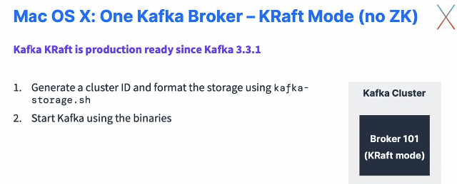
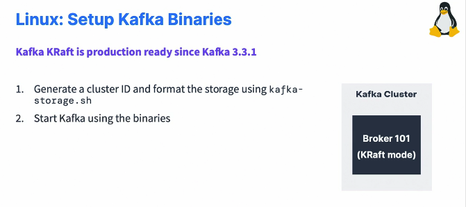
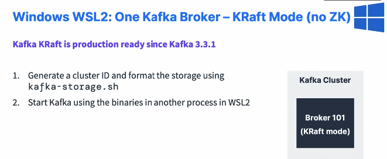

### Starting Kafka without ZooKeeper

#### macOS X: Start Kafka in KRaft

* We're going to see how to start one Kafka broker using KRaft mode. So, I mean, there is no zookeeper in this instance and which is something that you will have to do, starting with Kafka 4.0, because Zookeeper is going to be completely removed from Kafka 4.0. But as of Kafka 3.3.1 Kafka KRaft is production ready, and then we're going to be able to see how to actually start Kafka without Zookeeper. So for this two steps, we need to generate a cluster ID and then format the storage using the Kafka storage.sh command, and then we can start Kafka using the binaries very simply.

  

* I'm going to stop the commands that I have running already on my terminal, so I'll do Control C on Kafka to stop my Kafka server. So now my Kafka server is shut down. Okay. And I will clear my screen and then I'll do Control C to stop Zookeeper and then I will clear my screen. Okay. So now Zookeeper is shut down, Kafka is shut down, and I can actually close one terminal because I will only need one terminal for the rest of this course. Okay. So next on the Kafkademy website, I'm going to install Kafka without zookeeper in KRaft mode. And again, all the commands are for reference right here. So we don't have to reinstall Java 11. Of course, we don't have to read an old Kafka because we have it. But now we can start Kafka and first we need to generate a new ID for our cluster. So thankfully, the Kafka storage command is accessible to us and it's already in the path. So I can just copy this part. Kafka storage.sh and then random UUID. 

  ```sh
  kafka-storage random-uuid
  l-FtCHrsTB2eEhwNx7LBWw
  kafka-storage format -t l-FtCHrsTB2eEhwNx7LBWw -c /usr/local/etc/kafka/kraft/server.properties
  Formatting /usr/local/var/lib/kraft-combined-logs with metadata.version 3.5-IV2.
  /usr/local/bin/kafka-server-start /usr/local/etc/kafka/kraft/server.properties
  ```

* So this is going to generate a cluster ID for your cluster. Okay. Next we're going to format our storage directory and then we'll replace the UUID by whatever is obtained above. So this is the full command right here. So I'll just copy this part. So Kafka storage format, okay, let me paste this in. So Kafka storage format. Then we need to pass the UUID we obtained from before, so I will just copy this and paste it in. And then we need to pass the KRaft server.property file. So it is in the config. So if you go into your config folder already there is a KRaft directory and within it there is a server.property file that we'll be using. Okay. So what I'm going to do is just use this, but as you can see, the path is wrong. So this is not Kafka 300 I'm using, but it's Kafka 310 that I'm using. Okay. So let's press "Enter". And it has formatted a directory called temp slash KRaft combined logs. And this is where Kafka is going to store its data. So once this command is done, then I will be able to do a Kafka server start. Okay. And then I'm going to do a Kafka server start and pass in the right configuration file. So let's do Kafka server start. And then in here we have access to the config KRaft server.property. So I will just edit and put a one here to have the right path because if you don't, you're going to get a like file not found exception, you see, because something has not been found. So instead, make sure you pass in the right directory path. You press "Enter" and there you go. So Kafka is started, and as we can see, Kafka is running on its own. It was not using Zookeeper to get started, which I think is pretty awesome and cool. So either using Kafka KRaft mode or Kafka with Zookeeper

#### Linux : Start Kafka in KRaft mode

* We're going to see how to start one Kafka broker using KRaft mode. So, I mean, there is no zookeeper in this instance and which is something that you will have to do, starting with Kafka 4.0, because Zookeeper is going to be completely removed from Kafka 4.0. But as of Kafka 3.3.1 Kafka KRaft is production ready, and then we're going to be able to see how to actually start Kafka without Zookeeper. 

  

* So for this two steps, we need to generate a cluster ID and then format the storage using the Kafka storage.sh command, and then we can start Kafka using the binaries very simply. Okay. So back here, I'm going to stop the commands that I have running already on my terminal, so I'll do Control C on Kafka to stop my Kafka server. So now my Kafka server is shut down. Okay. And I will clear my screen and then I'll do Control C to stop Zookeeper and then I will clear my screen.

  ```sh
   kafka-storage.sh random-uuid
   e5-OVWAWSoebOBxJom3gdw
   kafka-storage.sh format -t e5-OVWAWSoebOBxJom3gdw -c kafka_2.13-3.0.0/config/kraft/server.properties
   kafka-server-start.sh kafka_2.13-3.0.0/config/kraft/server.properties 
  ```

* So now Zookeeper is shut down, Kafka is shut down, and I can actually close one terminal because I will only need one terminal for the rest of this course. Okay. So next on the Kafkademy website, I'm going to install Kafka without zookeeper in KRaft mode. And again, all the commands are for reference right here. So we don't have to reinstall Java 11.

* we don't have to read an old Kafka because we have it. But now we can start Kafka and first we need to generate a new ID for our cluster. So thankfully, the Kafka storage command is accessible to us and it's already in the path. So I can just copy this part. Kafka storage.sh and then random UUID. So this is going to generate a cluster ID for your cluster. Okay. Next we're going to format our storage directory and then we'll replace the UUID by whatever is obtained above. So this is the full command right here. So I'll just copy this part. So Kafka storage format, okay, let me paste this in. So Kafka storage format. Then we need to pass the UUID we obtained from before, so I will just copy this and paste it in. And then we need to pass the KRaft server.property file. So it is in the config. So if you go into your config folder already there is a KRaft directory and within it there is a server.property file that we'll be using. Okay. So what I'm going to do is just use this, but as you can see, the path is wrong. So this is not Kafka 300 I'm using, but it's Kafka 310 that I'm using. Okay. So let's press "Enter". And it has formatted a directory called temp slash KRaft combined logs. And this is where Kafka is going to store its data. So once this command is done, then I will be able to do a Kafka server start. Okay. And then I'm going to do a Kafka server start and pass in the right configuration file. So let's do Kafka server start. And then in here we have access to the config KRaft server.property. So I will just edit and put a one here to have the right path because if you don't, you're going to get a like file not found exception, you see, because something has not been found. So instead, make sure you pass in the right directory path. You press "Enter" and there you go. So Kafka is started, and as we can see, Kafka is running on its own. It was not using Zookeeper to get started, which I think is pretty awesome and cool. So either using Kafka KRaft mode or Kafka with Zookeeper, you should have Kafka started and you should be good to go for the rest of this course.

#### Windows WSL2: One Kafka Broker - KRaft Mode (no ZK)

* We're going to have a look at how to start Kafka in KRaft mode. So without Zookeeper on Windows WSL2. So just note that Kafka KRaft is production ready since Kafka 3.3.1 and this will be the only supported mode to run Kafka in starting with Kafka 4.0. And this mode, the KRaft mode, only works with Windows WSL2. So that means that after Kafka 4.0, you will have to run Kafka in KRaft mode on Windows WSL2, and these are the instructions for it. So for this you need to generate a cluster ID and format the storage using the Kafka storage.sh command, and then you can start Kafka using the binaries in another process in WSL2. So let's get started. Okay. So I'm going to stop the Kafka right here. I'm going to stop Kafka and I'm going to stop Zookeeper as well. And I will only keep one window because we'll need one window for this tutorial. 

  

* We can go into the page here on Conduktor Kafk ademy to get the instructions that I wrote to run Kafka on Windows without Zookeeper in KRaft mode. Okay. And to do so, we need to, just go and do these steps right here to join a cluster ID and format the storage. So to do so, we click on Start Kafka, and here we have a Kafka storage command that we have to run and to generate a cluster ID that is a random UUID. So let's go and copy this and then I'll paste it in. And this is generating for me a random UUID for my cluster. And then next what I could do is to format my Kafka storage. Okay. So let's copy this command and then we'll analyze it. So we'll paste it and to do so, so we are going to run this Kafka storage. We're going to replace the UUID by what we obtained right here. So copy and then paste and then we need to pass in a config file. So make sure to change the directory to the Kafka correct Kafka version, /config/KRaft/server.properties. And this is going to format my Kafka storage. So now the formatting is done. And once the step is done, then I can go ahead and start Kafka. So I'm going to again copy this command, click here, paste it, and then I will just change again my Kafka version in this command right here then we press Enter. And now, voila. We have a Kafka running on its own in KRaft mode, which is quite cool. So this broker is running without zookeeper, which is quite nice. And finally, if you wanted to edit the data directory for this, you would edit the config file. So we'll do nano Kafka bin sorry, config KRaft and then server.properties. And in this file yet again you can scroll down and you will find the logs, directory settings or logs.dir. And here you have this value you can change if you wanted to, but I will not do it in this lecture because I am very happy the way it is. We've launched Kafka in two ways on Windows.