### CLI (Command Line Interface) 101

#### CLI Introduction

* We're going to have a look at how to start Kafka in KRaft mode. So without Zookeeper on Windows WSL2. So just note that Kafka KRaft is production ready since Kafka 3.3.1 and this will be the only supported mode to run Kafka in starting with Kafka 4.0. And this mode, the KRaft mode, only works with Windows WSL2. So that means that after Kafka 4.0, you will have to run Kafka in KRaft mode on Windows WSL2, and these are the instructions for it. So for this you need to generate a cluster ID and format the storage using the Kafka storage.sh command, and then you can start Kafka using the binaries in another process in WSL2. 

  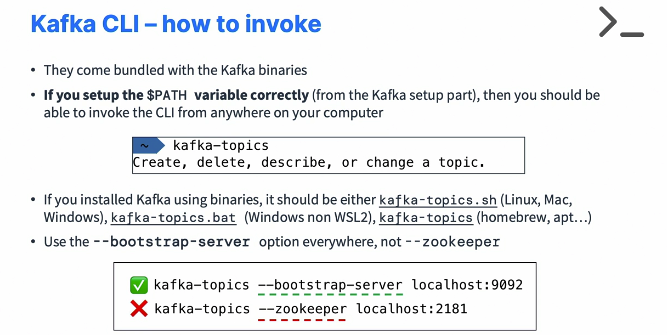

* So I'm going to stop the Kafka right here. I'm going to stop Kafka and I'm going to stop Zookeeper as well. And I will only keep one window because we'll need one window for this tutorial. Next, we can go into the page here on Conduktor Kafk ademy to get the instructions that I wrote to run Kafka on Windows without Zookeeper in KRaft mode. 

  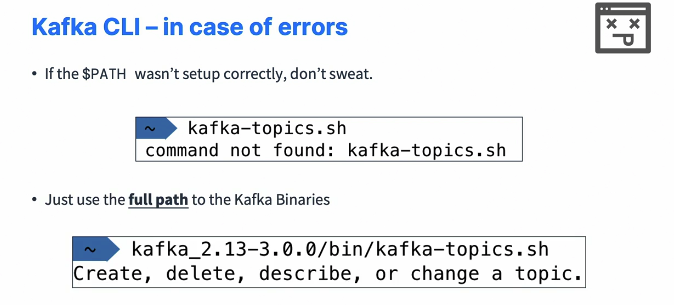

* Okay. And to do so, we need to, just go and do these steps right here to join a cluster ID and format the storage. So to do so, we click on Start Kafka, and here we have a Kafka storage command that we have to run and to generate a cluster ID that is a random UUID. So let's go and copy this and then I'll paste it in. And this is generating for me a random UUID for my cluster. And then next what I could do is to format my Kafka storage. Okay. So let's copy this command and then we'll analyze it. So we'll paste it and to do so, so we are going to run this Kafka storage. We're going to replace the UUID by what we obtained right here. So copy and then paste and then we need to pass in a config file. So make sure to change the directory to the Kafka correct Kafka version, /config/KRaft/server.properties. And this is going to format my Kafka storage. So now the formatting is done. And once the step is done, then I can go ahead and start Kafka. So I'm going to again copy this command, click here, paste it, and then I will just change again my Kafka version in this command right here then we press Enter. And now, voila. We have a Kafka running on its own in KRaft mode, which is quite cool. So this broker is running without zookeeper, which is quite nice. And finally, if you wanted to edit the data directory for this, you would edit the config file. So we'll do nano Kafka bin sorry, config KRaft and then server.properties. And in this file yet again you can scroll down and you will find the logs, directory settings or logs.dir.

#### Kafka Topics CLI

* So we have a Kafka cluster and we know that it's made out of topics and so therefore we're going to do topic management using the CLI, we're going to create Kafka topics, we're going to list Kafka topics, describe Kafka topics, increase the number of partitions in a Kafka topic. And finally, we're going to delete a Kafka topic. But if you are on Windows non-WSL2, then please do not delete a topic, otherwise things will crash fatally for you. Okay. So let's get started and practice.

  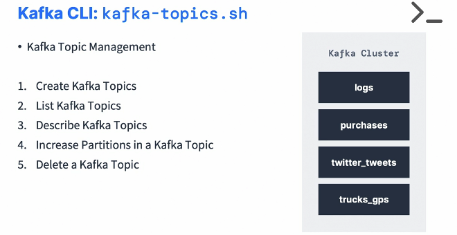

* We're going to learn how to use the Kafka topics CLI to create and delete and list topics. And these files you can find in the Section 2 of this course called Code Download. And you can download the code and unzip it and you'll be good to go. So in this tutorial and for the CLI, I'm going to show you how to do it on the conduktor platform. 

* But all the instructions for all these files right here are available for the conductor platform right here and the very same instructions are available if you wanted to decide to use Kafka on your localhost. The reason why I'm going to use the conduktor platform is because we've created a UI and this makes learning visual. So as such, I strongly recommend to follow the same way as me. But again, you can do everything on localhost. It will be the exact same commands. On top of it, this allows you to understand how to connect to a secure cluster, which is something you most likely will have to do at some point in your Kafka journey. So why not start now? So the first thing we have to do is to create a configuration file with these configuration right here. So I will copy this properties. And what I have to do is to create a playground.config file. 

  ```bash
  kafka-topics --bootstrap-server localhost:9092 --topic third_topic --create --partitions 3 --replication-factor 1
  kafka-topics --bootstrap-server localhost:9092 --topic second-topic --describe
  kafka-topics --bootstrap-server localhost:9092 --topic first_topic --delete
  ```

* So that file needs to reside exactly where you're going to run your CLI command. So for me it resides in this directory. So I'm going to just do code to open my code editor, and then I'm going to create a file called playground.config. You can do this any way you want, but as you can see this, just open this playground.config file and I'm just going to paste what I have before and save it. So make sure it is three lines on it. So one, two and three, and then you'll have your username and your password in there. So that's the first step. And then now you can go ahead and run some commands. So the first thing is that we're going to look at the Kafka topics command so it can be dot sh, and then you'll get this blob of documentation, which means everything is working. Or this could be Kafka topics without doth sh based on your operating system. And again, you'll get the blob of text. So one or these two should work. If not, please use the full path. 

* So the first thing I'm going to do is to show you the anatomy of a command. So if I paste this in, the first part is Kafka topics.sh which presents to command itself. Then we have command config, playground.config, which is the file I just created in this directory, and this is to pass on additional connection property to Kafka, which is necessary when you connect to a secure Kafka cluster. And then you have the bootstrap server option with the actual bootstrap server you're trying to connect to which represents the URL of where Kafka is. So if you try to do this command right here, you will have an issue. 

* When you have an issue, it just shows the documentation just right now and you will know why there is a problem. So if I scroll back up, if I scroll back up in here and I look at it, it says that the command is wrong because it must include at least one action, which is list describe, create, alter or delete. And these options are pretty much shown in the documentation of the CLI. So of course you're going to learn these options with me today. But in case you see the documentation as an output of your command, that means that you're missing some options. So let's remove this. So now let's actually create our first topic. So I'm going to copy the entire command right here and do the minus minus create and then minus, minus topic and then name first topic. So this will create my first topic. I press "Enter" and it works. And just to show you just once on localhost, you can do the exact same thing. So let's create our first topic on localhost and this time there is no command config. You can just go ahead with bootstrap server localhost 9092 because it is an unsecure connection. 

* We can do the same, create our topic and the topic is created. But the thing is when you lose localhost, you cannot view what's happening. So again, for you to get the best learning, I recommend you use the playground because in the playground you can go under the console home, make sure you choose my playground on the top, right, and then you have first topic. And as you can see, I just created it and it appears so it's a really nice way to get visual feedback of your actions, which can help you a lot during your learning. Okay. So we know now how to create a topic, but there is a new option. So as you can see, this topic got created with three partitions, as you can see in the UI. And if I paste this command here now, actually now we can also specify the number of partitions and it's always good to be very explicit about what you're trying to create. So in this example, I create a topic called second topic and it has five partitions. So let's press "Enter" and the topic is created. And of course if I go in the console and refresh this, now I see three partitions and five partitions. 

* So we have visual feedback again, that things worked as expected. Now there's something called the replication factor. So replication factor is a way to replicate topics onto multiple servers for disaster recovery purposes in high availability. And what you have learned is that you cannot have a replication factor higher than the number of brokers you have. So it turns out that if you try to create a topic with a replication factor of two, for example, on localhost, this is going to fail. Why? Well, because on localhost, as you can see, there's an error saying that the replication two is larger than the number of available brokers one. And so therefore you cannot create a topic with an RF, replication factor, higher than the number of brokers. And so therefore the only way to make it work on localhost with the setup we have is to use a replication factor of one. And that's fine. But in the cluster we have online on conduktor, it turns out that if you're a bit curious and go to the brokers here, as we can see, we have 39 brokers. Now that may be different for you, but we'll have more than one. So you have 39 brokers and that means that we can use a replication factor that allows our topic to be fully distributed. So back into our topic now. On conduktor, you can actually run this command. 

* And what happens if you try to do replication factor of two? Well, this is going to work, but actually it's not going to be two. It's still going to be three. And the reason is en conduktor platform, we've decided to just make it constant so that all the topics created have a replication factor of three, which is optimal. So even if you try to create one with the replication factor of one, we will say no, it will have to be a replication factor of three. So if you go on to the third topic, as you can see, there is a replication factor of three right now that is shown. Now in case you have a UI, it's actually very simple to list topics. You just go and you can see them all. But how do you do this when you don't have a UI? Well, for this we can use the Kafka topics and then minus minus list command, which is going to simply list your topics one by one in this UI. As you can see, I have my first, my second and my third topic. Now, how do you get details into your topics? Well, you can use the describe option and the describe option goes alongside your topic arguments. So I have my minus minus topic, first topic and then minus minus describe. And it's going to describe my topic itself, which means that every single partition is going to give me a bit more information. So here what I see is that my topic is name first topic. We have three partitions and a replication factor of three. You get some additional information about potential configurations. 

* And then here we have a topic with three partitions. So each line represents one partition. And as you can see, there is leader 31 and then replicas 31, 15, 5 and then ISR 31,15, 5 And you may have some different numbers here, but what does it mean? Well, if you remember, I told you that when you have a topic and it is distributed, it is retrieved on different broker IDs. So this means that my partition zero in here has the broker number 31 as the leader and the replicas represents 31, number 15 and number five, which makes it a replication factor of three. And because all my replicas are in sync, it says ISR in sync replicas of also 31, 15 and 5 and my partition one right here has the leader of 14 and the replicas of 14, 1 and 9, which is really cool because thanks to this we really see the distribution of our topic onto different brokers. And in this example, nine brokers to be exact, which is really, really nice. And if you try to run the same describe topic command but on your localhost. So I don't know if I have created this topic, I forgot. Yes, there it is. So my first topic is created as you can see, you see something a little bit less interesting because we have first topic partition 0 leader 0, replica 0, ISR 0. So don't mix up the numbers. Partition 0 is the ID of the partition, whereas leader 0, replica 0 and ISR 0 represents the broker id 0 that holds this topic partition. But again, you won't see any replication with one broker. So that's a good. And then finally, how do we delete a topic? Well, very simply you go and run the Kafka topics command and you have the topic name and the option minus minus delete, which is going to delete a topic. So in this example, I can delete my second topic. And if I refresh this, as you can see, it is gone. But also I can quickly go back into here. I can choose to delete my topic by just using the UI one more way so you don't have to remember all the commands and I can even delete my first topic. So we have seen a lot. We've seen how to use the CLI on localhost, we've seen how to use the CLI on the conduktor platform and Kafka topic CLI is something you'll use a lot if you don't have a UI hopefully any kind of UI can help you speed up your processes.

#### Kafka Console Producer CLI

* So we're going to practice two use cases. 

* We're going to practice without sending key. So the key will be null and the data will be distributed across all partitions. 

* Or we can produce with keys to have the same key always go to the same partitions

  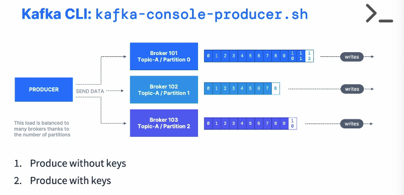

* So let's practice using the Kafka console producer for this. Go into your code and open the file name one Kafka console producer. So again, we'll run the same commands both on conductor platform and localhost. They're very similar. So first things first. If you don't have any topics, which I don't right now, I will go ahead and create my first topic with one partition and we use one partition to demonstrate a special behavior. I will let you know later. So my topic first topic is now created and the next thing we have to do is to produce to it. For this, we're going to use the Kafka console producer command so you can look at its documentation by just typing the command and then you'll have access to the full documentation right here. But in this lesson, I'm going to teach you the most important one. So let's go back to our console producer and have a look at what we do. So we're going to copy and paste this entire command. So the first part of the command, the producer playground.config allows you to connect to a secure cluster and the bootstrap server is specifying where the cluster is. And then we just specify minus, minus topic first topic. The command is a little bit simpler when you connect to an unsecure cluster. So if you have bootstrap server localhost 9092 and then topic first topic, you're good to go. Okay. So let's go ahead and run this command. And when you launch your console producer, you're going to have this chevron on the left hand side, which tells you that you're ready to produce. So I'm just going to say hello world, and then I'm going to say my name is Stephane from Conduktor, and then I love Kafka. And every time you press Enter, this is actually going to send a message into Kafka. And this is why you have a new chevron. And to just stop sending messages into Kafka, just press Control C and you're out of the console producer. Now we will see how to consume messages in the next lecture when we will look at the console consumer. But if you wanted to do a quick shortcuts, you can go into the UI and then you can have a look at the fact that the messages have been consumed here with hello world, my name is Stephane from Conduktor and I love Kafka. So this is the confirmation that our console producer has worked, of course. Next we can actually enhance our producer and when we start specifying properties to enhance this behavior, to change batching and so on, we can use the producer property arguments. So in this example I'm producing with properties and the property acks equals all, just specify that every message should be acks by all brokers. So again, you won't see anything producer side that changes. But in the backend, if you say some message, that is acked, of course the message is going to be acked by all brokers the way we learned about it just for fun and then learning. Okay. So we've we've specified six messages right now, and these three have been acked, of course, because all my brokers are up, everything worked just fine. Another behavior you should have a look at is producing to a non existent topic. So in this example I have the same command as before, but I produce to the topic called new topic. And if you have a look at my topic list, as you can see right now, there is no new topic. There's only one called first topic. So if you produce to a non-existing topic, you're going to have a different behavior based on different clusters. So for us, as you can see, there's a chevron. So it seems like everything is fine. But if I type hello world, you're going to have a sort of timeout or you're going to have a sort of error and this is because we don't allow you to produce to a topic that doesn't exist. And as you can see, we get an error message saying that the topic is not in the metadata. So it was never created. We can verify this behavior by running a Kafka topics command with a list and to look at the fact that we only have first topic in here. So this is a different behavior you will observe because if you try the exact same command but on your Kafka on localhost that you've just created with a default configuration and you say hello world, you see two warnings saying leader not available because it actually is no leader for the topic that got auto created. So you may see once or twice, but then after twice or three times of this error, the topic will have been created and the topic will have a leader. And so therefore this hello world worked. And you can verify this because well, if you do a list of topics, as you can see, we can find the new topic that get auto created and if you describe that topic in case of auto creation, it will have, for example, one partition, partition count equals one because this is the default you set for your Kafka cluster. So what you can do is that you can actually go and edit some configs in the server.properties file. So the file you used to start your Kafka server with and you can add for example, number of partitions equals three. And by default, if you send messages to a non existing topic again, then it will have three partitions by default. This is to make it a little bit easier for you to start with Kafka. But to be fair and the best practice is and this will be on many, many different clusters that auto topic create will be disabled and you are strongly encouraged to create the topics ahead of time, which is why we have disabled it on the Conduktor playground. So try to get used to it. Lastly, we can also produce using keys. So if you have a look at our first topic right now and we have a look at some messages, as we can see, the key is null. So key null, value learning, key null value just for fun and so on. Because by default, when we send a message using the console producer, it's going to send the null key. But we can actually produce with keys. And we've seen that when we produce with keys, the same key will go to the same partition and that's the behavior we will verify later on. So if we have a look here. The producer of keys, I copy this entire command and we have a look at the arguments right now. So the topic is still first topic, so something that already exists for us and the property is parse key true. So the key is going to be sent as part of this console producer and the property is key.separator is colon. So that means that when you produce messages what is left of the colon is the key and what is right of the colon is the value. So let's press Enter. We'll have example key example value and here is name Stephane. So I send different keys and different values. And if we have a look now in the playground and refresh this page, I'm going to just refresh this view right here. As you can see now, the key is name, the value is Stephane and the key is example key and the value is example value. Now, I can't really show you the same key goes to the same partition right now because we only have one partition. So all the messages will go to that one partition. But we will see this behavior later on. 

  ```sh
  # Replace "kafka-console-producer" 
  # by "kafka-console-producer" or "kafka-console-producer.bat" based on your system # (or bin/kafka-console-producer or bin\windows\kafka-console-producer.bat if you didn't setup PATH / Environment variables)
  
  kafka-console-producer 
  
  # producing
  kafka-console-producer --bootstrap-server localhost:9092 --topic first_topic 
  > Hello World
  >My name is Conduktor
  >I love Kafka
  >^C  (<- Ctrl + C is used to exit the producer)
  
  
  # producing with properties
  kafka-console-producer --bootstrap-server localhost:9092 --topic first_topic --producer-property acks=all
  > some message that is acked
  > just for fun
  > fun learning!
  
  
  # producing to a non existing topic
  kafka-console-producer --bootstrap-server localhost:9092 --topic new_topic
  > hello world!
  
  # our new topic only has 1 partition
  kafka-topics --bootstrap-server localhost:9092 --list
  kafka-topics --bootstrap-server localhost:9092 --topic new_topic --describe
  
  
  # edit config/server.properties or config/kraft/server.properties
  # num.partitions=3
  
  # produce against a non existing topic again
  kafka-console-producer --bootstrap-server localhost:9092 --topic new_topic_2
  hello again!
  
  # this time our topic has 3 partitions
  kafka-topics --bootstrap-server localhost:9092 --list
  kafka-topics --bootstrap-server localhost:9092 --topic new_topic_2 --describe
  
  # overall, please create topics before producing to them!
  
  
  # produce with keys
  kafka-console-producer --bootstrap-server localhost:9092 --topic first_topic --property parse.key=true --property key.separator=:
  >example key:example value
  >name:Stephane
  ```

* And when you use such a producer where you have a key separator, of course, is you just send something without a colon, you're going to get an exception because while you haven't found any key separator.

#### Kafka Console Consumer CLI

* So we know that consumers can read from partitions the data in order and as well in the group. And so we're going to practice an example to read a Kafka topic. So we'll consume from the tail of the topic, that means only new messages. 

  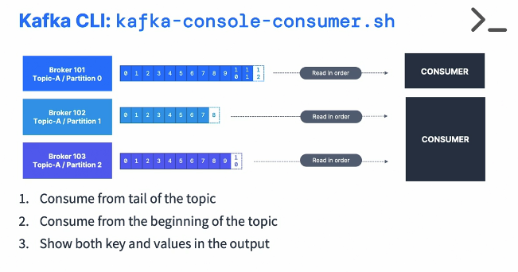

* We'll also consume from the beginning of the topic, okay, to see all this stuff from the beginning. And finally, we're going to also show options to see both the key and the values in the output of our consumer. So let's get started. So let's go ahead and practice the Kafka console consumer so we can reproduce with the CLI where we saw with the UI. We're going to use this command right here. So you can always type the command to see the documentation, but we'll learn the most important options right now. So we have a topic with one partition, but I want to create a second topic with three partitions to show you different behaviors if the data is distributed or not. So if we have a look now, the second topic is created using the Kafka topics command and we're going to consume that topic. 

  ```sh
  kafka-console-consumer --bootstrap-server localhost:9092 --topic second_topic
  kafka-console-producer --bootstrap-server localhost:9092 --producer-property partitioner.class=org.apache.kafka.clients.producer.RoundRobinPartitioner --topic second_topic
  #consuming from beginning
  kafka-console-consumer --bootstrap-server localhost:9092 --topic second_topic --from-beginning
  ```

* We don't consume the first topic yet. Right now let's just consume the second topic. So when we launch this console consumer command, as you can see, the second topic is being consumed, but nothing happens. That's because we haven't sent any messages into the topic and you will observe the same behavior. So if I do the same command with the first topic, as you can see, still no messages are being consumed because we consume from right now, not from the previous messages, but we'll see how to consume from the beginning in a few seconds. So let's do it again. We are going to consume right here and I'm going to start a command in the bottom to start producing. So I have my consumer on top and my producer in the bottom. So you can open a different terminal for you. For me, it's a shortcut command Shift D for my special terminal item, but you can just open another terminal window and achieve the exact same behavior. So let's do a console producer and we're going to pass in a few important things. So number one, we produce to the second topic, the topic we just created. And number two, we pass in a producer property called the partitioner class, and this is called a round robin partitioner. The reason I'm using this round robin partitioner is because I want to produce to one partition at a time and change every partition. If you do not use this round robin partitioner, there have been so many optimizations built in into Kafka right now that you will keep on producing to the same partition up until you send about 16kB of data and then you will switch partition, which is very difficult to demonstrate as a teaching mechanism but is great for production settings. But because we are learning Kafka and I want to show you what happens when we produce through multiple partitions, I'm going to be using this round robin partitioner. But again, do not use this in production. This is most likely the most inefficient partition you can ever find. Okay. So we are in this round robin partitioner and now if I just send a message, hello world. My name is Stephane. It's working, as you can see where we see the messages appear in the console consumer. 

  ```sh
  kafka-console-consumer --bootstrap-server localhost:9092 --topic first_topic --formatter kafka.tools.DefaultMessageFormatter --property print.timestamp=true --property print.key=true --property print.value=true --property print.partition=true  --from-beginning
  ```

* So that's pretty cool. So to just stop a consumer, you do Control C and again, if I run the same command and press Enter, as you can see, nothing happens because you need to actually be sending messages again to the topic. So one, two and three. And of course these messages are appearing in my consumer. So you may be asking me, how do we consume it from the beginning? Well, there is an option called consume from beginning. So let's run this right now and press Enter. So as you can see, we have the messages appearing. So all the messages I sent are here, the six messages. But it turns out that they're not in the same order I sent them. So as you can see, number three, for example, and the two were out ordered from the one. But that's actually normal. It's because I have three partitions and so the data is only read in order by partition. I will show you this in a second to show you the partition number so we can observe that behavior. But for now, just accept this. And if you just do consume the first topic instead from the beginning, you're going to find all the messages are sent in order because there's only one partition. And because there's one partition, you will have everything in order but you don't scale. In Kafka you want to scale and so therefore you need multiple partitions and the producer will produce two different partitions and we will consume from different partitions with different consumers at the same time. Another behavior we'll see in the next lecture. So to go back to our example with the second topic with three partitions, let's go ahead and try to display the partition number. So for this, we have this entire command right here that I'm going to describe to you in a second. And so in here, what we do is that we are actually going to use a formatter and the formatter is using the default message formatter. And this is to format the output of this command. And first property is print timestamp true to know when the message got received. Second is print key true to print the key because we don't see the key right now in the default console consumer. Print value true to also get the value of course. And print partition true to get the partition number the message got assigned to. Finally we use from beginning to read the messages from the beginning. So let's press Enter. And we have some interesting information. So now it makes more sense as to the output we got because, well, the message my name is Stephane get assigned to partition two and the message two get assigned to partition two. And so therefore I see them in order from within the partition two. And then it's working and the message three gets sent to partition zero and hello world and one gets sent to partition one. So again, remember that we get ordering per partition and that makes sense. And this is why it's good to remember this in Kafka. You don't get full ordering because that makes no sense. You get ordering per partition and this command we just run allows you to see this. And this is similar if you went into the UI and you are looking at the topic called second topic. So let's refresh this page and look at second topic and you could filter by partition for example, and just look at partition zero and apply and we'll find only two messages. And if you click on a specific message right here, you can look at the metadata and you see that it's partition zero offset one. So that's very helpful. And hopefully that allows you to understand the behavior of producers and consumers. And of course, well, if I keep on producing to my topic, so another one, yet another, and then last one. As you can see for these messages, they get sent to partition one and then partition two and then partition zero.

#### Kafka Consumers in Groups

* We've seen how the Kafka console consumer works, we're going to be able to start them in a consumer group and we'll learn about the group parameter, and it's going to show us how partitions are divided amongst multiple CLI consumers. It is actually a really cool demo. So here is a reminder of what we're trying to expose. So we have, for example, five partitions and then three consumers and each consumer is consuming from a different partition. They're all distinct. So that's the behavior we're going to try to explore by creating multiple consumers within the same group.Let's have a look at file number three called Kafka Consumer in Group. 

  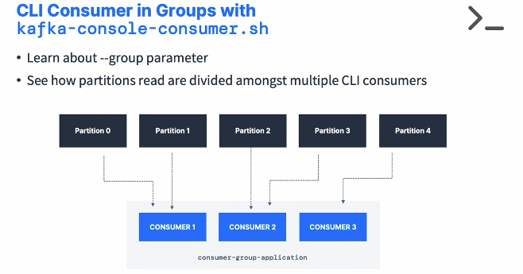

* And we are going to first create a topic named third topic with three partitions. This way we can start afresh.So my topic is now being created and what we're going to do is that we're going to consume from this topic. So I copy this part, but we add one last argument, which is the group parameter, which specifies a group ID for our console consumer. My first application, we tell Kafka and the console consumer that we are using a consumer group and this is the first time we're actually doing it. 

  ```sh
  kafka-topics --bootstrap-server localhost:9092 --topic third_topic --create --partitions 3
  kafka-console-consumer --bootstrap-server localhost:9092 --topic first_topic --group my-first-application
  kafka-console-producer --bootstrap-server localhost:9092 --producer-property partitioner.class=org.apache.kafka.clients.producer.RoundRobinPartitioner --topic third_topic
  ```

* So we press enter and nothing happens because, well, we need to start producing into our topic. We start a console producer and we use the round robin partitioner to make sure we send messages across different partitions. This is the only way to observe this behavior from a learning perspective. But remember, no production here. So we have launched this producer, and if I do a test, as you can see, the message test is appearing in my console consumer. 

  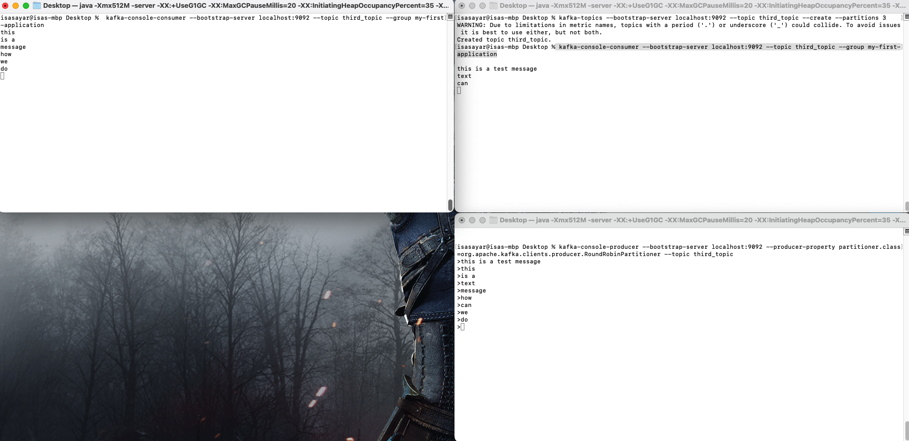

* So this is great. And what we're going to do now is that we're going to launch another consumer as part of the first group, because right now if I obviously send messages, these messages are going to be received by that one console consumer. But what I'm going to do now is to fold this a little bit and start a console consumer but on the right hand side. So with the same command, okay, we consume from the third topic, but the group is my first application. So we have now two consumers in the same group. And if we have a look here, I say hello and then world. and then last. As you can see, the hello and the last went to my first consumer and the world went to my second consumer. This is because we have a consumer group and it turns out that this consumer gets two partitions assigned and this one get one partition assigned and we can push this behavior to having a third consumer. So we are doing a third consumer as part of the group. And now it has joined the group. So again, if I start to send messages, so one, two and then three. As we can see, the one got here, the two got here and the three got here. So the messages get spread all across my consumers. And that really shows the power of Kafka, because now we have a producer producing two different partitions and consumer consuming from different partitions. And so as I keep on sending messages into Kafka over time and depends how fast I do it, of course, but they will be spread across all my consumers. And just for the experiment, if I do one more consumer on this consumer group on the same topic now we have four consumers for three partitions, and it turns out that, well, it's what we call not impossible case, but the one consumer will never be reading data and the other ones may. So this one right here is not assigned any partition. So it's not receiving any messages, which is why you're not seeing it read right now. So just stop a consumer and then things will rebalance. So if I just send A, B and C, as you can see, each of these consumer received one message. If I shut down now, this consumer right here, a rebalance happens again. So D, E and F, and as you can see, D and E got here and F got here. And if I, of course, stop this consumer altogether and just keep one consumer G, H, I these messages all go to the same consumer. So we've seen really how that works with consumer groups. On top of it, if I keep on producing, as you can see, there is no more consumer okay in my group. But I keep on producing. I produce for example J, K, okay, so more messages. If I restart my consumer as part of this group, because it is part of the group and there's been some messages we need to catch up on, these messages are going to be read so J and K not necessarily in this order for you because we consume across multiple partitions, but these messages get sent to my consumer because it was catching on, catching up on the lag it had from before. And to finish, if we start a consumer from beginning as part of a different group. So this time the group name is my second application, which is different from my first application and I read this from the beginning, I'm going to be reading all the messages in my topics since the beginning, and we're done. And what if you run the same command again? So we read from a group that already existed, but we specify from beginning. Let's see, press Enter. And as you can see, nothing happens because from beginning is an argument that is only helpful when there has never been a consumer offset that has been committed as part of the group. So you're saying, hey, for this new group, start from the beginning. But now that we've actually used the my second application as a group and that we've read data in Kafka, as you can see, we don't use the from beginning argument. It doesn't work. And so this will not be taken into account. And we'll just be reading from where consumer offsets were last committed. So hopefully you've seen all the core behaviors of Apache Kafka in this lecture and you really understand consumers and consumer groups because that's the core of it. 

#### Kafka Consumer Groups in CLI

* We're going to have a look at the Kafka consumer groups CLI because in this lecture we're going to see how we can reset, delete and so on, manage these consumer groups. 

* We had multiple consumer groups reading from the same topic. It was possible. And we've also shown that consumer groups can within spread the reads. So this makes sense. So in this lecture we're going to list the existing consumer groups, we're going to describe one consumer group, and then we're going to delete a consumer group. 

  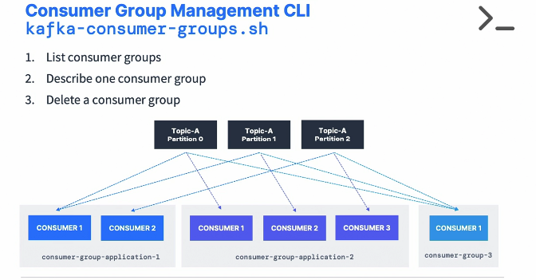

* This file name for consumer groups and we'll have a look at the Kafka consumer group CLI.The documentation can be done by entering the command itself. And so the first thing we're going to do is list all our consumer groups. So as you can see in here, we have two consumer groups, my first application and my second application. But this is something you can do visually as well. Here you can see I have my first application and my second application in the conduktor platform. 

* So this is the whole purpose of having a UI is to save a bit of comments. So what happens if we describe one specific group? So let's go ahead and describe the group called my second application, and I'm going to fold this a little bit. And as we can see here, we see that my second application is reading from the topic third topic, partition zero, and that the current offset is 14 and the log end offset is also 14 and therefore the lag is zero. So that means that my consumer group has fully caught up with my topic, but we can see these numbers changing and you can get the same kind of information by clicking on my second application and get some details here. 

  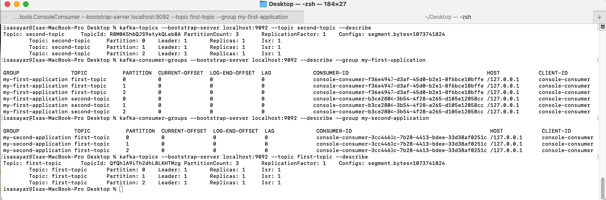

* But so if we want to create a console producer, so let's go and recreate our producer. So Kafka console producer and we produced to the third topic and then just send A, B, C, D. Okay. So this has sent more messages into my topic and this will have created some lag for my existing custom consumer group. So if I run this command right now and look at the output, as we can see now, the log end offset is 16 and 14 and 27. So on three different partitions and we have a current offset committed of 14, 13 and 25 and therefore the lag is 2, 1 and 2. So there has been some lag for my consumer group now because messages have been produced but not yet consumed and committed.

  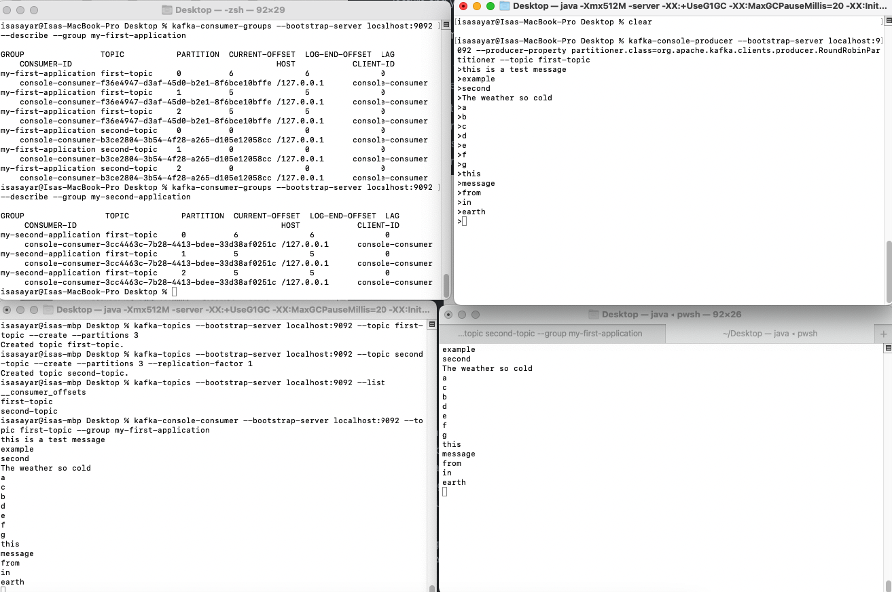

* If I stop this console producer and I start a console consumer again on my second application, what we expect is that we will be reading five messages because that's what the lag was. So we see these five messages right here. And if I leave the consumer running and do a describe again of my consumer group, as we can see, the lag is now 0. But there's been some data. So the consumer ID has been now filled and this is very, very long. But as you can see, this console consumer right here is consuming these three partitions. And this is something you can also see in UI settings. So if you refresh this page and look at this one, so as we can see, we can see that this console consumer right here has been assigned from this host, these three partitions. So this helps, this makes sense. And what happens if you start another console consumer? So let's start another one on the same group. This is a consumer group command. So now let's start a console consumer. Here we go. So now we have two consumers as part of the same group. And if I do a consumer group as we can see in here, you will see it. So partition zero has ID b46, partition one as ID b46 and partition two as ID fa1. So that means that this consumer fa1 this new one is consuming partition two whereas this consumer right here b46 as partition zero and partition one assigned to it. And this is why we see messages being spread out between different consumers when we read. And this is again a behavior you will see by going into the UI now we can see two different consumers with two different IDs are consuming different sets of partitions. So that's a pretty cool thing to demonstrate. And now we understand why things are happening and how we can describe what is happening.  

* I want to show you is that when you start a console consumer, but you don't describe a group. So in this example, I'm going to have a console consumer, but in this command right here, I use the topic third topic from the beginning, but I don't specify a group ID, so my console consumer is actually going to read all of my topic. This is expected. And now if we do a consumer groups command, but we are going to do a list to list all the existing consumer groups. As we'll see, we'll find console consumers in there. So these groups are here for a little bit of time, but after a while, they're going to be removed because there are temporary consumer groups. But just so you know, this is the kind of output you would expect when you're using consumer groups on the console with that group IDs. But they're temporary ones, and after a while, they will be gone. So do not leverage these consumer group IDs. Always when you want to consume a topic, leverage the consumer groups you have predefined. 

#### Resetting Offsets

* We're going to learn about how to reset offsets using the Kafka Consumer Groups command. So we've seen that consumers read from a consumer group and then they commit offsets once in a while, which allows them to restart the reads from where the offset was less committed.

* We'll start and we'll stop a console consumer, we'll reset the offsets and then we'll start a console consumer again and see the outcome. So let's describe the consumer group we have created from before. So if we have a look at my first application, currently we see that the lag is two, two and one. 

  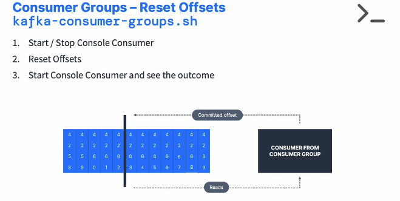

* So if we consume, we'll be consuming five messages. But we can also, for example, reset the offsets of this application to the very beginning to read all the messages. So the Kafka consumer groups has a thing called reset offsets. 

  ```sh
  kafka-console-consumer --bootstrap-server localhost:9092 --topic first-topic --group my-first-application
  kafka-console-producer --bootstrap-server localhost:9092 --producer-property partitioner.class=org.apache.kafka.clients.producer.RoundRobinPartitioner --topic first-topic
  kafka-consumer-groups --bootstrap-server localhost:9092 --describe --group my-first-application  
  # Reset offsets
  kafka-consumer-groups --bootstrap-server localhost:9092 --group my-first-application --reset-offsets --to-earliest --topic first-topic --dry-run
  ```

  

* So minus minus reset offsets, and then we can set two earliest, which is the earliest the data exist in the topic. And then we specify dry run to know what the assignment will be but we don't run it yet. So if we do this minus minus and then a dry run. As you can see, and this is for first topic, but we are consuming actually the third topic. So if we do a dry run for this, as you can see, it says that the new offsets is going to be zero, zero and zero. Which makes sense because that's the beginning of my topic. So to fix that, we need the execute flag. So instead of minus minus dry run, we do minus minus executes, which is going to actually execute resetting the offsets. So if we have a look right now, do minus, minus, execute and now the new offsets are zero. So instead of using the CLI, we can use, for example, this console consumer to have a look. And if we have a look right here, as you can see on conduktor and we see now that the lag is greater than zero because, well, we have reset to the beginning. So now we know where we are and so of course we would get the exact same result by using the consumer groups command to describe our group. So my first application and we'll find the exact same lag as before. So this makes sense. And now, of course, if we run a console consumer that's called my first application, that has been reset and we read this topic, third topic, we'll see that because we have reset the offsets, then we read all the messages again. So if we run a describe on the group now, because the consumer has been run. Now the lag is zero everywhere and we can verify this right here. So the one thing you should know is that the resets cannot happen when the consumer is running. So the consumer must be off and no consumers as part of group to reset the offsets. So for this, let's just stop this consumer and we can also choose to reset the offsets directly from the UI so we can choose the topic we want, the partitions we want and the strategy we want. So lots of options and I do earliest and now we're back to offsets refreshed at zero. So just two ways of doing things again. But you can get very funky with this CLI and if you have a look at the Kafka consumer groups documentation, you'll see that you have a lot of different arguments you can set to latest, to an offset, to a date, time, to current, you can set the shift by and so on. So lots of different options, but usually it becomes quite complicated to use the CLI and this is why a UI may become preferable when resetting offsets because you actually get a lot more information into what you want to do and be very specific about what happens. It allows you to iterate faster. 