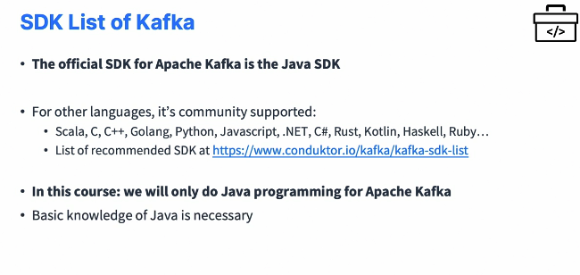
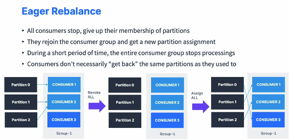

### Kafka Java Programming 101

#### Kafka SDK List

* So first we're going to use the official SDK for Apache. Kafka is the Java SDK, and we will write all the code in this section in Java. 

* But if you are using other languages all the SDK of Kafka are community supported. So all these languages right here and I have listed them all on my website at conduktor.io/kafka/kafka-sdk-list. In this course, we will only do Java programming for Apache Kafka. 

  

  ```sh
  https://www.conduktor.io/kafka/kafka-sdk-list/
  ```

* So I need you to have a basic knowledge of Java. And then if you wanted to, you can try to adapt the code for the language of your choice. So if you go to this URL, I give you before kafka/kafka-sdk-list, I show you the list of all the libraries based on different languages, and hopefully that gives you a little bit of pointers into how things work. Okay. And I cannot guarantee that all these client libraries will work the exact same way as Java, but at least it gives you some pointers into starting your Kafka projects. As I said in this course, we're going to use the Java official client library, which is low level and will allow us to write all the code we need against Kafka.

#### Creating a Kafka Project

* We're going to set up our Kafka project with a Java language to start programming against Kafka. And to do so prerequisites is that you should have downloaded and installed IntelliJ community ID. This is the development environment I'm going to use to program, and you can use the one you want if you wanted to. If you're a VS Code fan or if you're an Eclipse fan, you can do this, but it will be harder for you to follow along with me. Also, you need to install Java 11 JDK. So I liked Amazon Corretto 11 so you can Google it and find link for Linux Windows or Mac. Okay. But if you have, for example, the Oracle Java JDK for 11, it's fine as well. If you go as well for say version 17, I think it's good as well. But I know that 11 is working. 

* This is why I recommend you to install Java 11 JDK. Next is there is a question. Sometimes when you start with a Java project, people ask me, should I start with Maven or with Gradle. So I prefer to use Gradle in this instance for this course because I find it easier to write and easier to read and it will lead to less syntax errors and less errors overall. If you suddenly wish to use Maven because you are Maven expert, then I have written some instructions on my website, Conduktor.io/Kafka, and then you can find how to create a Kafka project using Maven. 

* And either way, you know, even if you use Gradle or Maven, the code will be the same and your Java project should work the same. So in this lecture, what I'm going to do is that I'm going to set up our project using Gradle and get back to you. Okay. So I have opened IntelliJ IDE and I'm going to click on New project. Now on the left hand side, I'm greeted with a couple options. You may see less, but you should have Gradle as an option and then I will choose Java for my gradle. 

  

* For the Project SDK, make sure you select, for example, Corretto 11. If you've installed JDK 11 through Amazon Corretto or choose the just installed through this drop down. For me, I will keep it as Corretto 11. I'll click on next and then you have to give it a name. So I'll choose Kafka beginner's course, and then place it on a location on your computer. In terms of the artifact coordinate, you can specify them. Then for group ID, I will enter IO .conduktor.demos, and for the artifact, I will keep it as Kafka beginners course as well as the version. I will keep it as 1.0 snapshots. So I'll finish it. 

* And this is creating a new project for me that I can find right here. So next, it's going to take a little bit of time for Gradle to synchronize, but you're going to see a couple of folders appearing on the left hand side. Now, I like to create sub projects for this course just to keep things organized. So we're actually not going to use this source directory with main and test, we're going to actually delete it. So I'm going to go ahead and delete this one. And this is just a very special step for me to set up sub projects. Okay. And then I'll click, I'll right click on Kafka beginer's course, I will do new and then module, and yet again I'm going to use Gradle Java version 11. Okay. And next I'm going to click on Next and bring a new project. Okay. And this one is going to be called Kafka basics because we'll start to see first the Kafka basics. The group ID is still the same and the artifact ID is now Kafka basics. So we'll finish this. And now you see, underneath now of my beginners course, there is a Kafka basics. Now it's very possible that IntelliJ will keep on recreating Source main and test for me, but this folder you should not use. Okay? You should use the one within Kafka basics. And then we have a build.gradle file in it. So don't get mistaken. Use the Build.gradle file in the Kafka Basics directory. Okay. So next, what I've done that I need to first pull in the Kafka dependencies. Okay. So in this build.gradle file, I'm going to add the Kafka dependencies so we can start using Apache Kafka. So to do so, I'm going to go on Google and I will type Kafka Maven and then enter. So I get the org.apache.kafka repository on Maven. I will click on Kafka clients, okay, make sure to choose the clients one. And then you see you get some information. The latest version is 310. So I'm going to click on 310, and then I will choose the gradle short so you can choose greater long or gradle short. I'll choose the gradle short, and I will copy this entire blob of text right here that I will paste. And so we need to paste it under our dependencies. So right underneath the dependencies block right here, I can paste this one. So this one represents the Kafka clients and we have two more dependencies that are logging dependencies that we should be getting. So to do so, we're going to go left. And the first one is called SLF4J API. So here it is. So I'm going to take SLF4J API again, take the latest version. I will pick the version 1.7.36. I will choose a non beta one. Okay. So this is good. I'll use the gradle shirt and I will paste this one here. Okay. And then finally I need to get SLF4J simple. And this is for again logging. So I'll type in SLF4J simple and then again choose the exact same version. Copy this and paste it in here. Great. I don't need to test my code right now, so I will remove these implementations of units. And one last thing you need to change is that here it says test implementation. So you copy it and you just have it as implementation. So the three dependencies are implementation. So once we have this, then we've set up our Kafka, our Java project with Gradle, and we need to pull in these dependencies. So to do so on the right hand side you may see here there's like load gradle changes. You can also access it directly. On the right hand side there's a gradle and then there is this like a refresh button to reload all gradle projects. So what this is going to do is that's going to actually pull your dependencies as external libraries. Okay. So how do you know this? Well, under sorry, here external libraries on the left hand side, you should start seeing some Kafka. So as you can see here, I have some Kafka clients available to me and I have SLF4J API and simple. So this is thanks to reloading the Gradle projects. So remember, if you don't find a dependency, remember to reload these gradle projects. Okay. So we're almost there. Now to finish the setup, I'm going to go under Kafka basics source main and then Java. And underneath here, I'm going to create a new and then it has to be a Java class and I will name it IO .conduktor.demos .Kafka.producerdemo. So this is going to create for me the folder IO.conduktor .demos.Kafka under class producerdemo. And I have my first class being created. Now we just need to make sure that it works. So I'm going to type main and then tab. So this is a little shortcut. So you do M-A-I-N in and then you can press enter or you can press the tab key and this is automatically going to generate the public static void, okay, which is like the class you need to start running some code in Java. And then I'll just do a system.out.println Hello world. This is just to make sure that your Java code is working okay. You add a semicolon at the end and then we can press one of these arrows. So I'll press this one. Run producerdemo.main. And as you can see, the Hello world is being run. And the last thing I'm going to do is go under IntelliJ IDE preference and then under build execution deployment under build tools, the first one and gradle I'm going to choose to build and run using IntelliJ IDE. This is because I found it to be working better when we go into deeper into the programming. So it's just a little trick, so it should be good anyway, but I'd like to build and run using IntelliJ IDE and the run test using Gradle. This is fine. I will apply it, press enter test one more time that this is working. So I'm building it and then it's running it. And then very soon. Perfect. I get the hell world in this kind of window and I like this kind of window to get my results. 

#### Java Producer

* I'm going to show you how to write your first Kafka producer using Java API. So we'll just write a very basic code to send data to Apache Kafka. We'll use some basic configuration parameters and we'll confirm that we receive the data in a Kafka console consumer. So we are going to create our first producer. So for this we first need to create the producer properties. Then we need to create the producer. Then we need to send data and finally flush and close the producer. And we'll have a look at all these steps, of course, in this video. So right now it's just the comments just to see what we're going to build.We need to create a logger. So private static final logger and a log equals. Logger factory dot get logger and then producer demo dot class dot get simple name. So anytime I was getting the code completed, I just press the tab button and I press the tab button as well on logger factory, which made me import the org dot SLF4J logger factory. 

  

* This is important because this is what you need to have in this course. And then if I click on the logger, as you can see, there is a question mark because you need to import the logger as well. So you do alt and then enter, which brings up this menu and you import class and the class is imported. So next we can replace this System.out.println by logger.info and we press play to run this demo and we'll see if our logger is working. So once you run this, you will get a producer demo Hello world as an output. That means that everything works. If you don't see this, the issue is that maybe you go in build.gradle and you haven't replaced test implementation by implementation. So you need to make it happen and you need to make sure you've imported SLF4J API and SLF4J simple and use the latest version if you can. Okay. So this is working fine. Next, we have to create our producer properties. So producer properties is the configuration of our producer. So we do properties. Properties equals new properties. And every time I do a tab it autocomplete and if need be, it will import the necessary packages. I won't say this over and over again, but I just type things and I press tab. All right. So next we need to set properties, so properties dot set property. And this is the key and this is the value. So whenever you create a property and you set it, you need to say, for example, that the bootstrap servers is going to be equal to 127 001 port 9092. So this is the kind of things that we've set with CLI a lot. We were setting up the bootstrap servers, but now, as you can see, we can also set it directly from within Kafka, our program. And so this is if you want to connect unsecurely to a local host, of course, but you may want to also connect to your playground. So this is a really good opportunity to know how to configure it. So back into the conductor home, I'm going to go under my playgrounds and I'm going to copy the connection properties to my playground. So I'll copy them all right here and then I paste them and here are my properties themselves being set. So the first one is the security protocol. So I just do a command D to duplicate my line. Okay. So this is how I have duplicated this to go a little bit quicker. And so we set the security protocol to be equal to Sasl jass. We need to set the Sasl jass config right here to be equal to this entire blob of text, including the last semicolon. So make sure you have everything copied and pasted. And when you see when you paste, so this was like in between quotes when you paste it, as you can see, the in between quotes will get escaped automatically. So leave it as is. This is InteliJ doing something nice for us. And then lastly, the Sasl mechanism is plain. So let's enter this as plain. And we're good. So these have been included. And lastly, my bootstrap servers, of course I need to set them. So I will set my bootstrap server to be equal to my cluster on playgrounds. So here with these properties, we are connecting to our secure cluster. So here is connect to localhost and here is connect to Conduktor playgrounds. And this is very important for you to see it. So if you want to keep on using localhost, you just keep the first line and you can just delete those or comment them. And if you want to use Conduktor Playground and I will be using Conduktor playground just to have the niceness of UI to just show you what is happening in Kafka, then please keep the last four and you can just comment this line right here. So for me, it's command and slash, which sets a common right here and I'm good. So now these code are going to work the same way on localhost and the Conduktor playground. So no worries here. But I wanted to show you this because now you know how to connect to your localhost server, but also knows how to connect to a remote server and add security properties to your producer. So next, we need to specify how the producer is going to behave. So regardless of what you did before here we're going to set producer properties. and before this was just connecting to the broker. So now the properties is going to be set property and we have two things going to do. So we have the key serializer config and here's the value. And if I duplicate this line, we also have the value serializer. So because in Kafka, when you use a producer, you pass in some information and of course that will be a string and that will be serialized into bytes by this key serializer and the value serializer before being sent to Apache Kafka. So as such, what I'm going to put here is the string serializer. I will press tab to do autocomplete and to import again my class in here. So stringserializer.class, .getname. And similarly here I will use again the stringserializer.class .getname. That means that our producer is expecting strings and these strings will be serialized using the string serializer, which is a class provided with the Kafka client. Next we create the producer, so I'm going to create a Kafka producer. And then you open the chevrons and you have string strings. So what does that mean? That means it's a Kafka producer, of which the key is of type string, and the value is of type string, which matches the string serializer and the value of serializer. So Kafka producer string, string. And then I'll call this one a producer equals new Kafka producer. And then you have the properties that you pass in. So as you can see, these strings are grayed out so they can be removed because it's called an explicit argument versus an implicit arguments. So you can leave things like this. It is completely equivalent. So we've created a producer object from a Kafka producer class by passing in the properties and the properties tell how to connect to Kafka and how to serialize values and keys. All right, great. Next. Next, we need to actually create a producer record. So what is a producer record? It is a record that we're going to send to Kafka. So as such, it's a producer record. Then the key is of type string and the value is of type string. So I type these two outs. I call this one a producer record equals new producer record. And here if we do command P, we get the constructor of this producer record. So we have lots of different options. We can just specify a topic and a value. We can specify a topic, a key and a value, a partition key. You can see we have a lot of different options. But to keep it very simple, right now I'm going to produce to the demo underscore Java topic. So this is the topic name, comma, and then the value is going to be hello Space world. So here you see something very interesting. As you can see, IntelliJ helps us understand what the argument means and so it says topic demo Java and value Hello World. But this is not written out by me, okay? This topic thing is not actual code. This is just IntelliJ telling me what this is about. So it's a nice UI feature of IntelliJ. But again, my only thing that I put in here is demo Java. This is a common mistake for those who do not understand Java very well. Okay. So now that this producer record is created, we're saying, hey, this is going to go to the demo Java topic and the value is Hello World. So next we need to send the data so we do producer and the code is called send and the constructor is taking a producer record as an input. So let's enter the producer record and close our line with semicolon. Then I'm going to flush the producer so I can just do producer.flush. And this is actually tell the producer to send all data and block until done. So this is synchronous operation, whereas sending data was asynchronous and then we can close the producer. So let me copy this comment right here producer.close. So it turns out that actually when you do producer.close, it will also call producer.flush before doing it. But I wanted to highlight the fact that producer.flush exists as an API if you need to. So when you send data as a producer, it sends it asynchronously. So if I'd never entered these two lines, my program would have just completed without having let the producer the chance to send data to Kafka. But by telling it to flush it, it was sending the data to Kafka, and then by closing it, we get able to make sure that everything was flushed before we finished our program. So it turns out that when you have a real program, of course, you will just flush it very, very rarely and you will close it before your program exits. But over time, of course, when you do, don't send data will be sent because your producer will keep on running. So before we run this program, we need to of course create this demo Java topic. So multiple options, you can use a CLI and that could be great practice. But I'm going to be using the console because it's a little bit quicker. So I go and I create this topic called demo Java. So up to you. If you use the platform, you can do the same as me or if you want to use a CLI, it's amazing practice, so try it out. So demo Java, I create it with three partitions. I create this topic and now I'm going to just send data. So I'm going to send the producer record. So let me run this code. And as you can see, we see a lot of log output. So, this is obviously going to be a lot and we're going to have a look at it in the future lectures about what that means. But it turns out that my program was probably successful. So how do we verify this? Well, two options. We can go in our topic and see. As you can see right here, we have the null hello world that appeared. And refresh this page if you need to be convinced of this or you can go and use a Kafka console consumer. Okay. So let's have a look. I'm going to do my config, so I use playground.config. Yes, the bootstrap server is good. The topic I'm reading from, I don't need the group so I remove the group. The topic I'm reading from is called demo_Java and I want to read from the beginning. So this is something you can do as well, and press Enter. And as you can see, I get my hello world back. All right. So we have processed one message. We've read our entire topic, and we were able to produce the first message from our producer in Java.

#### Java Producer Callbacks

* Kafka producer where we're going to use the Java API and we're going to look at callbacks from the Java API. So this is for us to understand from the producer itself to which partition and offsets the message was sent to. And for this we use the callback interface. 

  

* We'll have a look at something called the StickyPartitioner, which is a very interesting behavior of the producer. I will just show you the round robin and StickyPartitioner and I will explain to you what this graph means in a second. So let's first have a look at creating our code. So let's have a look with callbacks. But first on here, I'm going to say I am a Kafka producer. We're good. Next, I'm going to take this producer demo class and duplicate it. And this one is going to be called producer demo with callback. All right. So my class has been created, and as you can see, the logger factory get adapted to change the class name. So that's perfect. And what we're going to do is that we're going to add a callback to our producer. 

* So what is a callback? Well, when we are taking the producer and do producer .send producer record, if I do command P, I see that I can also provide a callback as a second argument. So this is what I'll do. I'll do a comma and then new callback and press tab and the callback get included. And now I have a new function called on completion that it can overwrite. So this method has two arguments. It has the record metadata and possibly an exception. So instead of saying exception, I'm just going to say exception E. Okay. 

* So what's going to happen is that this callback is going to be executed every time a record is successfully sent or an exception is thrown. Okay. So this is why we also have an exception. And so how do we know if it's successful or not? Well, we'll check that if E equals equals null, so that means there is no exception, then, of course, that we know that the record was successfully sent. And here we can do some logging. So to know what is in this metadata object. So log.info and then we pass on a string. So received new metadata. And then I'm going to add in a new line. So slash and end to add a new line plus and I'm going to keep on doing my code. So the topic is going to be metadata., and here we can get a lot of information out of this metadata object, as you can see. So metadata.topic plus and then a new line. And then a plus again. 

* So I'm going to duplicate this line a few times. Okay, perfect. So I have the topic that I'm going to show you. I'm going to have the partition. So metadata.partition, we're going to have as well the offsets. So metadata.offsets, we're going to have finally the timestamp. So timestamp is metadata .timestamp, which shows you everything that there is to know about this metadata objects. Now, I close in my parentheses and I add a semicolon at the end and we're good. So this is going to log every time a record was successfully sent and then have an else. And in this else I'm going to have a log.error and error while producing. And with comma E to pass in the exceptional happens. Okay. so we are good now. 

* So now we have this on completion method that will execute every time a record is sent. So why don't we go and run this program? So let's run our producer demo. And as we can see now, we receive new metadata and we have a topic demo Java partition, 1 of set 14. Okay. So you can run this more and more. So we keep on producing. Now we're producing two partition 0 and I can keep on producing. Now we're producing to partition one and I can keep on producing. And as you can see, the partition is random and it's changing every time. So I'm trying to show you Partition 2, but again, it's just random so you may not see partition 2 at the moment. 

* So now let's produce multiple messages at a time in our topic and see what the behavior. So just before the producer record, we're going to have a for loop. So for int I=0. And then I<10. So we'll send ten messages. i++ to increment i. You open. Sorry. You open these brackets and we're going to take this entire code for the producer record and the sending data. Don't send the flush in the four. Okay. So the flush is outside the four. And in here we're producing a new produce record. So the text is going to say hello world plus I so that we have like the hello world one, hello world two, hello world three and so on, and then we're going to run this code. So each producer record is going to be sent as part of producer and we're going to get this on completion with the metadata. So let's run this code and see what happens. 

* So my code is now being run. And if we have a look at the partition number, it is always number 1. So 1, 1, 1 and it's always number 1. And if you try to rerun this code, you may get another partition, you may get partition 0, partition 1, partition 2. In this case, I have partition 0, but it's always going to be the same partition for all these messages. And this is due to what's called the StickyPartitioner. So I was showing you these two little diagrams. So what I've been telling you all along is that the producer sends data around robin. That means that the first message will go to partition 1, the second two partition, 2, partition 3 and so on. And we've actually observed that behavior quite a bit. But somehow now what's happening is that our producer is using what's called a StickyPartitioner, which is actually a performance improvements. So what's going to happen is that if you send six messages in this example, but 10 in our code, if you send six messages very quickly, the producer is smart enough to be now batching these messages into one batch to just make it more efficient. So maybe the first three message, if sent rapidly enough, will go to the same batch in partition 1 and then once this batch is sent, then the other two, then the next three messages will be sent to partition 2 as one batch, which is more efficient than sending one message per partition because this requires as many batches as messages and it's very not efficient for your producer. So this is the behavior of my producer with the uniform partitioner and how do we know that it's using the uniform partitioner? Well, if I go into my Kafka log and look at this, whenever you start a producer, you're going to have all this information being logged. And if you scroll down and look at the partitioner class, you see it's equals to null, meaning that we are going to use the default partitioner. And this applies only, of course, when we don't specify a key which we are not specifying right now. So I want to show you how this behaves. So we want to see how we switch between different partitions. And so for that I need to change a few things. First of all, I need to produce 30 messages at a time. So I will have I equals 30 so that my batch is a little bit bigger. So we produce 30 messages at a time and in between each produce of a batch, I'm going to have a small thread that sleep and then 500 milliseconds and this is set up in red, so I can just do alt option and then I'm going to surround with try catch. So we're going to sleep for 500 milliseconds. And what I want to do is repeat this multiple times so that we send multiple batches so I can have another for loop. So for int J=0 and J<10, and J++ oops In here. I'm going to cut to copy this entire blob of code in here. Perfect. So here we're saying, hey, you're going to do 10 times this, and for each time you do this, you're going to create a batch of 30 records and then you're going to wait 500 milliseconds between each send. And finally to demo how this works, I need to also set a smaller batch size because this new partitioner really does play with batch size. So I will set the property batch.size and I will set it to 400 like a really low value just to demonstrate to you the behavior. So now we have this producer is still using the uniform StickyPartitioner, but now we send a lot of batches. And if I run this code right now, we're going to send a lot of messages into Apache Kafka. But hopefully we should start seeing the behavior we want to see and we start to seeing it. So this is perfect. I'm going to show you. But if you look in your login, the log may go very quickly. Okay? But I can look at the fact that it was partition 2, now it's partition 0 and I scroll down, we have partition 2 again, I scroll down partition 0 and then partition 1. So it's really going between different partitions. And finally, but I would never recommend it in production. Okay. But if you want it to exhibit the behavior of just going to every different partitions, you can set your properties. So property.set property and then the partitioner class to be the round robin partitioner .class.getname. And this will make your messages go to different partitions for every batch. And this is what we've been seeing when we are using the CLI, but I would not recommend using this at all. So I will keep this commented. And same for the batch size. This is just to demonstrate the behavior. But you would never go for a smaller batch size in production. You would keep the Kafka default of 16kb of batch size. All right, that's it. 

#### Java Producer with Keys

* We're going to look at how to send, okay, messages in Kafka with keys. So we're going to send non-null keys to the Kafka topic, and then we'll observe the behavior that same key goes to the same partition you remember? And so what happens? Well, the key is going to be an ID we define, and then the data with the same key will always go to the same partition. Okay. So this is the same when we had this truck ID and the truck ID 123 was always going to be in partition zero and truck ID 345 always going to be in partition one. So let's observe this behavior by adding a little bit of programming. Okay. so let's duplicate the producer demo with callback and I'm going to call it producer demo Keys. 

  

* I will remove this batch size. I will remove the Partitioner class because we don't need it. I don't need this for loop. I will just loop on 10 messages back with my I and I will also remove anything related to sleeping. So now my code looks good, I believe. And I go back one level of tabs and we're good. Okay. so now we're going to be sending some keys. So to do so, first let's go and create externalize some, some things. So the string topic equals demo Java, and then we're going to say that the key is going to be ID underscore and then I so ID one, ID two, ID three ID four and so on. And then the value is a string as well. And the value we have it right here. It's Hello world plus I. So let's have it here. Okay. And what we want to see is that the same keys goes to the same partition. So how do we do this? Well, first of all, in this producer record, I'm going to edit it and I'm going to add the key. So I'm going to replace the arguments by topic, key, and value. So now we have three arguments and that's why I externalize them. So we have topic, key, and value. And in the callback itself, now I'm just going to strip it to the most important information. So we have this most important thing is going to be the key in the partition. So I'm going to have key is metadata.key, the key itself. Sorry. So I'm going to just say key. And then the other thing that's important is the partition. So key is there and then I'm going to remove this new line as well, I don't need it, and I'm going to have partition as a space and a okay partition being equals to metadata to partition, just to really isolate as much as possible the information we need. And we're going to run this twice so I can actually have an external for loop. So for int j=0 and then j< 2, j++ . We run the same commands. So that means that we're going to produce multiple message with the same key and we'll see whether or not they end up in the same partition. So let's run this code right now. And we start seeing some outputs. So my first batch is my first 10 messages. So we see that ID zero goes to partition one, ID eight goes to partition one, and then again things get sent very quickly. Actually, I should probably add a sleep in there just to send the batch away. So I will have thread that sleep for 500 milliseconds just to separate my two batches. And I will surround this to with try catch and I will also have a little bit, okay, we're good. That should be good. So now we actually going to produce this again and observe the behavior we want. Okay. So it's better. So we have ID one, ID three, and ID six, they go to partition zero. We have ID two, ID four, and ID five, seven, and nine, they go to partition two. And we have ID zero, eight that go to partition one and then we send the second batch. So we send again ID two, we send again ID four, ID five. And as you can see, these IDs two, four and five that go to partition two are the exact same two, four and five that went to partition two before and so on. So ID seven goes to partition two, ID nine goes to partition two and so on. So we can see here and we've demonstrated that the same key goes to the same partition. And we've also seen as part of this lecture how to send a key in a producer record. And that's something you can verify in here in the Conduktor console. If we have a look at some messages, we can see now that the key gets sent. So ID zero, hello world zero, ID eight, hello eight and then if you go to the metadata, you can have a look at the partition as well.

#### Java Consumer

* So now we are going to code our first Kafka consumer. We'll use the Java API, the basics. So we're going to write a basic consumer to receive data from Kafka. We'll view some basic configuration parameters and we'll confirm that we receive data from the Kafka producer written in Java. So we'll look at the pull method to get messages from the Kafka broker, and we'll see that the pull method will return data immediately, if possible. Else we'll return empty and wait for a timeout until it actually responds.

  

* Create our consumer. So I'm going to take my producer demo and then I will create a new file. Call it consumer Demo Perfect. And I'm a Kafka consumer and I'm going to delete some stuff. So I keep this. This is a connection to Kafka, and then anything after this I will delete. So we still have properties and if you want to connect to localhost, we just keep that line only. If you want to connect to the Conduktor playground, we add all these lines. Okay. Next we're going to add some consumer config. So creates consumer configs and we first add what's called a key deserializer and then we'll add a key value deserializer. So the producer was serializing and the consumer deserializes. That means takes the bytes and transform them into an actual objects. So therefore we need a string deserializer this time dot class dot get name. And this is the exact same thing we're going to add to our value deserializer. So this is important because we need to set it to the values based on the type of data that is being sent to our topic. So if we have Avro data, then we need an average deserializer. If it's a string, it's a string deserializer and so on. Another setting we need is to set the group ID, So the group ID config is called group.id, and then we'll set it to group ID and we'll define a group ID variable in the beginning. So I will have string group ID equals my Java application. Because we're using Java right now and we want to create a new consumer group. And by externalizing this at the top, we can quickly change it. Okay. And one less setting we need to know about is called properties dot set property auto dot offset dot reset dot auto offset resets. And this is important because it has three possible values; none, earliest, and latest. So let me discuss them and then we'll choose the appropriate one. None means that if we don't have any existing consumer group, then we fail. That means that we must set the consumer group before starting the application. So we don't want that. Earliest means a read from the beginning of my topic. This corresponds to the minus minus from beginning option when we looked at the Kafka CLI and latest corresponds to, Hey, I want to read it from just now and only read the new messages since from now. So because we want to read the entire history of our topic, we'll choose earliest. So let's go ahead and create our consumer. So I'm going to create a consumer right here, and this is very similar to the producer. So Kafka consumer string string because we consume strings as part of our topics for the key and the value, I call this one consumer, equals new Kafka consumer. And then we need to pass in, of course, the properties we just created. So we don't need these because they're optional. So let me remove them. Okay, perfect. So next we need to pull for data. And just before pulling for data, we need to subscribe to a topic. So the topic we're going to consume from is the demo Java topic. So I will do string topic equals demo underscore Java. That's perfect. And then underneath I'm going to subscribe the consumer to this topic so that it can consume from it. So subscribe and then we need to pass in a pattern or a collection of topics. So we'll pass in a collection of topics. So I have arrays as list and then you can pass in as many topics as you want. So we can say topic one and then topic two and so on. But we only have one topic right now. It's called the variable topic. So we'll do it like this. And you'll get a small warning here because this is a topic of one. So you can use as lists, as singleton, but you can add topics over time. So we'll keep it as arrays as lists. Okay. So we are subscribed to the topic now we need to retrieve data from the topic because the consumers pull data from Kafka. So we'll have a while through loop and this is an infinite loop. We'll see how to be a little bit better with infinite stuff in the future. But right now we keep on pulling for data infinitely and we're going to display a little nice message saying pulling to tell that our consumer is pulling. Next we need to extract do so do consumer.pull and we need to pass in a duration, which is how long we're willing to wait to receive data. So I will do duration of milliseconds 1,000. And this means that if there's data to be returned right away, this will complete in no time. As soon as the data is retrieved, we move on with the code. But if Kafka does not have any data for us, we are waiting to wait one second to receive data from Kafka. So this is in order not to overload Kafka? So this returns actually a collection of records. So it's called consumer records of type string string, and I'll call these one records which is equal to this consumer dot poll of millisecond 1,000. So now we receive records. This could be an empty list, it could be many lists, but we can iterate over it. So we'll do four consumer record this time with only one with no s of type string string and I call this one record and then colon record. So this is for every record in my collection of records then we're going to do something with this record. And what we want to do right now is just show it on the log. So we'll do log.info and we'll extract the key. So the key is the record dot key. And we'll extract the value. So value is and then record.value. Perfect. And I'm going to duplicate this line because we can also extract the partition. So record.partition. And then the offset. So for the offset right here I could do record offsets. So now we have this infinite loop where we're going to be pulling waiting up to one second to receive some data and then showing the data on our console. And we are reading from the beginning of our topic. So now let's start our consumer and see what happens. So we're going to run the consumer demo dot main so it compiles and then we'll get some log outputs. So we'll see a lot of things happening. So a lot of log, but let's take it one by one and decompose it. So first the Kafka consumer starts and as you can see, any kind of settings we've set, such as auto offset reset is put to earliest. The bootstrap servers is put to my conductor playgrounds. And then if we look at the group ID, it's called my Java application. And the key deserializer is the string desterializer. So all the configurations are correct. And then let's scroll down and have a look at what's happening. So we are starting the consumer group and the first thing you see is polling. So we are already here in the code and nothing is happening. So we get the polling and the polling again and then we'll have polling, polling and that's after four polling will get some values. So in the meantime, the reason we don't receive values is messages is because the consumer is doing its thing. So if we look at the log of the consumer, this is very interesting. So the consumer is joining a group and it turns out that the group is joined, this is called my Java application, and it says that I found three partitions for my topic called demo Java 1, demo Java 2, and demo Java 0. And no committed offsets have been found for these partitions. So therefore, because there is no committed offsets, the setting auto offset reset kicks in and the strategy is earliest. So because it's earliest it says it's going to reset the offset for partition demo Java 2 to a specific position and the position is offset zero, offset zero. And so it's going to reset the offset as well here, offset zero to the very beginning of my topic. And as soon as it's done well, as you can see, we can start to consume data. So we receive one big batch right here for Partition 0. Then we receive a batch right here for partition 2. So as you can see there', a lot of messages from partition 2 and this is because the consumer is extremely efficient. So I'm scrolling down until I probably will find something else. So let me scroll down. We'll see all the messages for Partition 2. When after a bit we have partition 1 and then after a bit we have partition 0 because the consumer was doing one API call to partition 0, got everything back, one API call to partition 1 get everything back and then partition 0, get everything back because Kafka is very efficient and if things can be batched, then the consumer can receive up to one megabyte of data at a time from a broker. So it's quite a lot of data. And then after all the data was polled, then we are in this infinite polling loop and it will keep on going until we receive new data. So let me go into this polling loop and of course, if I actually run my producer demo with keys, for example, right now and start sending some data with my producer demo with keys. As we can see now, the data has been received by the consumer. So we can see the hello world, we can see the key, the values, if it's not null and, and so on. And we can see the fact that we've read from partition 2, 1, 0 and then again before partition and again after partition 2, 1, 2 again, 0 and 1. So it was reading and being efficient. So we see how the consumer works at the moment. And another thing we can notice is that if I decide to exit my program, it's exiting it too abruptly. So we have, I will create a way. And this is the consumer demo code I want to show you. We'll create a way to get out of this while loop in the clean way in the next lecture. Okay. So we are out of our consumer. We haven't done a clean shutdown, but we're out of it. But what I want to show you is that let's produce, let's restart first our consumer. So I restart my consumer is going to be using the same group ID. And now if I restart it, as we can see, we are polling, polling, polling, poling, polling. That's because we rejoined the group. Okay. And then by rejoining the group, we have actually caught up on the previous offsets and we are not going to consume again because we have committed offsets from before. So this is actually the bit of code is happening. So it says here setting offsets for partition 0 to offset 327, 214 and 535. So this is the important part in here is that, yeah, we are rejoining the previous offsets and so therefore we don't see any new data. But of course if you stop this, okay, and you have the producer demo key run in the background, so just once to send some data.

  ```java
  package com.syrisa.tr;
  
  import com.syrisa.tr.common.Record;
  import org.apache.kafka.clients.consumer.Consumer;
  import org.apache.kafka.clients.consumer.ConsumerRecord;
  import org.apache.kafka.clients.consumer.ConsumerRecords;
  import org.apache.kafka.clients.consumer.KafkaConsumer;
  import org.apache.kafka.clients.producer.KafkaProducer;
  import org.apache.kafka.clients.producer.ProducerRecord;
  import org.apache.kafka.common.serialization.StringDeserializer;
  import org.apache.kafka.common.serialization.StringSerializer;
  import org.slf4j.Logger;
  import org.slf4j.LoggerFactory;
  
  import java.time.Duration;
  import java.util.List;
  import java.util.Properties;
  
  public class ConsumerDemo {
  
      private static final Logger logger = LoggerFactory.getLogger(ConsumerDemo.class.getSimpleName());
  
  
  
      public static void main(String[] args) {
          logger.info("Kafka Consumer Demo");
          String groupId = "my-java-application";
          String topics = "demo_java";
          // Create Producer Properties
          Properties properties = new Properties();
          // Connect to localhost
          properties.setProperty("bootstrap.servers", "127.0.0.1:9092");
          // Set consumer properties
          properties.setProperty("key.deserializer", StringDeserializer.class.getName());
          properties.setProperty("value.deserializer", StringDeserializer.class.getName());
  
          // Create Consumer configs
  
          properties.setProperty("group.id",groupId);
          properties.setProperty("auto.offset.reset","earliest");
  
          KafkaConsumer<String,String> consumer = new KafkaConsumer<String, String>(properties);
  
          // Subscribe consumer to our topic(s)
          consumer.subscribe(List.of(topics));
  
          // poll for new data
          while (true){
              logger.info("Polling");
              ConsumerRecords<String,String> records =  consumer.poll(Duration.ofMillis(1000));
              records.forEach(record -> {
                  logger.info("Key: "+record.key()+" Value: "+record.value());
                  logger.info("Partition: "+record.partition()+" Offset: "+record.offset());
              });
          }
      }
  }
  
  ```

* And then we run the consumer demo again. What's going to happen is that upon rejoining the group, which can take a little bit of time because we don't have a clean shutdown yet, this is why it's taking some time to find the offsets back. But we'll see how to address this in the very next lecture. So don't worry. But upon retrieving and rejoining the group and having specific offsets, then we're going to start to see the data from the producer demo keys. So it'll be any seconds now. And yes, now it has found the data I wanted to. 

#### Java Consumer : Graceful shutdown

* We're going to add a shutdown hook to our consumer code. And this is going to allow us to just properly shut down the consumer just like we did previously, properly shut down the producer. Let's duplicate this consumer demo and I'll call this one consumer demo with shutdown. Okay. So we are done. We're going to keep the same Java application for now. We're going to keep the properties all the way. This is perfect and we're going to keep the consumer. 

* But now we're going to actually, just before the subscribe creates what's called a shutdown hook. So the first thing we need to do is to get a reference to the main thread, the current thread. So what we do is that we do final thread main thread Equals thread.current thread. And this is a reference to the thread that is running my program. So this is the main thread because we are in the main method right now. So it's a reference because we'll be using it in a few seconds. and then we add the shutdown hook. 

  

* So to add to a the hook there, easy, we'll do runtime .get runtime.add shutdown hook. And this is a standard Java method. We need to pass in a new thread called the Hook. So new thread. And then I'm going to open up the brackets and we'll do public void run to actually create this run method inside of a thread. So what is the thread that is going to run when we have a shutdown? And the thread we're going to run is that first of all, we're going to say, hey, we detected a shutdown because we have a shutdown. Let's exit by calling consumer .wake up and we'll see what the wake up method is and how it works. But this is the trick to exit the while loop. So once we do this, let's do actually a consumer .wake up. And when we do a consumer .wake up, what's going to happen is that the next time we will do consumer .poll in our code, this is going to throw a wake up exception. And this wake up exception is what we want to be catching. 

* So consumer.wakeup is what we want to catch. And so once we allow and we tell the consumer, hey, you should throw an exception next time, some code is going to execute after the while loop. So what we want to do is to not finish our program just yet. We want to make sure that this shutdown hook is now waiting for the main program to finish. So here we'll join the main thread to allow the execution of the code in the main thread. And to this we'll do a main thread.join. Now we need to try catch this so I will surround it with tried catch. So for me was alt enter. And then we have surrounded it with a try and catch statements. So to summarize, upon getting a shutdown hook, we call consumer.wakeup, which will trigger an exception in our consumer on this line of code. And then we will join the main thread, the main thread to wait for all the code in this page to be completed and have no more execution. So because we know that this consumer is going to throw an exception on the poll method, we need to have a try around everything. 

* So let's try around and we'll even add the consumer ,subscribe in there. So we'll try and we'll close it here. So on the try block, we are trying and will just have more space. So we try and we try this entire block of code. And we know that at some point consumer poll is going to throw a wakeup exception. So we catch a wake up exception E. And this is expected. So log.info consumer is starting to shut down. This is because this is expected and so it's not an exception we want to react to. We expected it because this is a shutdown. But in case we catch an exception E that we don't know about. So this is an unexpected exception. Then we can have a log.error, unexpected exception in the consumer, and then we can pass in the exception itself to see what is happening. And no matter what, if we have an unexpected exception or a wake up exception, you want to have a final block to actually shut down your consumer. So we do consumer.actual close to actually, well, close the consumer. And this will also commit the offsets. Good to know. And then finally, we'll do loginfo the consumer is now gracefully shut down. Oka. So let's summarize because this was a bit of improvement. So we are creating a reference to the main thread. We add a shutdown hook, we wake up the consumer in the shutdown hook, and then we join the main thread so that the code after the try gets run. Then the consumer on that poll throws the wake up exception, which is saying, hey, the consumer is starting to shut down. We go into the final block, we close the consumer, which is going to gracefully close any connection to Kafka and allow our group to rebalance gracefully, by the way. And this will also commit assets. And finally, we will have a final message saying the consumer is now gracefully shut down. So let's run our code now. So let's go ahead and run the consumer demo with shutdown. And we're going to see what happens when we try to exit our consumer. So in this case, we are joining a group and now our consumer is polling, polling, polling, polling. But if I click on here on Exit, it's going to send a shutdown. So as you can see, thread zero, which is a new thread, not the main thread is saying, hey, I detected a shutdown, let's exit by calling consumer .wake up. So we were right here in the shutdown hook. That makes sense. And then the consumer.wakeup get called we went into poll which triggered an exception because now we see that the main thread is saying consumer is starting to shut down. So we were right here. Then we go and close the consumer. And this is what you see right here. As you can see, this is called a graceful shutdown of the consumer because now we're revoking the previously assigned partitions, we're resetting generation and so on. We're leaving the group. This is all the things that happened. 

  ```java
  package com.syrisa.tr;
  
  import org.apache.kafka.clients.consumer.ConsumerRecords;
  import org.apache.kafka.clients.consumer.KafkaConsumer;
  import org.apache.kafka.common.errors.WakeupException;
  import org.apache.kafka.common.serialization.StringDeserializer;
  import org.slf4j.Logger;
  import org.slf4j.LoggerFactory;
  
  import java.time.Duration;
  import java.util.List;
  import java.util.Properties;
  
  public class ConsumerDemoWithShutdown {
  
      private static final Logger logger = LoggerFactory.getLogger(ConsumerDemoWithShutdown.class.getSimpleName());
  
  
      public static void main(String[] args) {
          logger.info("Kafka Consumer Demo With Shutdown");
          String groupId = "my-java-application";
          String topics = "demo_java";
          // Create Producer Properties
          Properties properties = new Properties();
          // Connect to localhost
          properties.setProperty("bootstrap.servers", "127.0.0.1:9092");
          // Set consumer properties
          properties.setProperty("key.deserializer", StringDeserializer.class.getName());
          properties.setProperty("value.deserializer", StringDeserializer.class.getName());
  
          // Create Consumer configs
  
          properties.setProperty("group.id", groupId);
          properties.setProperty("auto.offset.reset", "earliest");
  
          KafkaConsumer<String, String> consumer = new KafkaConsumer<String, String>(properties);
  
          // Shutdown hook - get a reference to the main thread
          final Thread mainThread = Thread.currentThread();
          Runtime.getRuntime().addShutdownHook(new Thread() {
              @Override
              public void run() {
                  logger.info("Detected a shutdown, let's exit by calling consumer wakeup");
                  consumer.wakeup();
                  // joind the main thread to allow the execution of the code in the main thread
  
                  try {
                      mainThread.join();
                  } catch (InterruptedException e) {
                      e.printStackTrace();
                  }
                  /*logger.info("Caught shutdown hook");
                  consumer.close();
                  logger.info("Consumer closed");
                  synchronized (mainThread){
                      mainThread.notify();
                  }*/
              }
          });
  
          try {
              // Subscribe consumer to our topic(s)
              consumer.subscribe(List.of(topics));
  
              // poll for new data
              while (true) {
                  logger.info("Polling");
                  ConsumerRecords<String, String> records = consumer.poll(Duration.ofMillis(1000));
                  records.forEach(record -> {
                      logger.info("Key: " + record.key() + " Value: " + record.value());
                      logger.info("Partition: " + record.partition() + " Offset: " + record.offset());
                  });
              }
          } catch (WakeupException e) {
              logger.info("Received shutdown signal");
          } catch (Exception e) {
              logger.error("Unexpteced exception in the consumer", e);
          }finally {
              logger.info("Closing consumer");
              consumer.close(); // close the consumer, this will also commit offsets
              logger.info("Consumer closed");
              synchronized (mainThread){
                  mainThread.notify();
              }
          }
      }
  }
  ```

* Then the metrics shut down. The app info bar also shuts down. And finally, when Kafka has done all its thing, we display one final message called that says the consumer is now gracefully shut down. And that's it. 

#### Java Consumer inside Consumer Group

* We're going to have a look at the behavior of our consumer as part of a consumer group. We'll observe partition rebalance mechanisms and in the next lecture, we'll go one step deeper on this rebalance mechanism. 

* Let's have a look at our consumer reading from a topic with three partitions and we're going to have one, then two, then three consumers in our group.Let's have a look at how consumer rebalances work for my consumer. So I'm going to use the same code, but this time I'm going to remove the log info.polling because we don't need it and this will make just some noise. 

  

* So let's go ahead and run this Java application. So we're going to run it. And as you can see, it's being run. And we have some log lines when we join the consumer group. We've seen this before. And as you can see, no messages have been consumed. We know this because we are consuming from the latest, but we can, you know, confirm it because if you go to consumer groups and look at my Java application, we know that it is stable and the lag is three. So that makes sense. We know exactly the kind of behavior we're having. So now let's do something interesting and then we're going to actually start another instance of consumer demo with shutdown. And this is done by first exiting the presentation mode. So oops, I'm going to exit the presentation mode and then I'm going to go for my consumer shutdown and I'm going to edit the configurations. And by editing the configurations, I can go on modify options and allow multiple instances of my consumer demo will shutdown. So this is what you have to do. And this is why in the beginning I made you modify running with Gradle versus running with IntelliJ. So back into my presentation mode. Okay. We're back in. Back into my presentation mode. I can see the fact that now I can run another consumer will shut down. So I ran it. So you can click on the arrow right here. And so now we have two instances of our consumer with shutdown. But the interesting thing now is that we look at the logs of them and if we look at this one, we are seeing that a group is rebalancing. This is due to the second consumer demo joining with the same group ID, and now we have some generation and now at the end there is added newly assigned partition, Java Zero and Java one. So two partitions were added and for this one it joined the consumer group and then it got assigned the demo Java two partition and then we have the offsets retrieved. So that means that now this producer, a this consumer on the right hand side is partition two and this one is partition zero and one. So how do we verify it? Well, if I start my producer, a producer demo with keys and I run my program right here, this is going to produce some data across all partitions. And we see that on the first one we read the partition one and partition zero. And on the second one we only read partition two. So this works really great. So now we can also clear the log again and we're going to run the consumer demo we shut down one last time, so let's run again. And now we have a third instance of our consumer demo. And if we have a look here again, we see the same lines of logs. So this time we have only one partition assigned. So demo Java one, this one is also having demo Java two and this one is having demo Java zero so I can clear the log lines again in here. And of course, if I run my producer demo with keys. Here is just partition one that get consumed here is just partition two and here is just partition zero. And we can verify this as well by going directly into our. Conduktor UI. So if I go into the Conduktor, you are right here and I refresh this page, we can see that three different applications are reading from three different topics, and these represents the three instances I have running on my computer. So it's extremely helpful. And now I can also demo the shutdown because, well, if I clear the log of all these so I'm clearing the logs, clear the logs and clear the logs and I decide to shut down this one, for example, by clicking here on the exits, we are entering into a clean shutdown, but because it's a clean shutdown, my other consumers rebalanced and we can see that this second one got assigned partition two and this one got assigned partition zero and one. And if I decide to exit this one again, it's doing a clean shutdown. And this one get assigned all the partitions zero one and two. So that's it. We've demonstrated how consumer groups are balancing works at the Java level.

#### Java Consumer incremental cooperative rebalance and static group membership

* So let's talk about consumer groups and partition rebalance strategies. So whenever you have consumers joining and leaving a group, partitions are going to move. And when partitions move between consumers, it's called a rebalance. Okay. These rebalance happens whenever a consumer leaves or joins a group. And it also happens for example, if an administrator adds a new partition into a topic. So let's take an example. We have three partitions and two consumers into a group. And then what happens is that's something we've seen right away, right before is that a new consumer joins this group. And so the whole question is how do these partitions get assigned to the consumers and what happens? And based on, well, the strategies, the outcomes can be different and you may be surprised. So the first one, and it's called a eager rebalance and it's one of the default behavior. And so the eager rebalance has it like this. 

  

* So consumer three joins the group and then all consumers are going to stop. It's called eager. So all consumers stop and they will give up their membership of partitions. That means that no consumer is reading from no partitions. Then all consumers are going to rejoin the group they were in and get a new partition assignment. So that means that all these consumers are now going to get new partitions assigned to them like this. Okay. But it is quite random. And during a short period of time, then the entire consumer group has stopped processing. So it's called the stop the world event. And there is no guarantee that your consumers are going to get back the partitions that they used to have. So these are two problems. Number one, maybe you want your consumers to get back the same partitions they had before. And number two, maybe you don't want some consumers to stop consuming if they were reading from the same partition. 

  

* You don't want this stop the world events. So therefore, there is something called a cooperative rebalance. And this is quite recent in Kafka, also called incremental rebalance. So instead of reassigning all partitions to all consumer, the strategy is to reassign a small subsets of the partitions from one consumer to another and the consumers that do not have any reassign partitions, they can still process the data uninterrupted and it can go through several iterations to find a stable assignment, hence the name incremental. This avoids the stop the world events where all consumers stop processing data. So let's take an example. We have two consumers with three partitions. One just joins the consumer group. Now the incremental rebalance is smart and says, Hey, look at this, I only need to revoke partition 2. And so therefore consumer one and consumer two can keep on reading from partition 0 and 1. And then after this, the partition 2 is going to be assigned to my consumer three and then part consumer three can start reading partition 2. So this was less disruptive. It allows us to keep on reading from the topics and only assign one partition to the consumer three. So this is quite handy and gives you a lot more stability for your consumer group. So how can you use the cooperative balance? Well, in the Kafka consumer there is a setting called the partition assignment strategy and the default is are used to be sorry, the range assign, which assigns partition on a per topic basis and can lead to imbalance. And then there's a round robin. It's also an eager type of assignment and all the partitions across all topics are assigned in a round robin fashion, which is really good for balance because all the consumers will have plus or minus one the same number of partitions and you have sticky assigner, which is balanced just like round robin in the beginning. Okay. And then it will minimize partition movements when a consumer joins or leaves the group in order to minimize movements. 

  

* So these three partitions, these three strategies are eager strategy. That means that every time you use them, there's going to be a stop the world event and is going to be just breaking your consumer group for a little bit of for a few seconds. And if your consumer group is big, then it can take a while to reassign all the partitions. Therefore, the newer cooperative rebalance mechanism you can use is called the CooperativeStickyAssignor. So StickyAsignor is a strategy as just showed you, where it minimizes the number of partition movements between consumers in order to minimize the number of movements of data. Okay. But this time it supports the cooperative protocol and therefore the consumers can keep on consuming from the topic if the partition hasn't been moved for them. So the CooperativeStickyAssignor is really the best, I think. But the default in Kafka 3.0 is now a list of a signer. It's RangeAssignor, CooperativeStickyAssignor. And that means that it will only use the range assignor by default. But then if you remove the range assignor, then it will use the Cooperative StickyAssignor by just rolling, by just doing a single rolling bounce. Okay. So I'm going to show you how to do this right now. If you use Kafka Connect and you new what Kafka Connect is. Cooperative rebalance is enabled by default. And if you use Kafka streams, then again it is turned on by default using the streams partition assignor. Okay. So let's have a look at one last thing before we go into the practice. It's called the static group membership. So we've seen here that whenever consumers join or leave the group, there is going to be a rebalance triggered because Kafka says that, okay, we need to absolutely have all the partitions being read by all the consumers. 

  

* But it is possible for you to say that, hey, when the consumer leaves, then do not change assignment. Okay. So the reason why first, when it leaves and comes back, there's a requirement is that it gets a new member ID because it leaves. Then upon signing up, boom, here's a new member ID for you. But if you specify a group instance ID as part of the consumer config, then it makes the consumer a static member and you need to figure out what you want to put in this conflict. But what happens is that if you, for example, have a consumer one with ID equal consumer one, the consumer two with ad equals consumer two and a consumer three with ID consumer three, okay, then in case consumer three leaves the group, then partition 2 is not going to be reassigned because Consumer three was a static member. 

  

* And so if the consumer joins back within the session time at millisecond, then the partition 2 will be reassigned to the consumer automatically without triggering a rebalance. So this allows you to, for example, to restart your consumer and not be and not be worried that a rebalance is going to happen. Okay. But if your consumer is a way for more than a session, timeout, milliseconds, then a rebalance is going to happen and partition 2 is going to move over to different consumers. So it's up to you whether or not you want to use this feature. But it's quite helpful when you have something like Kubernetes and so on. Also, this is very helpful if your consumers need to maintain a local cache and local states, because if you have this, then you avoid rebuilding the cache by making sure that your consumers are assigned to a specific set of partitions. Okay. So that's it for the rebalance protocol. I know it can be quite complicated, but these are improvements of Kafka made recently, and I'm going to show you how to use the Cooperative sticky rebalancer. 

#### Practice

* So let's demonstrate the cooperative parts. So we're going to copy this And it's called Consumer Demo Cooperative. Okay. So we are going to just run this code once and see one line of code that is of interest to us. So let's run this. And if we scroll back up, we look at the partition assignment strategy, we have the range assignor and then we have the cooperative sticky assignor. But this will have precedence because it is first and it is supported by all my consumers. Therefore, we want to use this cooperative sticky assignor type of partition assignment strategy. So super easy. We go in the code and we add one more consumer config and we set the property called partition assignment strategy to be equal to this cooperative sticky designer.class .getname and this will just set this now to be only equal to that. So let's let's verify this. So we are going to stop and rerun. So we're going to run a new time our program. And here we can verify at the top that the partition assignment strategy gets set to cooperative sticky assignor. All right. So if you scroll down now, we see that the log is a little bit different because now we have the assigned partition to be the three partitions, and the partitions were three. And so we have a different log lines because we're using a different kind of partition assignment strategy with a different class of assignor. So this will make a lot of sense when we run this program multiple times. So again, let me just exit presentation mode. I'm going to edit this and allow multiple instance of this program. Okay. So let's run this one, one more time. So this is second time I run it. And if we have a look at the log, now we can see that this one had three partitions and then as a new one get added we had a new assignment where only demo Java two get removed, but this was incremental and demo Java to get removed. But we were still consuming from partition zero and partition one. And if you go right here, nothing was assigned. But upon having a rebalance that was sticky, then we are being assigned demo Java two. And so again, if I refresh, recreate another instance of this. As we can see, we currently have zero partitions, but then very soon we're going to get demo Java one. And if we have a look at the first program, well it was having demo Java one right here and then it scroll down, then it got removed. So now we only have demo Java two, but if we have a look at this one right here, well, nothing happened to it because the assigned partitions and currently on partitions did not change. And so this was going to keep on reading from this partition. So I really like this cooperative sticky assignment because it really shows that you can be a bit nicer in your rebalance of consumers. And I think this will become the default at some point for consumers in the in the future. And so if you wanted to have a look at static assignments, you would need to have a look at the group instance ID config, which is null for everything. So you need to set the group instance ID config and set a different value for every single every single consumer. So this isn't something complicated to demo right now. So I'll comment it and we don't need it. But this is the strategy for static assignments. Okay. That's it for this lecture. We've seen the cooperative partition strategy.

#### Java Consumer Auto offset Commit Behaviour

* So one thing that we've been getting for granted is around the consumer offsets. And in the Java Consumer API, whenever you poll regularly, then offsets are going to be regularly committed as well. And this enables at least once reading scenarios by default under certain conditions. 

* So when are the offsets going to be committed? Well, whenever you call poll in the consumer and then the setting auto commit interval millisecond has elapsed. For example, if you have by default, auto commit interval millisecond equals 5,000 and enabled to commit equals true, then it will commit every five seconds. So for example, if you want to be in at least one setting, you need to make sure that all the messages you receive from Kafka are successfully processed before you call poll again. If you don't, then you're not in an at least one scenario because you can go into a scenario where you commit before you actually successfully process the message. And in the rare case you actually disable enable auto commit, then you're going to have a separate thread to commit once in a while and you can call, commit, sync or commit async. 

  

* But I want to show you that behind the scenes, the offsets are being committed. So let me just explain the behavior very quickly. So you have consumer and enable auto commit equals true as well as auto commit interval milliseconds equals 5000 and the Kafka broker. So the consumer is going to call poll and then the timer is going to start. So the consumer, the Kafka broker may return some messages. Then we do poll again we get more messages from the broker and so on. Maybe three seconds have elapsed in total. Then we call poll again and then three more seconds have elapsed. So six seconds total from when the the timer has started and we still get some data from Kafka, we process it and then behind the scene there's going to be a commit async because, well, it's been more than five seconds then we have called the last poll and therefore offsets are automatically going to be committed behind the scene from the last successfully processed batched. Okay. And then the timer starts again and then it goes again into the same loop and so on. 

  

* So this is what happens behind the scenes for your consumer. And this is what I want to show you. So let's take the example of the consumer demo with shutdown, and we'll have a look at a few properties of this consumer. So the first one is the auto commit interval millisecond of five seconds, and then the enable auto commit equals true, which means that in my consume loop, upon calling .poll every five seconds, we're going to I mean, after five seconds and the next time we call .poll, we're going to asynchronously commit offsets. And we know we are in an at least one setting because we are actually consuming records and then processing them before we call poll again. So we are doing the things correctly and this is at least once.

#### Programming Advance Tutorials

* I used to walk you through some very, very advanced examples of a Kafka consumer, and they're all here in the advanced folder when you've done with the code. So it's consumer demo assigned seek, consumer demo rebalance listener and consumer demo threads. 
* These were advanced demos and sometimes way too complicated for everyone and not for a beginner Java programmers. I would say, okay. So I don't want to go over them because they're quite advanced and they're not necessary to really be a Kafka expert yet I want to still include them. And so therefore, if you are interested into consumer demo doing, assign and seek to read from a specific offset manually or if you want to do a rebalance listener to be really, really careful about when these rebalances happen or if you want to run consumer demo in threads. 
* So you want to run your consumer in threads so that you can do something else in the main thread. Then these examples are for you. If what I said is of no interest to you, then you don't need them. And if you want to follow these advanced tutorials you will go under Kafka programming tutorial, Java programming and then advanced Kafka consumer with Java and you will find a very long and detailed tutorial for the rebalance listener for seek and assign, as well as for consumer and threads. So I hope you like this. 
* Hopefully this is a good in between for those who just want to get started with Kafka and those who want to go really, really deep in the Java programming and see if that benefits them. But I would say if you are a beginner with Kafka and medium with Java, you don't need these advanced examples.