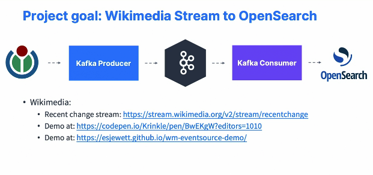

### Kafka Real-World Project

#### Real-World Project Overview

* we're going to go and implement a real world project with our Kafka skills. So this is a programming section in which we're going to get data from Wikimedia as a stream through a Kafka producer into Apache Kafka topics. And then we're going to create a Kafka consumer that will take this data and send it to OpenSearch. So this is a Java programming class, but we are going to learn a lot of Kafka related concepts in this section. So even if you don't do programming, please stick around and watch the lectures above the programming lectures and you will learn a lot about Kafka still, okay. If you are a Java developer and you're up for the task, you can try to implement this on your own. So the Wikipedia stream is going to be right here. I will provide you the link in the next text lecture and you can also look at demos into how this can be used at these two different links and we'll look at them in the next lectures as well. So once you have done this with the Kafka producer, you can send data into Apache Kafka, and then you could try to write your own Kafka consumer as well to send data into OpenSearch. So try implementing it. But if you don't succeed, don't worry. 

  

* There is a walkthrough of the implementation in this course as well. So we do this because I want to show you a little teaser. So once we have done, okay, all the Kafka producer and the Kafka consumer, then we're going to go to the next level and implement it with more advanced concepts such as Kafka Connect and Kafka streams. So we'll get a Kafka Connect SSE source connector to get data from Wikimedia into Apache Kafka. Then we'll use Kafka streams to do a counter application and compute some statistics on our stream of data. And finally, we'll use Kafka, Connect ElasticSearch, Sync to send data into OpenSearch and OpenSearch is just an open source fork of ElasticSearch, hence why I'm using ElasticSearch sync in this instance. 

  

* Recent Change Stream : http://stream.wikimedia.org/v2/stream/recentchange

* Demo at : https://codepen.io/Krinkle/pen/BwEKgW?editors=1010

* Demo at : https://esjewett.github.io/wm-eventsource-demo