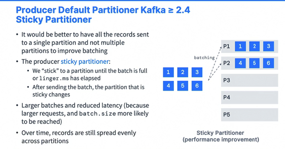

### Kafka Wikimedia Producer and Advanced Producer Configurations

#### Wikimedia Producer Project Setup

* Wikimedia producer and producer configurations. So we're going to first set up the project to be able to take data from Wikimedia in a Kafka producer into Kafka. And we'll have a look at the recent change stream. We'll have a look at a few demos as well available to us to see the kind of transformations we're going to do. We will set up Java libraries for our project in this lecture just to get started. So we'll set up Okhttp3 as well as Okhttp-eventsource and all these things should be enough for us to start writing our code. Okay. So the first thing we're going to do is go to this URL to see the recent changes of Wikimedia. And actually, you see this page keeps on being updated and it goes really, really fast. And this is a stream, a real time stream accessible from your web browser of all the changes happening in Wikimedia in real time. 

  

* So as you can see, it's quite a fairly high throughput type of data stream. And this is the one we're going to use to send data into Apache Kafka. So I'm quite excited about showing this one to you. And then in the second page, I'm going to go and I'm going to close this one. This is a codepen, so this is a sample of a code that can be running in the web browser in JavaScript. And I'm going to zoom out a little bit for you. So this is the code in JavaScript and HTML. And then in here we get some information around some stats. So this is the same stream we show you from before, but we have information around how many wikis we get per second. So this is an average of 29 per second. We get also a distribution of which pages are affected by these changes. So en.wikipedia.org is the highest change. Okay. But we have for example wikidata.org as well changing. We have for example fr.wikipedia.org that's changing and so on. So these are some very interesting stats and at some point we will be playing in Kafka streams to get some of these stats available to us. So I just want to show you that this stream of data could be also analyzed in real time for example, like this. And the last way to analyze this stream in real time, just to again visualize the stream of data is to go to this website and this is going to show you over time a chart of the type of events that are going to happen. So is it a categorization event, and edit log or new? Okay. Was it posted by about or not by about? So about 5050 right now? Is it a major edit or a minor edit of these pages? And it's mostly majors we can see and we can look at the number of edits over time. So I like this stream because it's quite high throughputs. It's also a real time it's on data that you may have already seen. Okay. And it gives you some information around the website, the size of the edits, is it small edits, or is it a large edits and the arrival delay in seconds versus when it was posted on Wikipedia and when it ended up in the stream? So this is just to show you the fact that this stream of data can be analyzed in websites and we're going to actually write a Kafka producer for it. And I want to give you a taster of how things worked. Okay. So the next thing we're going to do is to set up our project. Okay. So we are going to set up our project. And so for this I go back to Kafka, beginner's course, I right click, and then I will do new and then module and we will create a new module for a project. So it's a Gradle project, Java 11 SDK Corretto 11 So this is good. And the name of the project is Kafka Producer Wikimedia. Okay. For the artifact coordinates, I am good with these. I will click on finish. So as you can see, a new module was created and within it a builder gradle file was created as well. Okay. So we're good to go. Now we need to add some dependencies in our gradle file. So the first thing we need to set up for dependencies are going to be the ones we had from before. So actually take the one from Kafka basics. I can copy this dependency block right here and paste it because, well, we need only to have Kafka clients SLF4J API and SLF4J simple, but we need two more events source dependencies, okay, to actually read this stream from a Java code. So how do we do this? Well, what I'm going to do is first get the Okhttp3. So I will type in this and we get this library. So Okhttp okay. I'm going to click on it and get one of the latest version. So 493 that I know works well. So I'll copy it and then I will paste it in here. Great. And the last one I need to get is also the Okhttp event source, which is going to allow me to grab this stream. So let's go back to Okhttp3 Maybe it's not here, so I'll just type it. So Okhttp event source. Here we go. So I like this one. And I will take the latest version so 250. Copy this and paste it. Okay. So we're good to go. Now, finally, we're just going to create one file, okay, just to make sure that things are set up. So let me close these files that I don't need and I will go into main Java. And here you need to be quite careful. So this source directory is not the one we want. We want the source from within the Kafka producer Wikimedia. I made the mistake in a recording, so I'm doing it again. Excuse me. So you're going to Java new and then Java class and the name is IO.conduktor.demos.Kafka wikimedia dot and then I will name this one wikimedia media changes Producer. In the class. Okay, we got it. Then we add the main method and we run our code. So our code is being run properly. This is great. And then the last thing need to check is to go into build.gradle. And right now I don't see the little gradle elephants to refresh it. But if you had the elephant, you click on it to refresh it and this will pull in your dependencies.

* Url : 

  * https://stream.wikimedia.org/v2/stream/recentchange
  * https://codepen.io/Krinkle/pen/BwEKgW?editors=1010
  * https://esjewett.github.io/wm-eventsource-demo/

  ```groovy
  plugins {
      id 'java'
  }
  
  group = 'com.syrisa.tr'
  version = '1.0-SNAPSHOT'
  
  repositories {
      mavenCentral()
  }
  
  dependencies {
      // https://mvnrepository.com/artifact/org.apache.kafka/kafka-clients
      implementation 'org.apache.kafka:kafka-clients:3.5.1'
      // https://mvnrepository.com/artifact/org.slf4j/slf4j-api
      implementation 'org.slf4j:slf4j-api:2.0.5'
      // https://mvnrepository.com/artifact/org.slf4j/slf4j-simple
      implementation 'org.slf4j:slf4j-simple:2.0.5'
      // https://mvnrepository.com/artifact/com.squareup.okhttp3/okhttp
      implementation 'com.squareup.okhttp3:okhttp:5.0.0-alpha.11'
      // https://mvnrepository.com/artifact/com.launchdarkly/okhttp-eventsource
      implementation 'com.launchdarkly:okhttp-eventsource:4.1.1'
  
  }
  
  test {
      useJUnitPlatform()
  }
  ```

#### Wikimedia Producer Implementation

* I'm going to implement the Kafka producer for Wikimedia, and this was quite advanced, I would say Java knowledge. But if you're a good programmer, you should be able to follow along. If not, you can just follow along. You can even get the code that is already ready and we will use that code for the future sections of this course, okay, where it will not be as much Java programming. Okay. So in the meantime, let's go ahead and implement this producer. So to get started with the producer, we need to first reference the bootstrap servers. And so Kafka for me is running at 127 001. 9092. Okay. Then we need to just like before, create producer properties. And so what I can do is I can go into my basics file, find my producer demo, and just copy this entire blob right here, all the way until here. So we'll copy it, we'll paste it. I'm going to fold that because I don't need it. So we create the producer properties and in here I'm just going to reference my bootstrap servers. Okay. So here we have created our Kafka producer and we will probably need it later on. Okay. Next we're going to create a string which is going to contain the topic we want to send data to, and it's called wikimedia .recent change, which is the name of the stream that we are using. So this is the producer part. And now we need to actually create what's called an event handler. And an event handler is coming from this event source library we just pulled in. Okay. And this is what it's going to allow you to handle the events coming from the stream and then send them to the producer. So here I'm going to create an event handler and we need to actually implement a class that will implement this event handler interface. So I will have a to do here, okay, to implement this class, then we need to pass in the URL. So we're going to do string URL of where we are getting the stream from. This URL is the one that I got for you. Okay. And next, once we have this, we should be able to pass in this URL to an event source. So we're going to do event source .builder to build our event source, okay, which is a builder. And this is just standard Okhttp3 event source type of documentation. So this is why I'm doing it. But this is not Kafka related knowledge. So it's a new event source.builder. And in it you pass in a handler and a URL. So the handler is very easy. It is the event handler we created from before that we're going to implement very, very soon, which is where all the magic happens, as well as passing the URI .creates a URL to create a URI from a URL. Okay. Once we have this, we need an event source. So because we have a builder from before which is named event source and it's equal to builder.build. Okay, this is a common Java pattern. And then finally, when we're done, we need to start the producer in another thread and we'll just do event source.start. 

  ```java
  package com.syrisa.tr.wikimedia;
  
  import com.launchdarkly.eventsource.EventHandler;
  import com.launchdarkly.eventsource.EventSource;
  import org.apache.kafka.clients.producer.KafkaProducer;
  import org.apache.kafka.common.serialization.StringSerializer;
  
  import java.net.URI;
  import java.util.Properties;
  import java.util.concurrent.TimeUnit;
  
  public class WikimediaChangesProducer {
      public static void main(String[] args) {
          String bootstrapServers = "127.0.0.1:9092";
          Properties properties = new Properties();
          // Connect to localhost producer properties
          properties.setProperty("bootstrap.servers", bootstrapServers);
          properties.setProperty("key.serializer", StringSerializer.class.getName());
          properties.setProperty("value.serializer", StringSerializer.class.getName());
  
          KafkaProducer<String, String> kafkaProducer = new KafkaProducer<String, String>(properties);
          String topic = "wikimedia-recent-changes";
  
  
          EventHandler eventHandler = new WikimediaChangeHandler(kafkaProducer, topic);
          String url = "https://stream.wikimedia.org/v2/stream/recentchange";
          EventSource.Builder builder = new EventSource.Builder(eventHandler, URI.create(url));
          EventSource eventSource = builder.build();
  
          // Start the producer in another thread
          eventSource.start();
  
          // TODO: Add a shutdown hook to close the producer when the application is terminated
          // TODO: We Produce for 10 minutes and block the program until then
  
          try {
              TimeUnit.MINUTES.sleep(10);
          } catch (InterruptedException e) {
              throw new RuntimeException(e);
          }
  
      }
  }
  package com.syrisa.tr.wikimedia;
  
  import com.launchdarkly.eventsource.EventHandler;
  import com.launchdarkly.eventsource.MessageEvent;
  import org.apache.kafka.clients.producer.KafkaProducer;
  import org.apache.kafka.clients.producer.ProducerRecord;
  import org.slf4j.Logger;
  import org.slf4j.LoggerFactory;
  
  public class WikimediaChangeHandler implements EventHandler {
  
      KafkaProducer<String, String> kafkaProducer;
      String topic;
      private final Logger logger = LoggerFactory.getLogger(WikimediaChangeHandler.class.getSimpleName());
  
  
      public WikimediaChangeHandler(KafkaProducer<String, String> producer, String topic) {
          this.kafkaProducer = producer;
          this.topic = topic;
      }
  
  
      @Override
      public void onOpen() throws Exception {
          // Nothing to do
      }
  
      @Override
      public void onClosed() throws Exception {
          kafkaProducer.close();
  
      }
  
      @Override
      public void onMessage(String event, MessageEvent messageEvent) throws Exception {
          logger.info("Received message: " + messageEvent.getData());
          // TODO: Send the message to Kafka synchronously
          kafkaProducer.send(new ProducerRecord<String, String>(topic, messageEvent.getData()));
  
  
  
      }
  
      @Override
      public void onComment(String comment) throws Exception {
          // Nothing to do
      }
  
      @Override
      public void onError(Throwable t) {
          logger.error("Error in Stream Reading", t);
      }
  }
  
  ```

  

* And this is going to allow us to start this whole event handling. Okay. So we have things going and now we just need to implement the real magic of this, which is the event handler. So right now we're saying, Hey, you build an event source using this handler and this URL and then you start it. So this handler is going to actually receive events now and we need to handle these events. So to do so, what I have to do is to go and create my event source handler. So I'll do new Java class and I will call this one Wikimedia change handler. Okay. And this file needs to extend our implements, excuse me the event handler. So let's go ahead and do this. So we're going to go into this public class and I will do implements event handler. So this is an event handler. And as you can see, there's this was imported. And so we'll go ahead do option and then implement methods and I will implement all these methods right here one by one. So I'll do, okay. So how do we do this? And by the way, this is wikimedia, so I'm going to just rename this file, excuse me, I'm going to right click refactor and rename file and I'm going to just remove this typo. Okay. So we're going to have to implement onOpen, onClosed, onMessage, onComments and onError and some of these methods of course, we do not want to implement. And so if we have a look at the producer right here, we actually have created a Kafka producer in here and we need to pass in this producer into this class to be able to use the producer, usually in the onMessage, because whenever we receive a message, we want to do Kafka producer .send message. So to pass in an object from one class to another in Java, you need to implement a constructor. So fairly easy. We're going to implement a constructor right here, so we'll be a public constructor. So Wikimedia change handler and it's going to take a Kafka producer of type string string as an input that I will name Kafka producer and then also a topic to where to send to. And therefore, because we need to have that, we need to also have these accessible from within my code. So we'll have a Kafka producer string string that is named Kafka producer and a string topic in my class. And we're going to say this Kafka .producer equals Kafka producer, which is standard Java code. And this .topic equals topic. So now we have passed in a Kafka producer and a topic into these change handler, and they can be referenced from within our code. Okay. The last thing I want to do is to have a private static final logger and actually doesn't need to be static. It can just be a private final logger. And then I will name it log and it's coming from the logger factory. Get logger and then the name of our class .class, .getsimplename. This is so we can start logging some stuff. Okay. And actually, I need to make sure that this logger is actually implementing the correct logger, which is the logger from SLF4J. Okay. we're good to go. So we have this log and we can use this log when we need to. So when we have onOpen, this is when the stream is open. Do we need to do anything? Not really. So I will have nothing here. Okay. Because we don't need to do anything. When the stream is closed, what should happen? So that means that we're closing reading from the stream and therefore a good thing to do would be to actually close our producer as well. So we'll do Kafka.producer .close to actually close our producer. Okay. And because there is no exception, we can actually remove this block right here because we don't throw any exception in these cases. Okay. Next, the important part is on the message. So on message means that the stream has received a message coming from the http stream. And so therefore we want to send it through the Kafka producer. So what we need to do is use some asynchronous code, just like we saw from before, and we're going to do Kafka producer.send. And here we need to specify a producer record. So we'll do new producer record, and then we need to specify a topic. So this is the topic we retrieved from before as well as specify a string value. Well, it is good because we get a message events out of this method. So if you look at the message event object, if we do get data, we are actually getting the data of the object as a string, which is exactly what we need. So here we're saying whenever we receive a message from the stream and this message is as message events, then get the data from it, which is the actual content of the message. Create a producer record to send to this topic and do Kafka producer.send. And because I want you to see the fact that we're sending some stuff we can do log.info and we can actually do message event .getdata. So the data itself is going to be put into the log so we can see in real time that we are receiving messages and therefore asynchronously we are sending it through the producer to Apache Kafka. So this is the whole magic of this code. Uncomment nothing here as well. It doesn't matter. And I can remove this, this exception and I can also remove here this exception. And then in case of error, well, we're just going to log it. So log.error, error in stream reading and we pass in the throwable just to get some information. Okay. Maybe we want to stop reading. Maybe we want to close the producer terminated. But for now, I'm good and I'm not expecting any errors anyway. So we have this Wikimedia change handler and this is something that gets invoked whenever the stream finds a new message. So to summarize, the important part is here whenever we receive a message, we log it and then we pass it to our Kafka producer. So now that we have implemented our event handler, we can actually use it in our change producer code. So that means that here the event handler we need is going to be a new Wikimedia change handler, and the constructor takes a Kafka producer out of it so I can use my producer and a string topic so I can use my string topic. So as we can see here, we have our code, just to summarize, we create our producer and we define the topic we want to send data to. We then pass this into a change handler, the producer and the topic. And I could have created my producer and my topic there, but I like to do it in my main. And then this gave us a event handler and then we used this and a URL to create an event source. And this event source, whenever new messages are happening in here, are going to pass them into the event handler we have. So the event source .start and this is going to start its own thread to process and so therefore I need to block my code here because if I don't block my code, then everything is going to just hang to finish sorry, and this is going to be bad because, well, those the main thread is just going to stop and so all the threads are going to stop as well. So to do so, to do it very simply, we can for example, produce for 10 minutes and block the program until then. And so we can do time units .minutes .sleep and then 10. We're going to say, Hey, I want to block for 10 minutes. And while this is happening, while my other thread is going to produce two Apache Kafka. So with this, I can add an exception to the method signature. So now my main throws an interrupted exception and we are good. So now this means that our code is ready and we are ready to try it and run it.

#### Wikimedia Producer: Producer Config Intros

* I want to show you a little bit of introduction into what's going to happen. So I just ran my code and I just stopped it. And so when we started our producer, they were producer config values and we have ACKS equals minus one. We have batch size equals 16,384 and bootstrap servers and so on. And so all these configurations are important for your producer. But what I'm going to show you is of course show you the ones that are very, very important to optimize. So this rest of the section is actually applicable to any type of Java code. And so this is why we're going to have a look into the different settings, what they mean and how you can maybe improve them based on the workload you have. So I hope you're excited and I will see you in the next lecture for some analysis.

#### Producer Acknowledgment deep dive

* We are going to learn about producer acknowledgments or the acks setting. So we see that producer sends data into our Kafka cluster, which hosts specific topic partitions, and then the writes are sequential. But when producers send data into the brokers, they can choose to receive some acknowledgments of data rights. They're basically acknowledgments of receipts. So we have acks equal 0, and that means that the producer is not going to wait for an acknowledgments, which is a possible data loss and actually doesn't even request a acknowledgement, and we'll see this why it leads to data loss in the next slide. We have acks equals 1 to wait for broker leader acknowledgement, which presents a limited data loss opportunities, and then we'll show you why as well in the future slide. And then we have acks equals all, or also minus one is the same value, which is that the leader and the replicas have to acknowledge the data writes which leads to no data loss. 

  

* So first acks equals 0. So when you have acks equals zero, the producer consider messages as successfully written the moment they are sent to the broker without even waiting for the broker to accept it all. And so that means that the producer sends data to the leader and then the leader does the writes. But if somehow the brokers goes offline or some kind of exception happens, we will not know and we will lose data. So acks equals zero is useful where it's potentially okay to lose messages such as when you, for example, do matrix collection. And some people also argue that even in metrics collection you don't want to lose data and people use acks equals 0 sometimes because it produces the highest throughput setting because while the overhead on the network is minimized. But it is only for very, very specific use cases that acks equals 0 would be acceptable to you where it's okay to lose data. 

  

* So then we have acks equals 1, and when acks equals 1, the producer consider messages as successfully written. When the message was acknowledged only by the leader broker, which is the default setting from Kafka version 1.0 to version 2.8. So it used to be the default for a very, very long time and the producer sends it out to the leader. The leader writes the data actually, and then responds to every request successfully say, Yes, I have successfully written the data and then the data gets written over time like this. So the leader response is requested. But we have no guarantee of replication. Only the leader has the data and replication is a background process. And so we don't know if the data has been replicated. That means that if our leader broker goes offline unexpectedly, but the replicas haven't had the chance yet to replicate the data, then we will have a data loss. And if an ack is not received, though, the producer may go into a retry for the request to actually try to write the data successfully. So acks equals 1 gives us more overhead of course, on the types of requests, but also more safety, because now we want the leader to acknowledge the write, but we don't have the guarantee the data is successfully replicated. So there is a potential data loss. So this used to be the default from version 1.0 to 2.8 and it was acceptable. But people are evolving towards getting the safest kind of guarantee when writing to Apache Kafka and this is provided by acks equals all also interpreted as acks equals -1. Okay. All and -1 are the same value. 

  

* So when acks equals all the producers consider the messages are successfully written, when the message is accepted by all in-sync replicas, So ISR which is the default value for Kafka 3.0 and over because this is the highest guarantee. We have a Kafka broker, a cluster with three brokers. One of them is the leader for partition 0, and the other two are replicas. So we have a replication factor of two and our producer is using acks equals well, so what happens? The producer sends the data to the leader. The leader will send it to the replica for replication, which will acknowledge the right to the leader broker. Same for broker 103. It will have the replica data and acknowledge the writes and then the broker 101 says, okay, we're good. We can acknowledge the right as well. There is some synchronization happening that I'm going over really quickly because you don't need to know how it works. And then you have the response back from the leader saying,

* All the ISR acknowledge your writes, therefore you can acknowledge your writeas well. And the data gets written this way. So behind this complicated mechanism, we are getting the certainty that all the ISR in your cluster will have the data when it's successfully written and the ack is received. So this setting acks equals all actually goes hand in hand with another setting called min in-sync replicas. That means that the leader replica when you do a writes with acks equals all is going to check if there are enough in-sync replicas in your cluster to safely write the message. And this is controlled by the setting min in-sync replica. 

  

* I will show you in a second. So if you have min in-sync replica which is a default, then it's okay as long as the only the broker leader successfully acknowledges your rights. If you have min in-sync replica equals two and this is a broker setting or a topic setting by the way, then it needs to have at least the broker leader and one replica to successfully ack before returning a successful ack to the producer. So let's take an example with min in-sync replica equals two and a replication factor of three. So we have the same diagram as before. But for example, if you have set min in-sync replica equals two for your brokers or your topic, then what happens? If broker 102 and broker 103 are down then the producer sends data to the leader and says, Hey, I would like to write to at least two replicas, but the only replica available is the leader. So we have min in-sync replica available is one, but the setting says that it should be two. Therefore, the broker 101 is going to respond to the producer and say there are not enough replicas and therefore is going to generate an exception. So acks equals all is great, but to get the safest data guarantee, it's recommended to have a replication factor of three and the min in-sync replica equals two because this guarantees that at least one other replica can get your data and therefore if that replica doesn't exist, then the leader, the broker is saying, I'd rather not accept the right than risk losing data. And so it's the producer's responsibility to wait for the replicas to come back up before sending the data. So this is quite a common setup in companies that want the safest and highest guarantee in terms of replication.

  

* So this brings us into Kafka topic availability. So if we consider a replication factor of three and we have acks equals 0 or acks equals 1, as long as we have one partition up and running and it's considered an in-sync replica, then the topic is going to be available for writes so we can keep on writing to the leader. If we have acks equals acks and we set min in-sync replica equals one, which is the default, then that means that the topic must have at least one partition up as an ISR and that includes the leader. And so we can tolerate two brokers going down in that setting. Okay. But if you have min in-sinc replica equals two, which was the setting I should show you before, then we must have at least two ISR up to be having a successful write. And so we can consider that at most one broker is down. Therefore, if only one broker is done, we still have the guarantee that two brokers available to take the writes. And so we have the safest guarantee. So if we have min in-sync replica equals three, that doesn't make any sense because if you have a replication factor of three and min in-sync equals three, then we don't tolerate any broker going down at all, which is not how Kafka was designed. 

  

* So in summary, if you have acks equals all and the replication factor of n amd min in-sync replica to be equal to m, then we can tolerate n minus m brokers going down for topic availability purposes. And by availability I means available for writes. Okay. Reads regardless are still going to happen. So the most popular combination is going to be acks equals all and min in-sync replicas equals two, which is going to give you good data, durability and good data availability of course, with a replication factor of three. And with these settings you can withstand at most, the loss of one Kafka broker. 

#### Producer Retries

* So when you have failures to send data from the producer to Apache Kafka, then developers are expected to have a little bit of code to handle these exceptions. Otherwise the data will be lost. And so section example of failures could be, for example, not enough replicas when there's not enough replicas due to the mini in-sync replica setting alongside acks equals all. But if you don't want to handle these failures, at least on the retry side, there is a retry setting and it's zero for Kafka. Less than two zero version two zero, or it's a very, very high number for Kafka over 2.1. And so we are using a recent Kafka. 

  

* But you still should know that if you're using an older version of the client, then retries can be zero. And then there is also a retry backup, which is saying how much time to wait before the next retry. And by default, this setting is 100 milliseconds. So the producer is going to retry infinitely quote unquote, infinitely until something happens and this thing that happens is a producer timeout. So if you set a retry to a very high number, then the retry is are not infinite. They're bounded by a timeout. And since Kafka 2.1 there is an intuitive timeout you can use which is called delivery timeout milliseconds and it's 120,000 as the default value which is equals to two minutes. And this delivery timeout millisecond takes over a lot of time that happened from before. So this is a very simple timeout saying that from the moment you do send up until it is received by Kafka, all of this is bounded by a delivery timeout of 120,000 milliseconds. 

  

* So in this graph, don't look at the in-between timeouts. Just remember that this delivery timeout takes over everything else. And if they are not acknowledged within this delivery timeout millisecond, then the records will be failed. So it's important for you to understand for the old version of Kafka that if you're not using an idempotent, which is a producer, which is a producer, I will show you in the next slide, then in case of retries, you have the chance that messages will be sent out of order because when you retry, well, messages are kept on being retried. But this is solved by an idempotent producer that I'm going to show you in the next lecture. So if you rely on key based ordering, then that is could be an old issue, especially for the old versions of Kafka. And as I said, I like to warn you about older versions of Kafka because sometimes people don't update their Kafka version and they see behaviors that are not taught in this course. 

  

* For this, there is another setting called the max in-flight request per connection, and this default value is five. But in case you have a older version of Kafka and you have retries, you need to set it to one to ensure key based ordering, although that may impact your throughput. But when you have Kafka higher version, for example, higher than 1.0, then you can use idempotent producers and you will be good to go. 

#### Idempotent Producer

* So when a producer is sending data into Apache Kafka, there can be duplicate messages due to network errors. What a good request looks like. We produced data into Apache Kafka. Apache Kafka commits the data into the log and Apache Kafka sends back an acknowledgment to our producer. From that point onwards, all good, right? But what if we have a bad request or duplicate request. What happens? We produce data to Kafka. Kafka commits the messages on the log and sends back an ack. But this ack never reaches our producer maybe because of a network error. Therefore, the producer never receives an ack and say this is weird. I'm going to retry my produce because we have a retry setting, right? So the produce is retried. Kafka sees it as a new request, so it will commit a duplicate message and then sends back the ack. So from a producer perspective, only one request made it to Kafka and was ack. But Kafka actually committed two messages. 

  

* For this, we can use an idempotent producer. So starting from an older version of Kafka, this idemptent producer does not introduce duplicates on network errors. Right? Well, because on the good request, everything is the same. But for a duplicate request, even though you have an ack that never reaches your producer and the same produce request is retried, Kafka is smart enough to say, Hey, this looks like a duplicate produce request, therefore I'm not going to commit twice, but I'm still going to send you back the ack for you to think that the request was successful. 

  

* So this is the whole power of item producer and they're quite powerful. So they're a must to guarantee a stable and safe pipeline. And since Kafka 3.0, so it took a little bit of time between 0.11 and 3.0, they are becoming the default. 

  

* And I definitely recommend to use them even before 3.0, but they're not the default for Kafka less than 3.0. So when you set up an idempotent producer, automatically the retries are going to be set to the max value. The max in-flight requests are going to be one for Kafka 0.11 or five for Kafka 1.0. And also, even if you set max in-flight request to five, then the ordering is going to be kept. And if you're curious about the implementation detail, just Google Kafka 5494. Okay. And also acks are going to be equal to all. So these settings are going to be automatically applied after your producer has started if you don't set those manually. So in your producer code, you can just set producer props .enable idemptentance true, and you're good to go. So this is super important for you to understand because, well, defaults are sharing in Kafka all the time, but you need to improve the behavior. And in case you're not using Kafka 3.0, then you can set those manually to force your Kafka producer to use the good values that we know .

#### Safe Kafka Producer Settings

* The Kafka producer defaults and how to have a safe producer. So since Kafka 3.0, the producer is safe by default and you do not need to do anything. So acks equals all minus one. Enable idempotence is equal to true. But if you're using Kafka 2.8 and lower, then the producer defaults are going to be acks equals one and enable idempotence equals false. No matter what, even 3.0 or 2.8 and lower, I would definitely recommend using a safe producer whenever possible, especially if you don't want to lose any data. So the other recommendation I have for you is to always use upgraded Kafka clients to make sure that you can send data into Apache Kafka with the highest guarantee and the highest safety. 

  

* So since Kafka 3.0 is safe, you can upgrade your clients or otherwise you would set manually in your program acks equals all to ensure data is properly replicated before an act is received. You would set min in sync replica equals to which is a broker or topic level setting. But you need to make sure you have at least a replication factor three and this will ensure that at least two brokers that are in-sync replicas have the data before you send an EC. There's also enable idempotence equals true and this is to make sure that duplicates are not introduced due to network retries and you would set retry equals max int which is going to guarantee the producer is going to retry until the delivery timeout millisecond deadline is reached. And for this we can keep the value of two minutes for this delivery timeout milliseconds. 

  

* Finally, for performance reasons you can set max in-flight request per connection equal five, which is going to ensure maximum performance while keeping message ordering because you have also enabled the enable idempotence equals true. So that's it for the summary. So to summarize, Kafka 3.0 super easy, nothing to do but Kafka less than 3.0, we need to add all these settings. So I will see you in the next lecture just to add them to our producer.

#### Wikimedia Producer Safe Producer Implementation

* I've told you because we are using a version of Kafka, so let's go into Kafka producer Wikimedia build.gradle. We are using Kafka 3.10, which is greater than 3.00. That means that our clients are going to be safe by default. So that means that the producer is going to have a safe config by default. So if we have a look at the log right here, we see that acks equals one, which means all. We see that the delivery timeout is 120,000 seconds, which is good. We see that the max in-flight request per connection is five. Yes. We see that enable idempotence equals true. And we see that retries is equals to integer.max config. So all the configs that are set from before are set correctly and the one we don't see is the min in-sync replica and there is a producer, a broker side config. So to check the min in-sync replica setting you just go to brokers and then you find your broker, you click on it and in the configuration you can look up any configuration you want. So if I look at the min in-sync replica, we can see that the value is one and that's the default config. And because we only have one broker, it's not recommended to change it. So you cannot have it higher than 101 otherwise things will break. So we seen that yes indeed the default are sets. But if I were to change my Kafka clients to use something like 2.8.0, let me refresh this right now. I'm going to redownload everything. Okay. So this is done, and then I'm going to just run my producer and then stop it right away. So let's run it. And then stop it. Here we go. So we are using now acks equals one. So you see, now it's not all. It's not minus one, it's one. So definitely things have changed. Enable Idempotence is false. We're used to be true and so on. So what we can do to fix this is to manually, properly set a safe producer. So I will set, set safe producer configs. And this is just for Kafka. Less or equal than 2.8 if you want it to. Okay, so we can just copy this line of code and do it so we have the enable idempotence config to be equals to true. We have the acks setting to be equal to all. It's also same as setting minus one. Okay. Then the retries. You could say the retry. So if you want it to you could set it to integer.max value and then to string. So integer two string and then we provide the integer.max value. Okay. And then we could also set the other values if we wanted to. But for now, this is good enough. Max in flight is also going to be good enough so you can just have but I don't want to specify it, but max in flight is five and so on. So now once we do these things, if we rerun our producer right here and click on stop. As you can see, acks equals minus one enable Idempotence equals true. And then we have the correct delivery time, timeout milliseconds. 

  ```java
  package com.syrisa.tr.wikimedia;
  
  import com.launchdarkly.eventsource.EventHandler;
  import com.launchdarkly.eventsource.EventSource;
  import org.apache.kafka.clients.producer.KafkaProducer;
  import org.apache.kafka.clients.producer.ProducerConfig;
  import org.apache.kafka.common.serialization.StringSerializer;
  
  import java.net.URI;
  import java.util.Properties;
  import java.util.concurrent.TimeUnit;
  
  public class WikimediaChangesProducer {
      public static void main(String[] args) {
          String bootstrapServers = "127.0.0.1:9092";
          Properties properties = new Properties();
          // Connect to localhost producer properties
          properties.setProperty("bootstrap.servers", bootstrapServers);
          properties.setProperty("key.serializer", StringSerializer.class.getName());
          properties.setProperty("value.serializer", StringSerializer.class.getName());
          // kafka-topics --bootstrap-server localhost:9092 --topic wikimedia-recent-changes --create --partitions 5 --replication-factor 1
          KafkaProducer<String, String> kafkaProducer = new KafkaProducer<String, String>(properties);
          String topic = "wikimedia-recent-changes";
  
          // set safe producer properties kafka <=2.0
          // properties.setProperty(ProducerConfig.ENABLE_IDEMPOTENCE_CONFIG, "true");
          // properties.setProperty(ProducerConfig.ACKS_CONFIG, "all");
          // properties.setProperty(ProducerConfig.RETRIES_CONFIG, Integer.toString(Integer.MAX_VALUE));
          // properties.setProperty(ProducerConfig.MAX_IN_FLIGHT_REQUESTS_PER_CONNECTION, "5");
  
          EventHandler eventHandler = new WikimediaChangeHandler(kafkaProducer, topic);
          String url = "https://stream.wikimedia.org/v2/stream/recentchange";
          EventSource.Builder builder = new EventSource.Builder(eventHandler, URI.create(url));
          EventSource eventSource = builder.build();
  
          // Start the producer in another thread
          eventSource.start();
  
          // TODO: Add a shutdown hook to close the producer when the application is terminated
          // TODO: We Produce for 10 minutes and block the program until then
  
          try {
              TimeUnit.MINUTES.sleep(10);
          } catch (InterruptedException e) {
              throw new RuntimeException(e);
          }
  
      }
  }
  
  ```

* We have the correct retries and we have the correct everything. So that means that now our producer is safe. So if you are using a version of Kafka that is recent enough, I'm going to put back 310. Then you're good to go. And I click the little elephant right here to synchronize. But if you're using, you know, an older version of Kafka and this could be the case for many of your programs, I would bet then absolutely do set the configurations that enable you to have a safe producer. 

#### Kafka Message Compression

* So usually your producers are going to send data into Kafka and it is usually text based, for example, JSON data. In this case, it's going to be very important to apply compression to the producer because once you enable it, the message is going to be smaller and it's going to be faster. So send it to Apache Kafka and also smaller to store it on disk. So compression can happen in different stages. It can happen either at the producer level and it doesn't require any changes in the brokers or in the consumer. Or you can set it on the broker. And I will show you the difference between producer and broker compression. So compression type can be of different values. It could be none. The defaults gzip, lz4, snappy and zstd from Kafka 2.1. And obviously compression is going to take repeated values and compress them together. 

  

* And so the bigger the batch of message you have, the more compression you're going to get and the more effective this thing is going to be. So there is a blog right here on Cloudflare, which is comparing compression in Kafka. I think you should read it if you're very interested. Okay. So how does compression works? So say a producer has a batch it wants to send to Kafka, and this batch contains 100 messages. So message one all the way to message 100. What's going to happen is that when you enable compression, this batch of message is going to be compressed as a batch of compressed messages, which, as you can see on this diagram, produces a big decrease in size. And so therefore, when sent to Kafka, is going to be a lot quicker to be sent and stored on disk. So message compression has a lot of advantages as a message, so you get a much smaller producer request you can get up to, for example, four times smaller requests. It's going to be much faster to transfer data over the network, which is going to provide you with less latency, better throughput as well as better utilization of disk on Kafka because the stored messages on disk are going to be smaller. 

  

* The disadvantages of using compression, I think are miners in today's world, the producer must commit some CPU cycles to do some computation and perform compression, and the consumers must also commit some CPU cycles to decompress the message batch and read it. Overall, I think you should consider first snappy or lz4 for optimal speed and compression ratio. But the others may work as well too for your data sets. And then as we'll see in the next lecture, we can consider tweaking two more settings called linger dot millisecond and batch size to force our producer to have bigger batches and therefore have more compression and higher throughput, and I will show you how to make it work. Okay. So whenever I have clients on Apache Kafka, I always recommend them, especially when it's a high throughput stream to enable compression in production, and you have no idea how many problems this one little setting solves. 

  

* So compression can also happen at the broker level or topic level. So if you enable it at the broker level, it is applied to all your topics. And if it's applied at a topic level, it's just applied to one topic. So you have different settings and this is a broker setting. So you can set compression type equals producer and that's a default. That means that the broker is going to take the compressed batch from the producer clients and it's going to write it directly to the topics logs file without compressing the data. So it is optimal, but that pushes the necessity of compression onto the producer. You can also have compression type equals none, in which case all the batches sent to Apache Kafka are going to be decompressed by the broker, which I think is a bit inefficient. But why not? You can, for example, set a specific type of compression for the settings. 

  

* For example, compression type equals lz4, and then some interesting behavior happens. So if the compression type sets on the topic is equal to the one on the producer setting, then the data is not going to be re recompressed. It's just going to be stored on disk as is. But if you're using a different compression mechanism on the producer side, then the batch is going to be first decompressed by the broker and then recompressed using the compression algorithm specified, for example, lz4 in this example. So just so you know, if you enable broker side compression, it's going to consume extra CPU cycles. So overall, my best recommendation would be for you to make sure that all your producers are compressing the data on their end and leave the broker default to compression type equals producer. But in case you have no control over your producers, but you still want to enable compression, then you can enable it on the broker side. But just so you know, the broker is going to consume a bit more CPU cycles and that can have a performance impact. 

#### linger.ms and batch.size Producer Settings

* So by default, when your Kafka producer is doing a .send, the records are going to be sent as soon as possible. And the setting that we seen before max in-flight request per connection equals five means that at most five message batches are being in flight between the producer and the broker at most. So it gives you some parallelism accessible to you. But after this the messages have to be sent while others in flights and Kafka is smart and therefore is going to start to batch them before the next sent. Okay. So as long as all your connection or your request in flights are busy, then Kafka starts batching the messages. The smart batching helps actually increase throughput while maintaining very, very low latency. So on top of it, because you are batching your messages, you have an added benefit is that if you enable compression, then the compression is going to be higher. So you have an added benefits. So batching is a good thing in Apache Kafka because it helps improve throughput and compression. And therefore there are two settings that you can use to influence the batching mechanism. The first one is linger.millisecond, the default value is zero, which is how long to wait until we send a batch. And for example, if you set this to five milliseconds, then you introduce a small delay, a small latency of five milliseconds. 

  

* But your Kafka producer is going to wait up to five milliseconds to add more messages in the batch before sending it. And the batch size is also saying that if a batch is filled up before the linear millisecond has been achieved, then send the batch and so we can increase the batch size if we want larger batch sizes. So here's an example. We have a producer batch and we send one, two, three message, but then we're going to wait up to linger millisecond to close the batch. So this allows our producer to keep on adding messages into the batch and then after linger.millisecoond is attained, then you're going to get one batch, one request. And the max size of this batch is batch.size. And then this is sent to Kafka, maybe through a compression mechanism if you have enabled producer compression. 

  

* Okay, so now that we understand lingo millisecond, let's understand batch size. So by default it is 16kB and represents the maximum number of bytes that will be included in the batch. And if you increase the batch size, something like 32kB or 64kB, it can help in increasing the compression throughput and also efficiency of request because you are sending less requests. If you have a message that is bigger than the batch size, it will not be batch and will be sent right away and the batch is allocated per partition you send to. So if you set it to a number that's too high, you will waste memory. 

  

* So be careful about that and you can monitor the average batch size limits, metrics sorry, using the Kafka producer metrics when you start to monitor your producers. So to summarize, you get a high throughput producer, we need to increase longer millisecond and then the producer will wait a few milliseconds for the batches to fill up before sending them. 

  

* If we send batches are full, we need to also increase batch sizes to send larger batches and be more efficient. And then we need to introduce some producer level compression for more efficiency in the sense. 

#### Wikimedia Producer High-Throughput implementation

* We are to implement a high throughput producer. So we'll add snappy message compression in our producer and snappy is going to be very helpful if your messages are text based and they are for our use case. For example, if you have log lines or JSON documents and we have JSON documents. Snappy I like it because it has a good balance of CPU to compression ratio, but test whatever algorithm is good for you and make your own decisions. We'll also increase the batch size to 32kb and we'll introduce a small delay with linger millisecond to 20 millisecond. And we'll also check which partitioner is being used for our code. At the end our code is going to look like this.

  

* So let's launch our producer. while it is like this and we are going to have a look at the default value set for the settings. So I'm going to stop this. Okay, stop, stop, stop. Okay. So if we have a look at it, the batch size is 16kB. And then we have the compression type. It is none and linger millisecond is zero. And if you have a look at the partition class, it is called the default partitioner. And if we have a look and just type default partitioner, we're going to import it and then go in this class. You see, it implements the sticky partitioning because there is a sticky partition cache and so on. So this is the newer type of partitioner I just told you about. Okay. So back here, I'm going to remove this because we don't need it. And next, we're going to set some high throughput producer configs. So we're going to do properties dot set property producer config that linger millisecond to be 20. This is to add a little bit of delay. 

  ```java
  package com.syrisa.tr.wikimedia;
  
  import com.launchdarkly.eventsource.EventHandler;
  import com.launchdarkly.eventsource.EventSource;
  import org.apache.kafka.clients.producer.KafkaProducer;
  import org.apache.kafka.clients.producer.ProducerConfig;
  import org.apache.kafka.common.serialization.StringSerializer;
  
  import java.net.URI;
  import java.util.Properties;
  import java.util.concurrent.TimeUnit;
  
  public class WikimediaChangesProducer {
      public static void main(String[] args) {
          String bootstrapServers = "127.0.0.1:9092";
          Properties properties = new Properties();
          // Connect to localhost producer properties
          properties.setProperty("bootstrap.servers", bootstrapServers);
          properties.setProperty("key.serializer", StringSerializer.class.getName());
          properties.setProperty("value.serializer", StringSerializer.class.getName());
          // kafka-topics --bootstrap-server localhost:9092 --topic wikimedia-recent-changes --create --partitions 5 --replication-factor 1
          KafkaProducer<String, String> kafkaProducer = new KafkaProducer<String, String>(properties);
          String topic = "wikimedia-recent-changes";
  
          // set safe producer properties kafka <=2.0
          // properties.setProperty(ProducerConfig.ENABLE_IDEMPOTENCE_CONFIG, "true");
          // properties.setProperty(ProducerConfig.ACKS_CONFIG, "all");
          // properties.setProperty(ProducerConfig.RETRIES_CONFIG, Integer.toString(Integer.MAX_VALUE));
          // properties.setProperty(ProducerConfig.MAX_IN_FLIGHT_REQUESTS_PER_CONNECTION, "5");
  
          // set high throughput producer properties
          properties.setProperty(ProducerConfig.LINGER_MS_CONFIG, "20");
          properties.setProperty(ProducerConfig.BATCH_SIZE_CONFIG, Integer.toString(32 * 1024)); // 32 KB batch size
          properties.setProperty(ProducerConfig.COMPRESSION_TYPE_CONFIG, "snappy");
  
          EventHandler eventHandler = new WikimediaChangeHandler(kafkaProducer, topic);
          String url = "https://stream.wikimedia.org/v2/stream/recentchange";
          EventSource.Builder builder = new EventSource.Builder(eventHandler, URI.create(url));
          EventSource eventSource = builder.build();
  
          // Start the producer in another thread
          eventSource.start();
  
          // TODO: Add a shutdown hook to close the producer when the application is terminated
          // TODO: We Produce for 10 minutes and block the program until then
  
          try {
              TimeUnit.MINUTES.sleep(10);
          } catch (InterruptedException e) {
              throw new RuntimeException(e);
          }
  
      }
  }
  
  ```

* Then we're going to add the batch size config we said is going to be 32kB, so 32 times 124 and this must be a string. So we're going to do integer to string. and pass in this number. So here we go and pass in this number. And lastly, we need to enable compression. So the compression type is going to be equal to snappy because I like it. So what I want to show you is that even though we enable these settings, the consumer is going to work equally well. So let's start a consumer on the Wikimedia recent change topic, and now we're going to relaunch this producer and let it produce a little bit of data. So it's launching. It's producing some data. Cool. I can stop it. So if we look at the settings, batch size is now 32kB. That is the case. Compression type is snappy and linger millisecond is 20 milliseconds. So we're trying to be a bit more efficient. Now if I go here, I look at the fact that indeed the data was received by my console consumer without any changes. We didn't modify any setting. We didn't specify the fact that our data was compressed, that it was in a batch and so on. So the consumer does all the magic behind the scene. Okay. So fairly simple. By adding these settings at the expense of 20 milliseconds of delay at most, we're going to get a lot more efficient producer.

#### Producer Default partitioner and Sticky partitioner

* Which is the default partitioner for your producer. So when your key is not null, then your data is going to go through a partitioner logic which decides how a record gets assigned to a partition. And this process is called key hashing, which is the process of determining the mapping of a key to a partition. And in the default Kafka partitioner the key are hashed using the murmur2 algorithm and this is the formula. And if we look at this formula, we can see that the same key goes to the same partition, because the murmur algorithm, it's predictable and therefore the same key goes to the same partition, because the formula has the exact same inputs and the exact same formula. But if we look at the formula, we look at the fact that if you look at num partitions, which is the right hand side part of this formula, and we increase it because we add partitions into our topic, then this entire formula is affected. And therefore once you add partitions to a topic, you are breaking the guarantee that the same key goes to the same partition. 

  

* So instead it's better to create a new topic in these kind of instances. So it's not necessary and recommended to override the default partitioner logic. But if you have a very advanced use case where you want to have your own partitioner logic for some reason, then you can do so by using the Partitioner class parameter for your Kafka producers. So when the key is equal null, then we have some interesting optimization. So the default producer has two behaviors. Number one, up to Kafka, 2.3. We have the round robin behavior that will explain in the next slide. And for Kafka 2.4 and above, we have the sticky partitioner that I will explain in the slide after round robin. The idea is that when we use the sticky partitioner, we're going to get a huge performance improvement, especially when you have high throughput and your key is null. So how is the round robin partitioner working? Say you have six messages that you send through your producer and a topic with five partition. 

  

* So when you have an older version of Kafka for your producer less than 2.3, then what's going to happen is that the messages are going to go round robin. That means the first one goes to partition one, then the second one partition two, then the third one partition three and so on, because the messages are distributed. And once you reach partition five, then it goes again to partition one and so on. So this makes sense. This is the behavior we expect because we want messages to be spread over all the partitions equally. But this results in more batches because you get one batch per partition and you get one message per batch and the batches are going to be much, much smaller. So this is not a optimal behavior. That means that you have more small batches, more requests and higher latency. 

  

* So instead, on 2.4 and over, the producer has implemented a new default partitioner called the sticky partitioner. And it results in massive performance improvement because while the records are going to be sent to the same partition as a batch and then move on to the next batch. So this is a sticky partitioner is going to stick to a partition until the batch is full or linger millisecond as elapsed. And then after sending the batch the partition that is going to be sticky changes. So if you have a look there is batching happening here, all the messages go to partition one and then the next batch will be opened and all the message will go to partition two. And then if there was a new batch, it'll be partition three and over. 

  

* So this leads to larger batches and reduce latency because you have larger requests and the batch size is more likely to be reached and over time you still get the same effect as round robin because your messages are going to be spread evenly across all partitions. So if you look at the performance improvements, here is the latency being noticeably lower on the sticky partitioner than the default partitioner. And if you look at a lot of partitions, for example, if you look at three producers, 10,000 messages per second and you look at, for example, a topic with 125 partitions, then you see the latency is much, much, much, much lower. So it is a big performance improvement. 

  

* And the only thing you have to do, of course, is to just upgrade your producer clients to version 2.4 and above. 

#### max.block.ms and buffer memory (Advanced)

* Here's one lecture that you're probably not going to use in the beginning or at all in your Kafka life and I hope for you not to, but I'm still going to have it there. So it's advanced. If you want to skip it, that's fine and we're actually not going to implement it. So it's to describe two settings called max block millisecond and buffer memory. So if the producer becomes very, very, very high throughput and the broker cannot respond fast enough to these requests, the records are going to be buffered in memory on your producer. And the buffer size of buffer .memory is 32MB. It is decide the size of the send buffer, and that buffer is going to fill up over time when the producer when the broker is too busy. 

  

* And then if the broker becomes less busy, it's going to empty back down when the throughput at the broker increases. So the idea is that this buffer is here to queue up messages before sending them into Kafka. Now we can obviously increase the buffer memory if we have if we fill it up too much. So if the buffer is full, all the 32MB of it, then next time you do .send on your producer, it will start to block. That means that it will block out this line of code. It will not be asynchronous anymore. It will not return right away. It will just block your code to prevent the buffer from filling up. And then goes a new setting in place. So if the send method is blocking, then max block millisecond is going to be 60,000. That means that for 60 seconds it's okay to be blocked on send. If the buffer is not unblocked after all this time, so if the buffer is still not emptied out after we have sent the message, then the send message is going to throw an exception. 

  

* So either the producer has filled up his buffer and the broker is not accepting new data and 60 seconds has elapsed. And if you hit an exception, that means that your brokers are down or really overloaded and they cannot respond to any types of requests. And so you need to have a serious look at your programs and so on. Okay. So this was just to show you now let me show you in the code where this would happen. So here is the max block millisecond as well as the buffer memory. I would not change the settings at all. And then what's going to happen is that in your wiki change handler right here on the Kafka producer .send, so this method right here, right now, I wrote it's asynchronous, but if the buffer is full, then this method is actually going to block and it's going to block your program just to make sure that Kafka, in the meantime, has some chance to catch up with your entire buffer. Okay. So it's good for you to know, nothing to do and it's quite a dense lecture, I would admit. But I have to just say that in case something comes up, you can refer to this video and you're good to go.